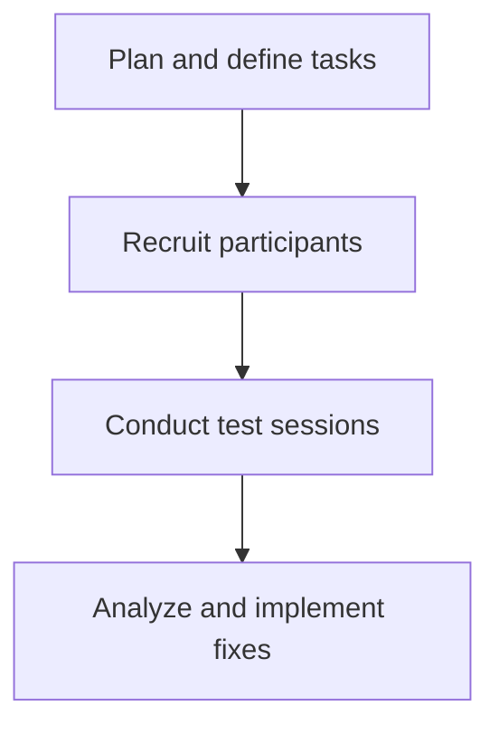

# Task-based testing

> Validating documentation usability by observing real users completing specific objectives to identify instruction gaps and improve findability

---

## What is task-based testing?

Task-based testing is a research method where you observe participants as they complete specific goals using only your documentation. Unlike a general content audit, this method tests how documentation performs in a live or simulated environment. It bridges the document development life cycle (DDLC) and the software development life cycle (SDLC) to verify that instructional content works as a reliable interface for the product.

This testing requires collaboration across teams. Technical writers design the test scenarios based on audience analysis. Product managers, user experience (UX) researchers, and quality assurance (QA) engineers help recruit participants, run the sessions, and analyze behavioral data. A subject matter expert (SME) often joins the observation phase to help identify where users struggle with complex systems, such as an API reference or a new developer experience (DX) setup.

---

## Why it matters

Writing accurate instructions isn't enough; information must be easy to find and follow. Internal teams often have an "expert's blind spot," meaning they can't see the documentation from a beginner's perspective. Without task-based testing, you might publish material that seems correct to engineers but confuses real users.

Using this workflow improves efficiency and customer support metrics. Validated documentation increases support deflection by resolving user confusion before a product release. Finding structural problems early also reduces technical debt and prevents the need for reactive documentation patches later.

!!! tip "Validate the Docs, Not the User"
    Task-based testing measures the quality of the documentation, not the intelligence of the participant. If a user can't complete a task, the documentation failed, not the user.

---

## When to adopt this workflow 

Adopt this workflow if you notice friction in product adoption or documentation maintenance, such as:

- **High volume of support tickets:** Users often ask for help with features that are already documented.
- **Major product redesign:** You introduce a new interface or architecture that requires updated onboarding and user guides.
- **Complex developer onboarding:** Engineers struggle to configure a software development kit (SDK) or navigate authentication despite having reference materials.

---

## How the workflow works

This workflow moves from planning to observation and concludes with content updates based on user performance.

1. **Task definition and scenario planning:** The team drafts scenarios based on a validated user persona. Tasks must be objective and should not lead the participant. For example, use "Create a database instance" instead of "Select the green button to start."
2. **Test facilitation and observation:** Facilitators run sessions while participants perform the tasks. Observers take notes on search patterns, navigation choices, and where users get stuck.
3. **Data synthesis and documentation updates:** The team reviews success rates, time-on-task, and qualitative feedback. They then update the information architecture (IA), restructure the content hierarchy, and rewrite confusing passages.

---

## RACI and team roles

To keep the process moving, define clear ownership across teams.

- **Responsible:** Technical writers (designing tasks, taking notes, and updating content) and UX researchers (running sessions).
- **Accountable:** Documentation lead and product manager (prioritizing documentation fixes in the product backlog).
- **Consulted:** SMEs (verifying user paths and system accuracy).
- **Informed:** QA team and support lead (tracking ticket trends after updates).

---

## Pipeline integration and tooling

You can use tools to streamline your preparation. Use automated link checkers and prose linting applications, such as [Vale](https://vale.sh/){: target="_blank" rel="noopener" }, to ensure technical errors don't distract participants.

After testing, log findings as issues in your project management system. This ensures that documentation updates are scheduled in the next sprint and tracked alongside software bugs.

---

## Troubleshooting and common points of failure

Watch for these common bottlenecks:

- **Leading the participant:** Observers sometimes guide participants when they struggle, which ruins the data. *Solution:* Train facilitators to remain silent and use neutral prompts like, "What would you do next if you were working alone?"
- **Recruiting the wrong audience:** Testing with internal developers instead of the target audience. *Solution:* Use screener surveys to find participants who match your customer profiles.
- **Scope creep:** Testing too many complex cases in one session, which tires the participant. *Solution:* Limit sessions to three to five high-priority tasks.

---

## Key metrics and success criteria

Measure effectiveness using these indicators:

- **Task completion rate:** The percentage of participants who complete the objective without help. Aim for 85% or higher.
- **Time-on-task:** The average time a user spends on a task. A downward trend over time shows improved findability.
- **Error rate per task:** The number of times a participant takes a wrong action before finding the correct path.