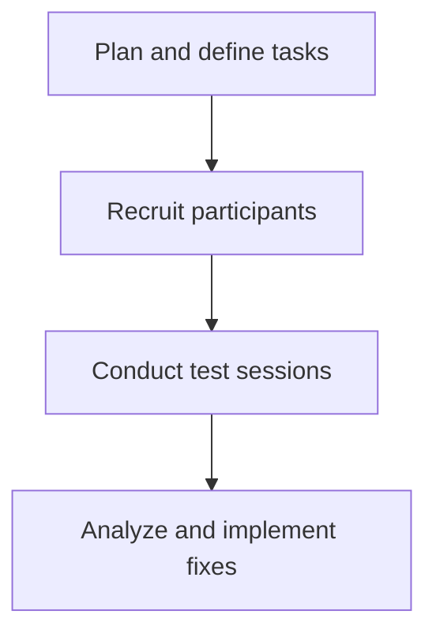

# Task-based testing

> A usability research method where participants perform specific goals using documentation to identify instruction gaps and findability issues

---

## What is task-based testing?

Task-based testing evaluates documentation by observing users as they attempt to reach specific milestones using only the provided guides. While a content audit checks for accuracy on the page, this method verifies how that information performs in a live environment. It functions as the bridge between the document development life cycle (DDLC) and the software development life cycle (SDLC), ensuring instructions act as a functional interface for the product.

Execution requires cross-functional input. Technical writers design the scenarios, while UX researchers and product managers recruit participants and analyze the resulting behavioral data. Having a subject matter expert (SME) observe these sessions is often the fastest way to pinpoint where users struggle with complex setups, such as API authentication or SDK configurations.

---

## Why it matters

Accuracy is only half the battle; if a user cannot find or interpret a step, the documentation has failed. Internal teams often suffer from the "curse of knowledge," making it impossible for them to see the instructions from a fresh perspective. Task-based testing strips away these assumptions.

Prioritizing this workflow directly impacts the bottom line. Validated docs drive support deflection by resolving friction points before they reach a help desk ticket. Furthermore, catching structural flaws during the testing phase prevents the accumulation of technical debt and the need for emergency documentation patches after a release.

!!! tip "Validate the Docs, Not the User"
    If a participant fails a task, the documentation is broken, not the user. The goal is to identify flaws in the content, not to test the participant's technical proficiency.

---

## When to adopt this workflow 

Implement this testing process when documentation maintenance becomes reactive rather than proactive. Common triggers include:

- **Support ticket spikes:** Users frequently ask for help with features that are already "documented."
- **Interface overhauls:** New UI or architectural changes render existing onboarding and user guides obsolete.
- **Onboarding friction:** New developers struggle to initialize environments or navigate reference materials despite having access to the full docs suite.

---

## How the workflow works

The process moves from objective planning to live observation, ending with data-driven content revisions.

1. **Scenario planning:** Draft objectives based on user personas. Tasks should be neutral and goal-oriented rather than instructional. For example, "Configure a webbook notification" is more effective than "Click the notification tab and enter a URL."
2. **Observation:** Facilitators monitor participants as they work through the scenarios. Observers should track search queries, navigation paths, and specific "dead ends" where users stop making progress.
3. **Data synthesis:** The team reviews success rates and time-on-task. These insights drive changes to information architecture (IA), content hierarchy, and the clarity of specific procedural steps.

---

## RACI and team roles

*   **Responsible:** Technical writers (task design and content updates) and UX researchers (facilitation).
*   **Accountable:** Documentation lead and product manager (ensuring fixes are prioritized in the sprint).
*   **Consulted:** SMEs (technical validation of user paths).
*   **Informed:** Support and QA teams (monitoring the impact on ticket volume).

---

## Pipeline integration and tooling

Testing is most effective when technical distractions are minimized. Use automated linting tools like [Vale](https://vale.sh/){: target="_blank" rel="noopener" } to catch grammar or style issues before the session so participants can focus on the workflow rather than typos. 

Findings should be logged as issues in your standard project management tool (e.g., Jira or GitHub). This treats documentation bugs with the same urgency as software bugs, ensuring updates are tracked and completed within the development cycle.

---

## Troubleshooting common failures

- **The "Helper" bias:** Observers often feel the urge to guide participants when they struggle. This invalidates the data. Facilitators must remain silent, using only neutral prompts like, "Talk me through what you’re looking for right now."
- **Internal echo chambers:** Testing with internal developers who already know the product leads to false positives. Use screener surveys to find participants who match the actual customer profile.
- **Participant fatigue:** Overloading a session with too many complex scenarios leads to declining performance. Keep sessions focused on three to five high-priority tasks.

---

## Key metrics for success

*   **Completion rate:** The percentage of users who finish the task independently. A target of 85% is a standard benchmark.
*   **Findability speed:** The time taken to locate the correct page or section.
*   **Error frequency:** The number of incorrect clicks or commands attempted before finding the successful path.