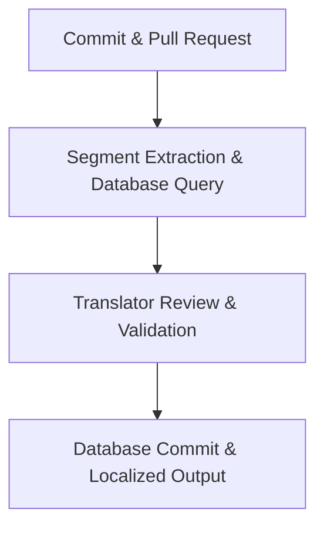

# Translation memory

> A database storing previously translated text segments to reduce enterprise localization costs by avoiding manual re-translations

---

## What is translation memory?

Translation memory (TM) is a database that stores sentences, paragraphs, or headings (called segments) as bilingual pairs. These pairs consist of source text and its corresponding target-language translation. As you create and edit documentation, the system searches the database to find matching text for new or modified content. If the system finds a match, it provides the existing translation for reuse. This helps you maintain a consistent voice and scale content reuse across platforms.

In the software development life cycle (SDLC), the translation memory pipeline works with continuous integration and continuous deployment (CI/CD) systems. The process typically starts after you finalize the source text and before you publish a software release or documentation update. While product managers and localization leads manage the workflow, software engineers configure the APIs or scripts to sync source repositories with a central translation management system (TMS). Quality assurance (QA) teams then validate these matches to ensure they are accurate before delivery.

---

## Why it matters

Using translation memory addresses bottlenecks in manual, repetitive localization workflows. In fast-paced release environments, content often changes slightly—for example, changing a single word in an installation step or fixing a typo. Without translation memory, you might pay to manually translate an entire page again, leading to higher costs and slower time-to-market.

Automating translation memory retrieval eliminates these manual roadblocks. It ensures that previously approved translations automatically apply to new documentation versions. This helps you maintain consistency across user manuals, help centers, and UI elements. Because you only pay for new or heavily modified segments, you can reduce localization costs and maximize your budget as your documentation grows.

!!! info "Pro Tip"
    Translation memory is different from a glossary. A glossary defines specific words or product names, while translation memory stores complete sentences and strings in context. Use both together for the best linguistic control.

---

## When to adopt this workflow

*   **Scaling localization costs:** Use translation memory when localization budgets increase at the same rate as documentation volume.
*   **Inconsistent terminology:** Use a central repository when different pages use conflicting translations for identical buttons, error messages, or menu paths.
*   **Frequent updates:** Adopt this workflow if you publish frequent documentation updates or release notes but experience translation delays.
*   **Transitioning to "docs as code":** Move to this workflow when migrating from manual file transfers to an automated, code-based publishing pipeline that integrates with source files.

---

## How the workflow works

1.  **Segment extraction and database query:** When you merge content changes, the CI/CD pipeline extracts the updated source files (such as Markdown or JSON) and sends them to the TMS. The system parses the text into segments and searches the translation memory database for exact or partial matches.
2.  **Translator review and quality control:** The system populates the localized files with exact matches (100% matches) or close matches (fuzzy matches). Professional translators or editors then review these segments in the TMS, validating the automatic matches and manually translating only the unique text.
3.  **Localized file export and database commit:** After validation, the TMS saves the new segments to the master translation memory database. The system then compiles the translated segments into the target file format and sends the localized files back to the development repository via an automated pull request.

---

## RACI and team roles

*   **Responsible:** Technical writers and software engineers write source content, configure file integrations, and manage database connections.
*   **Accountable:** The localization manager or documentation lead maintains database quality, approves style rules, and manages vendor budgets.
*   **Consulted:** Subject matter experts (SMEs) and product managers clarify technical terminology or verify localized feature behaviors.
*   **Informed:** QA and developer relations (DevRel) teams receive notifications when localized files are merged and ready for build verification.

---

## Pipeline integration and tooling

Modern development pipelines automate translation memory by integrating the database into the SDLC. Instead of manually exporting and emailing files, teams use continuous localization connectors or command-line interface (CLI) tools. These tools monitor changes in the master branch of a Git repository, parse updated source code or documentation files, and send them to the TMS via APIs.

Inside the translation platform, the system pre-translates the file using the translation memory database. You can also use hybrid models where machine translation provides a baseline, but translation memory takes priority to ensure high-priority terminology remains consistent. The automated cycle integrates into standard CI/CD frameworks, triggering build tests and deployment scripts once the localized files return.

---

## Troubleshooting and common points of failure

*   **Low leverage due to syntax changes:** Small changes to markup, such as inline code backticks, bolding, or custom tags, can prevent the database from recognizing identical segments. 
    *   **Solution:** Configure TMS file parsers to treat inline tags as placeholders rather than translatable text.
*   **Polluted database records:** If incorrect or outdated translations are saved to the master database, the system will populate future files with errors. 
    *   **Solution:** Establish read-write permissions so only designated senior editors can commit changes to the master database.

---

## Key metrics and success criteria

*   **Translation leverage rate:** The percentage of text segments resolved using existing matches. A higher rate directly reduces project costs.
*   **Localization cycle time:** The average time from merging a source content commit to deploying the localized page to production.