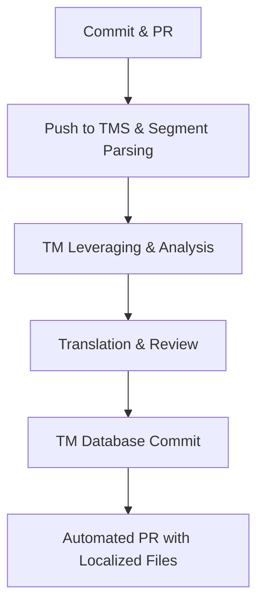

# Translation memory

> A database of bilingual text segments that stores previously translated content to improve linguistic consistency and reduce localization costs

---

## What is translation memory?

Translation memory (TM) stores previously translated segments—sentences, headers, or paragraphs—as Translation Units (TUs) consisting of a source string and its corresponding target string. When authors create or update documentation, the system scans this database for existing matches. If a match is found, the system retrieves the approved translation for reuse. 

Within a modern software development life cycle (SDLC), the TM pipeline integrates directly with CI/CD systems. After source text is finalized, the pipeline syncs source repositories with a central translation management system (TMS) via APIs or CLI tools. While localization leads manage the database maintenance and workflow, software engineers handle the automation scripts, and linguists/QA teams validate matches before the final delivery.

---

## Why it matters

Manual localization workflows often struggle with repetitive content. In rapid release cycles, updates are frequently minor—such as fixing a typo or adjusting a single step in a procedure. Without translation memory, these small changes can trigger the cost of re-translating an entire file or page because the context has changed.

Automated TM retrieval identifies these minor deltas, applying approved translations to identical strings instantly. This ensures that user manuals, help centers, and UI elements remain synchronized. By paying only for new or modified strings (and a reduced "fuzzy match" rate for similar strings), organizations decouple localization costs from content volume.

!!! info "Pro Tip"
    A glossary (Termbase) defines specific terminology or product names; translation memory stores complete strings in context. Use both to ensure technical accuracy and stylistic consistency.

---

## When to adopt this workflow

*   **Inefficient cost scaling:** Your localization budget is growing linearly with your documentation volume, indicating a lack of content reuse.
*   **Terminological drift:** Identical UI elements, such as buttons or error messages, appear with conflicting translations across different pages or platforms.
*   **Update bottlenecks:** Frequent documentation updates are delayed by translation turnaround times for content that is largely unchanged.
*   **"Docs as code" migration:** You are moving to an automated, repository-based publishing pipeline where manual file handoffs are no longer viable.

---

## How the workflow works

1.  **Parsing and Leveraging:** When content changes are merged into the source branch, the CI/CD pipeline pushes source files (Markdown, JSON, etc.) to the TMS. The system parses the text into segments and performs a TM lookup to find Exact (100%) or Fuzzy matches.
2.  **Production:** The system populates the project with matches. Translators or Machine Translation (MT) engines then process only the "New Words" or "Fuzzy Matches." 
3.  **Validation and Write-back:** Once the linguist approves the segments, the updated pairs are committed to the Master TM database. The system then compiles the translated content into the target format and returns it to the development repository via an automated pull request.

---

## RACI and team roles

*   **Responsible:** Software Engineers (API/CI-CD integration) and Linguists/Translators (content translation and TM cleanup).
*   **Accountable:** Localization Managers or Documentation Leads (database integrity, cost management, and vendor SLAs).
*   **Consulted:** Technical Writers and SMEs (source content clarity and technical context).
*   **Informed:** QA and Product Managers (notification of build status for localized versions).

---

## Pipeline integration and tooling

Modern development replaces manual file handoffs with CLI tools or continuous localization connectors. These tools monitor Git branches, pushing source updates to the TMS via API as they occur. 

Inside the translation platform, the system pre-translates files using the TM database. Many teams employ hybrid models where Machine Translation (MT) provides a baseline for new strings, but TM takes priority to ensure high-accuracy branding remains untouched. This is often referred to as "TM-augmented MT." Once localized files return to the repository, they trigger standard build tests and deployment scripts.

---

## Troubleshooting and common points of failure

*   **Tag and Placeholder Mismatch:** Minor changes to markup—such as shifting inline code backticks or bold tags—can cause a "100% match" to drop to a "Fuzzy match," increasing costs. 
    *   **Solution:** Configure TMS parsers to treat inline tags as non-translatable placeholders and use "Internal Tag" weighting to ignore minor positioning shifts where possible.
*   **Database Pollution:** Saving incorrect, unreviewed, or conflicting translations (e.g., from different product lines) to the master database causes errors to propagate.
    *   **Solution:** Implement a multi-tier TM strategy (Project TM vs. Master TM) and restrict master database write-access to senior editors.
*   **Segmentation Breakers:** Changing how a sentence is split (e.g., adding a hard return in the middle of a sentence) prevents the TM from recognizing the string.
    *   **Solution:** Enforce standardized Markdown linting and sentence-breaking rules (SRX) across source content.

---

## Key metrics and success criteria

*   **TM Leverage (Savings %):** The percentage of words recovered from the TM. Calculated as `(Total Wordcount - Weighted Wordcount) / Total Wordcount`.
*   **Post-Editing Distance:** The amount of effort/change required to correct a TM or MT suggestion.
*   **Localization Cycle Time:** The duration between a source content commit and the deployment of the localized page.