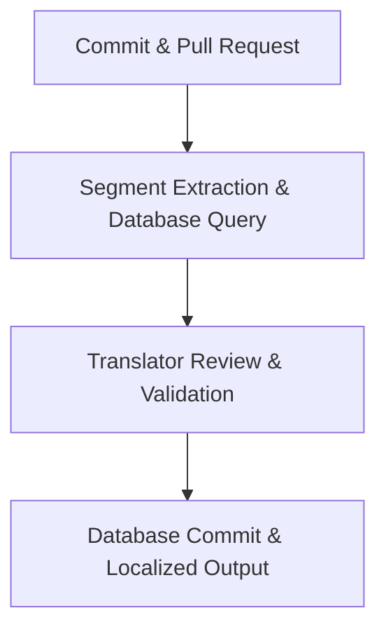

# Translation memory

> A database of bilingual text segments that stores previously translated content to improve linguistic consistency and reduce localization costs

---

## What is translation memory?

Translation memory (TM) stores previously translated segments—sentences, headers, or paragraphs—as bilingual pairs. When authors create or update documentation, the system scans this database for existing matches. If a match is found, the system retrieves the approved translation for reuse. This process maintains a consistent brand voice while scaling content across multiple platforms.

Within a modern software development life cycle (SDLC), the TM pipeline integrates directly with CI/CD systems. After source text is finalized, the pipeline syncs source repositories with a central translation management system (TMS) via APIs. While localization leads manage the high-level workflow, software engineers handle the automation scripts, and QA teams validate matches before the final delivery.

---

## Why it matters

Manual localization workflows often struggle with repetitive content. In rapid release cycles, updates are frequently minor—such as fixing a typo or adjusting a single step in a procedure. Without translation memory, these small changes can trigger the cost of re-translating an entire page.

Automated TM retrieval identifies these minor deltas, applying approved translations to new versions instantly. This ensures that user manuals, help centers, and UI elements remain synchronized. By paying only for new or heavily modified strings, organizations can maximize their localization budget as documentation volume grows.

!!! info "Pro Tip"
    A glossary defines specific terminology or product names; translation memory stores complete strings in context. Combine both to ensure total linguistic control.

---

## When to adopt this workflow

*   **Linear cost scaling:** Your localization budget is growing at the same rate as your documentation volume.
*   **Terminological drift:** Identical UI elements, such as buttons or error messages, appear with conflicting translations across different pages.
*   **Update bottlenecks:** Frequent documentation updates or release notes are consistently delayed by the translation turnaround.
*   **"Docs as code" migration:** You are moving from manual file transfers to an automated, repository-based publishing pipeline.

---

## How the workflow works

1.  **Segment extraction and database query:** When content changes are merged, the CI/CD pipeline pushes source files (like Markdown or JSON) to the TMS. The system parses the text into segments and searches the TM database for exact or partial matches.
2.  **Review and quality control:** The system populates files with "100% matches" or "fuzzy matches" (close approximations). Professional editors then review these segments, validating automated matches and translating only the unique, new text.
3.  **Export and commit:** Validated segments are saved back to the master TM database. The system then compiles the translated content into the target format and returns the files to the development repository via an automated pull request.

---

## RACI and team roles

*   **Responsible:** Technical writers and software engineers (content creation and API integration).
*   **Accountable:** Localization managers or documentation leads (database quality and vendor management).
*   **Consulted:** SMEs and product managers (technical accuracy and feature behavior).
*   **Informed:** QA and DevRel teams (notification of merged localized files).

---

## Pipeline integration and tooling

Modern development replaces manual file handoffs with CLI tools or continuous localization connectors. These tools monitor Git branches, pushing source updates to the TMS via API as they occur. 

Inside the translation platform, the system pre-translates files using the TM database. Many teams employ hybrid models where machine translation (MT) provides a baseline, but TM takes priority to ensure high-accuracy branding remains untouched. Once localized files return to the repository, they trigger standard build tests and deployment scripts.

---

## Troubleshooting and common points of failure

*   **Syntax-driven leverage loss:** Minor changes to markup—such as shifting inline code backticks or bold tags—can prevent the database from recognizing identical segments. 
    *   **Solution:** Configure TMS parsers to treat inline tags as non-translatable placeholders.
*   **Database pollution:** Saving incorrect or outdated translations to the master database causes errors to propagate across all future projects.
    *   **Solution:** Restrict master database write-access to senior editors.

---

## Key metrics and success criteria

*   **Translation leverage rate:** The percentage of content resolved via existing matches. Higher leverage correlates directly with lower costs.
*   **Localization cycle time:** The duration between a source content commit and the deployment of the localized page.