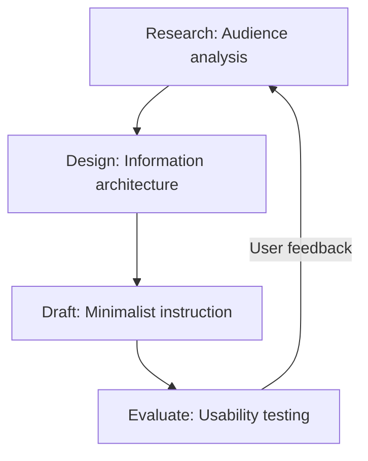

# User-centered design (UCD)

> A design framework prioritizing user needs and feedback throughout the development process to create intuitive, task-oriented technical documentation

---

## What is UCD?

User-centered design (UCD) shifts the focus of technical writing from explaining how a product works to helping users solve specific problems. By grounding content in cognitive psychology and observed behavior, UCD ensures that documentation reflects the user's mental model rather than the developer's system architecture.

When documentation is structured according to information design and UX principles, it dictates how a reader processes complex data. A well-executed UCD strategy prevents the "wall of text" frustration, making information easy to navigate and simple to digest.

---

## The risk of engineering-led content

Without a user-centered approach, documentation often devolves into an engineering "feature dump." This happens when writers translate technical specifications directly without filtering them for relevance. The result is a high cognitive load that leaves users frustrated and increases their reliance on support teams.

Prioritizing UCD within the document development life cycle (DDLC) positions the writer as a user advocate. Refined information architecture (IA) and task-oriented layouts create a seamless transition between the software UI and the help materials, effectively reducing support tickets and improving the overall developer experience.

---

## Core principles

Implementing UCD requires moving beyond simple descriptions toward a structured, actionable framework:

*   **Audience-specific personas:** Documentation should target a specific technical proficiency and environment. Mapping the user journey identifies where they are likely to encounter friction.
*   **Minimalist instruction:** Omit historical design context or hypothetical "what-if" scenarios. If it doesn't help the user complete the current task, it doesn't belong in the primary guide.
*   **Task-based hierarchy:** Organize content by use cases (e.g., "Authenticating an API request") rather than component lists (e.g., "The Auth Module").
*   **Progressive disclosure:** Use a "top-down" approach. Start with high-level overviews and use collapsible elements or nested pages for deep-dive configuration details to keep the main path scannable.

---

## Design pattern example

The following loop illustrates how UCD functions as a continuous feedback mechanism rather than a linear checklist.

### Refining the lifecycle

This cycle ensures that documentation evolves based on actual behavior. Feedback from usability tests reveals where users skip steps or misinterpret labels, allowing writers to refine personas and IA in the next iteration.

---

## Behavioral impact

A user-centered layout targets two specific outcomes:

1.  **Reduced hesitation:** Hierarchical structures allow users to find answers instantly, cutting down time spent on "pogo-sticking" through different search results.
2.  **Higher completion rates:** Using active voice and focusing on a single use case helps users configure systems correctly on their first attempt, building trust in the product.

---

## Best practices for implementation

*   **Adopt user vocabulary:** Avoid internal jargon. Use the search terms your users actually type into engines to improve discoverability and SEO.
*   **Prioritize accessibility:** Use semantic heading hierarchies and descriptive alt text. A screen-reader-friendly document is, by definition, a well-structured document.
*   **SME collaboration:** Use subject matter experts to verify technical accuracy, but retain control over the narrative structure. Don't let the technical complexity dictate the reading order.
*   **Scan-ready formatting:** Use bold text for UI elements and clear code blocks. Most users scan for keywords before they commit to reading a paragraph.

---

## Common anti-patterns

*   **The "SME brain dump":** This occurs when engineering specs are copied directly into guides, forcing the user to reverse-engineer the logic to find a solution.
*   **Information hoarding:** The urge to include every edge case on a single page. This clutter defeats progressive disclosure and overwhelms the reader.

---

## Validation and testing

To ensure the documentation meets user needs, employ these validation strategies:

*   **Usability testing:** Observe users as they attempt a task using only your draft. Note where they pause, which sections they ignore, and where they fail.
*   **Search analytics:** Monitor "zero-result" queries. These often point to content gaps or a misalignment between your terminology and the user’s vocabulary.