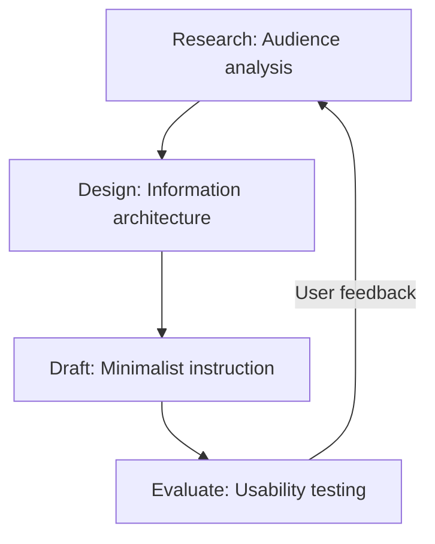

# User-centered design (UCD)

> An iterative design process that prioritizes the needs, goals, and feedback of the end user in the development of technical documentation

---

## What is user-centered design?

User-centered design (UCD) is an iterative framework that focuses on the end user during the product and documentation development processes. In technical communication, UCD shifts the focus from explaining how a product works to helping users solve specific problems. By grounding content creation in cognitive psychology and user behavior, UCD makes sure that technical materials match the user's mental model rather than the developer's system architecture.

UCD for documentation combines information design and user experience (UX) principles. Structuring a document or a developer portal determines how a reader processes information. Applying UCD to your content strategy helps prevent users from feeling overwhelmed by complex systems, making sure that information is easy to find and understand.

---

## Why it matters

Without a user-centered design approach, documentation often becomes an engineering-led "feature dump." This occurs when a writer relies too heavily on a subject matter expert (SME) without translating technical specifications into clear, structured information. This increases the cognitive load for the reader, leading to frustration and a poor perception of the product.

When you prioritize UCD in your document development life cycle (DDLC), you act as a user advocate within the product team. This shift improves the developer experience (DX) and customer satisfaction. Clear information architecture (IA) and task-oriented layouts make it easy for users to find answers quickly. This reduces friction and customer support tickets, making sure that help materials act as a seamless extension of the user interface (UI).

---

## Core principles and anatomy

Implementing UCD in your writing process requires a structured framework. The core anatomy of user-centered technical documentation includes the following:

*   **Audience analysis and personas:** Perform a thorough audience analysis to establish a clear user persona. Map the user journey to understand their technical proficiency, environment, and goals.
*   **Minimalist instruction:** Focus on the information the user needs to complete a task. Omit historical design details, secondary features, and hypothetical scenarios to keep the content actionable.
*   **Task-based structuring:** Organize articles by use case rather than product architecture. Grouping content by what the user wants to accomplish matches their problem-solving workflow.
*   **Progressive disclosure:** Present high-level overviews first, and use collapsible elements to hide advanced configuration details. This prevents information overload and keeps the layout scannable.

---

## Design pattern example

The following diagram illustrates how UCD functions as a continuous feedback loop within the documentation lifecycle. 

### Breakdown of the pattern

This pattern represents a continuous lifecycle of refinement. Rather than a linear model, the user-centered cycle relies on constant evaluation. 

Feedback gathered from usability testing feeds back into refining user persona profiles and information architecture (IA). This makes sure the documentation adapts to actual user behavior.

---

## Cognitive impact and user experience

Designing your documentation around the user targets specific behavioral goals:

- **Decreased hesitation:** With a clear, hierarchical layout, users quickly understand where to find answers. This reduces the time they spend navigating menus or using ++ctrl+f++ to search.
- **Higher task completion rates:** When you write instructions using the active voice and focus on a single use case, users can successfully configure or troubleshoot systems on their first attempt.

---

## Implementation best practices

To apply user-centered design to your content layout and strategy, follow these best practices:

- **Use the user's vocabulary:** Avoid internal engineering jargon. Use search-friendly terms that match what the end user types into a search engine to improve SEO.
- **Design for accessibility:** Make sure all images include descriptive alt text and use semantic heading hierarchies so the page is easy to navigate with a screen reader.
- **Collaborate early with SMEs:** Work closely with an SME during the initial research phase to verify technical accuracy before you simplify the language.
- **Format for scannability:** Use bold text for UI elements, numbered lists for sequences, and clear code blocks so readers can find critical commands quickly.

---

## Common anti-patterns

Avoid these common mistakes when implementing UCD:

- **The "SME brain dump":** Copying engineering specifications directly into user-facing guides. This ignores audience analysis and results in a document organized by how the system was built, rather than how it is used.
- **Information hoarding:** Attempting to explain every possible scenario, edge case, and configuration option on a single page. This defeats the purpose of progressive disclosure and overwhelms readers with irrelevant details.

---

## How to validate and test usability

Verify that your documentation meets user needs by using these testing strategies:

- **Conduct usability testing sessions:** Observe real users attempting to complete a task using only your draft documentation. Note where they hesitate, skip steps, or misinterpret instructions.
- **Analyze search analytics:** Track search queries that return zero results to identify content gaps and determine if your users are using different terminology than your documentation.