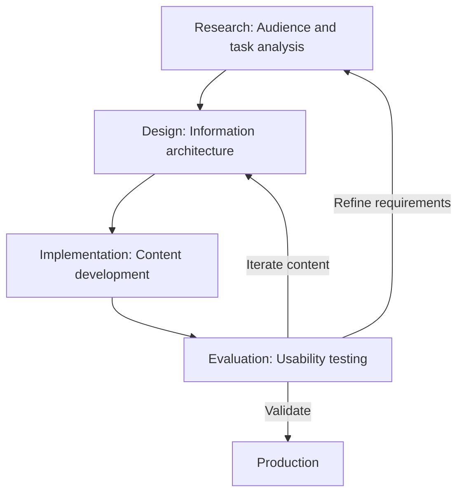

# User-centered design (UCD)

> *A design framework prioritizing user needs and feedback throughout the development process to create intuitive, task-oriented technical documentation*

---

## What is UCD?

User-centered design (UCD) shifts the focus of technical writing from explaining product mechanics to helping users solve specific problems. By grounding content in cognitive psychology and observed behavior, UCD ensures that documentation reflects the user mental model (how the user perceives the task) rather than the developer system model (how the code is structured).

When documentation follows information design and user experience principles, it manages the cognitive load of the reader. A well-executed UCD strategy prevents dense blocks of text by utilizing visual hierarchy and chunking, making information navigable and digestible.

---

## The risk of engineering-led content

Without a user-centered approach, documentation often results in an engineering-led output. This occurs when writers document technical specifications directly without filtering for relevance to the goals of the user. The result is a high cognitive load that increases time to value and reliance on support teams.

Prioritizing UCD within the document development life cycle (DDLC) positions the writer as a user advocate. Refined information architecture (IA) and task-oriented layouts create a seamless transition between the software user interface (UI) and the help materials, which reduces support ticket volume and improves the developer experience (DX).

---

## Core principles

Implementing UCD requires a structured, actionable framework based on the following:

- **Audience-specific personas:** Documentation must target specific technical proficiencies, roles, and environments. Mapping the user journey identifies points of friction where users are likely to encounter errors.
- **Minimalist instruction:** Based on Carroll’s minimalism principle, omit historical design context or hypothetical what-if scenarios. Content should focus on the immediate task to reduce interference with learning.
- **Task-based hierarchy:** Organize content by intent-based use cases, such as authenticating an API request, rather than structural components, such as the auth module.
- **Progressive disclosure:** Use a layered approach. Provide high-level summaries first, using collapsible elements or nested linking for complex technical details to keep the primary path scannable for expert users while supporting novices.

---

## Design pattern example

The following loop illustrates UCD as an iterative process (aligned with ISO 9241-210) rather than a linear checklist.

### Refining the life cycle

This cycle ensures that documentation evolves based on observed behavior. Feedback from usability tests reveals where users skip steps or misinterpret labels, allowing writers to refine personas and IA in the next iteration.

---

## Behavioral impact

A user-centered layout targets two specific outcomes:

1.  **Reduced hesitation:** Hierarchical structures allow users to find answers quickly, minimizing repeated navigation between search results and pages and reducing search-related dwell time.
2.  **Higher completion rates:** Focusing on a single use case per topic helps users configure systems correctly on their first attempt, increasing first-time fix rates and building product trust.

---

## Best practices for implementation

- **Adopt user vocabulary:** Avoid internal engineering jargon. Utilize user search intent keywords to improve discoverability and search engine optimization (SEO).
- **Prioritize accessibility:** Use semantic HTML heading hierarchies (H1-H6) and descriptive Accessible Rich Internet Applications (ARIA) labels or alt text. A screen-reader-friendly document provides the structural metadata necessary for all users to parse information efficiently.
- **Subject matter expert collaboration:** Use subject matter experts (SMEs) to verify technical accuracy, but maintain editorial control over the narrative structure. Technical complexity should not dictate the reading order.
- **Scan-ready formatting:** Use bold text for **UI strings** and clear, copyable code blocks. Users typically scan in F-shaped patterns or spotted patterns before committing to deep reading.

---

## Common anti-patterns

- **Unorganized information from subject matter experts:** Engineering specifications are copied directly into guides, forcing the user to reverse-engineer the system logic to find a solution.
- **Information hoarding:** Attempting to cover every edge case on a single page. This creates distractions that defeat progressive disclosure and overwhelm the working memory of the reader.

---

## Validation and testing

To ensure the documentation meets user needs, employ these validation strategies:

- **Usability testing:** Observe users performing a specific task, such as creating a webhook, using only the draft documentation. Track time on task and success rate.
- **Search analytics:** Monitor zero-result queries and high-volume search terms. These indicate content gaps or a misalignment between product terminology and user vocabulary.