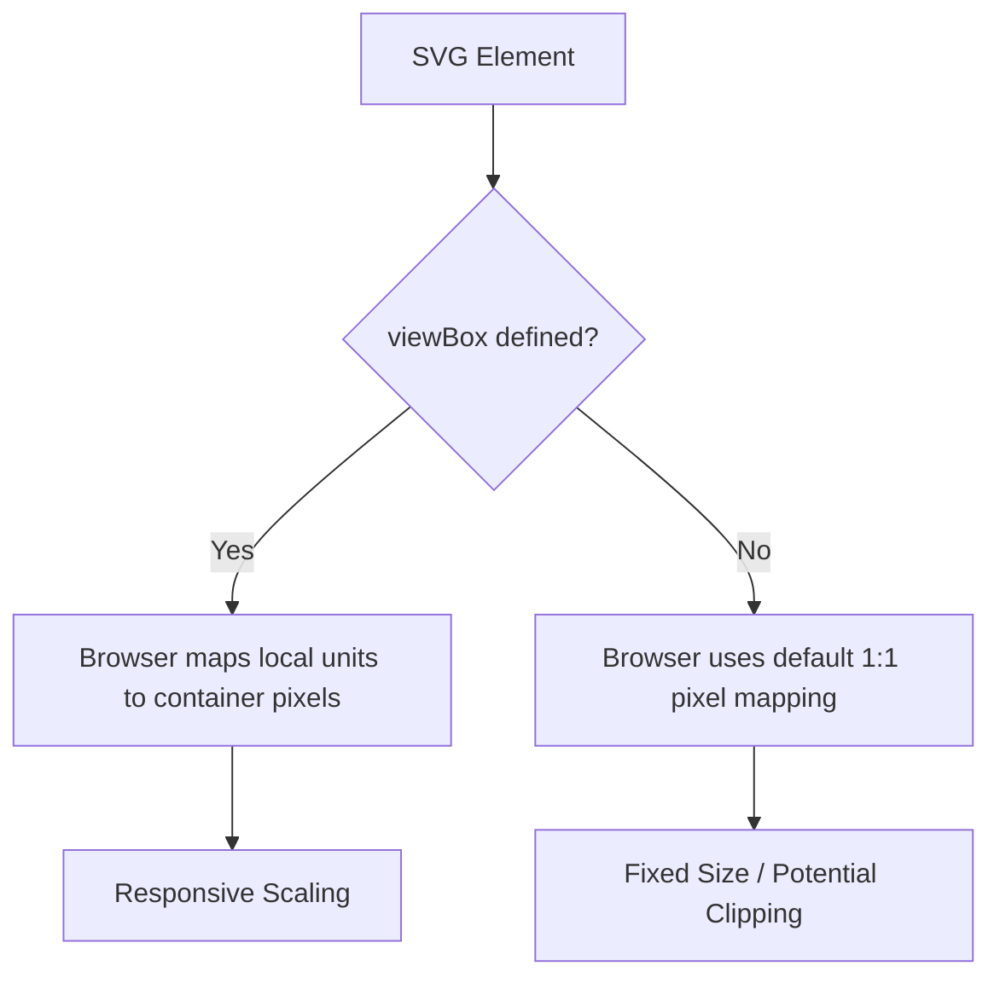

# viewBox

> An SVG attribute that defines the internal coordinate system and aspect ratio, allowing vector graphics to scale fluidly within any container

---

## What is viewBox?

The `viewBox` attribute acts as a virtual window over an SVG's artwork. It decouples the internal coordinate system from the physical dimensions of the container, ensuring that graphics scale proportionally without distortion. By defining a local grid, you dictate how coordinates inside the SVG map to the space the browser allocates for the image.

Without this attribute, SVGs default to a 1:1 pixel mapping. This makes the graphic rigid; if the container is smaller than the design, the image is cropped. If the container is larger, the image stays small. Adding a `viewBox` allows the browser to stretch or shrink the local coordinates to fill the available space.



---

## Why it matters

Fixed `height` and `width` attributes often break fluid layouts. Relying on them forces a graphic to occupy a specific number of pixels, regardless of screen density or viewport size. 

In modern documentation and UI development, responsiveness is non-negotiable. A properly configured `viewBox` ensures that technical diagrams, icons, and illustrations remain legible across different formats—from mobile help screens to high-resolution PDFs—without requiring manual resizing of individual paths or shapes.

---

## Syntax and structure

The syntax uses four numerical values: `viewBox="min-x min-y width height"`.

- **min-x**: The left-most coordinate of the grid (usually `0`).
- **min-y**: The top-most coordinate of the grid (usually `0`).
- **width**: The horizontal span of the internal canvas.
- **height**: The vertical span of the internal canvas.

!!! note "Aspect Ratio Control"
    The `viewBox` works in tandem with the `preserveAspectRatio` attribute. This determines how the graphic behaves if the container’s dimensions don't perfectly match the `viewBox` ratio (e.g., whether to "meet" the edges or "slice" the overflow).

---

## Code example

This configuration enables the coordinate system to fill its parent container:

```xml
<svg viewBox="0 0 100 100" width="100%" height="100%" aria-labelledby="svg-title">
  <title id="svg-title">A scalable circle graphic</title>
  <circle cx="50" cy="50" r="40" fill="#0078d4" />
</svg>
```

### Breakdown

- **`viewBox="0 0 100 100"`**: Establishes a 100x100 unit coordinate system starting at the origin.
- **`width="100%" height="100%"`**: Instructs the browser to expand the 100-unit grid to 100% of the available parent width.
- **`circle cx="50" cy="50" r="40"`**: Positions the circle relative to the `viewBox` grid. The center sits at `50,50` regardless of the SVG's actual pixel size on screen.

---

## Common pitfalls

### Mixing absolute and relative dimensions

Defining `width="400px"` alongside a `viewBox` can prevent the graphic from scaling down on small screens. For maximum flexibility, define dimensions in CSS or use percentages.

### Zero or negative canvas values

The `width` and `height` (the last two values) must be positive. Setting either to zero prevents the graphic from rendering entirely, as it creates an infinitely small viewing window.

---

## Tooling

Most design and development tools handle `viewBox` generation automatically:

- **Browsers**: Engines like Chromium and WebKit calculate the mapping during the initial layout pass.
- **Design Tools**: [Figma](https://www.figma.com/) and [Adobe Illustrator](https://www.adobe.com/products/illustrator.html) typically export the artboard dimensions as the `viewBox` values.
- **Optimization**: [SVGO](https://github.com/svg/svgo) is often used in build scripts to strip unnecessary metadata while preserving the `viewBox` for responsive rendering.

---

## Best practices

- **Align with artboards**: Use coordinates that match your original design file to avoid unexpected shifts or skewing.
- **Verify readability**: Scale the browser window to ensure that labels and thin lines remain visible at smaller sizes.
- **Accessibility**: Always include a `<title>` tag and appropriate ARIA labels so screen readers can describe the scalable content.
- **Clean export**: Use optimization scripts to remove hardcoded pixel widths from the SVG tag, leaving only the `viewBox`.