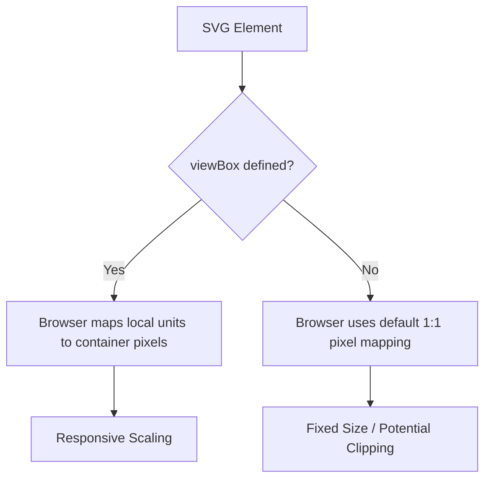

# viewBox

> An SVG attribute that defines a local coordinate system, allowing vector graphics to scale fluidly without hardcoded pixel constraints

---

## What is viewBox?

For technical writers and developers, ensuring visual content renders consistently across devices is a common challenge. The `viewBox` attribute is an XML-based instruction for the `<svg>` element. It defines the aspect ratio and coordinate system, acting as a virtual window over the artwork. You use this attribute to separate the physical rendering dimensions from the internal design coordinates.

By defining this coordinate system, you ensure that the graphic scales proportionally to fit any container. In modern web development and documentation pipelines, this is essential for creating responsive UI components, technical diagrams, and icons. Instead of editing raw coordinates when a graphic changes size, you can manage scaling through parent containers or CSS.



---

## Why it matters

Hardcoded `height` and `width` values in vector assets often break fluid layouts. If you omit the `viewBox`, the browser cannot determine how to scale the vector paths when the viewport size changes. This omission often leads to cropped illustrations or low-quality rendering in responsive layouts.

For those practicing Docs as Code (DaC), the `viewBox` attribute is critical for asset management and content reuse. When you single-source graphics across different formats—such as developer portals, PDFs, or embedded help tools—a properly configured coordinate system ensures the graphic remains legible without manual resizing.

---

## Syntax and structure

The syntax consists of four numerical values separated by spaces or commas: `viewBox="min-x min-y width height"`.

- **min-x**: The starting x-coordinate of the local system. Use `0` to align the left edge with the origin.
- **min-y**: The starting y-coordinate. Use `0` to align the top edge with the origin.
- **width**: The width of the internal canvas. This defines the horizontal bounds.
- **height**: The height of the internal canvas. This defines the vertical bounds.

!!! note "Aspect Ratio Control"
    The `viewBox` works with the `preserveAspectRatio` attribute to determine how the graphic behaves when the container aspect ratio doesn't match the `viewBox` aspect ratio.

---

## Code example

This example shows how to configure the coordinate system for responsive scaling:

```xml
<svg viewBox="0 0 100 100" width="100%" height="100%" aria-labelledby="svg-title">
  <title id="svg-title">A scalable circle graphic</title>
  <circle cx="50" cy="50" r="40" fill="#0078d4" />
</svg>
```

### Breakdown
- **`viewBox="0 0 100 100"`**: This line defines a local space of 100 units by 100 units, starting at `(0,0)`.
- **`width="100%" height="100%"`**: This tells the browser to scale the 100x100 grid to fill the container.
- **`circle cx="50" cy="50" r="40"`**: The circle uses the units defined by the `viewBox`, placing the center at the midpoint of the grid.

---

## Common pitfalls

### Hardcoded dimensions
If you define `width` and `height` in absolute pixels (like `width="400px"`) alongside a `viewBox`, the graphic may not scale fluidly in all browsers. To fix this, set container dimensions using percentages or CSS.

### Non-positive values
Setting the `width` or `height` to zero or a negative number is invalid. This error causes the browser to ignore the `viewBox` entirely, which usually results in the graphic not rendering at all. Ensure the last two values are always positive numbers.

---

## Tooling and ecosystem

Modern pipelines rely on these tools to parse and optimize graphics:

- **Browsers**: [Chromium](https://www.chromium.org/Home){: target="_blank" rel="noopener" }, [WebKit](https://webkit.org/){: target="_blank" rel="noopener" }, and [Gecko](https://developer.mozilla.org/en-US/docs/Mozilla/Gecko){: target="_blank" rel="noopener" } parse SVG attributes during page load.
- **Optimizers**: Tools like [SVGO](https://github.com/svg/svgo){: target="_blank" rel="noopener" } can be integrated into build pipelines to automate the cleanup of coordinate attributes.

---

## Best practices

- **Match design file dimensions**: Use values that match the original artboard in tools like [Adobe Illustrator](https://www.adobe.com/products/illustrator.html){: target="_blank" rel="noopener" } or [Figma](https://www.figma.com/){: target="_blank" rel="noopener" } to prevent skewing.
- **Test responsiveness**: Check rendering across desktop and mobile screen sizes to ensure labels remain legible.
- **Prioritize accessibility**: Use the `viewBox` alongside descriptive `<title>` tags and ARIA labels.
- **Automate optimization**: Use build scripts to strip unnecessary metadata while keeping the native scaling configuration.