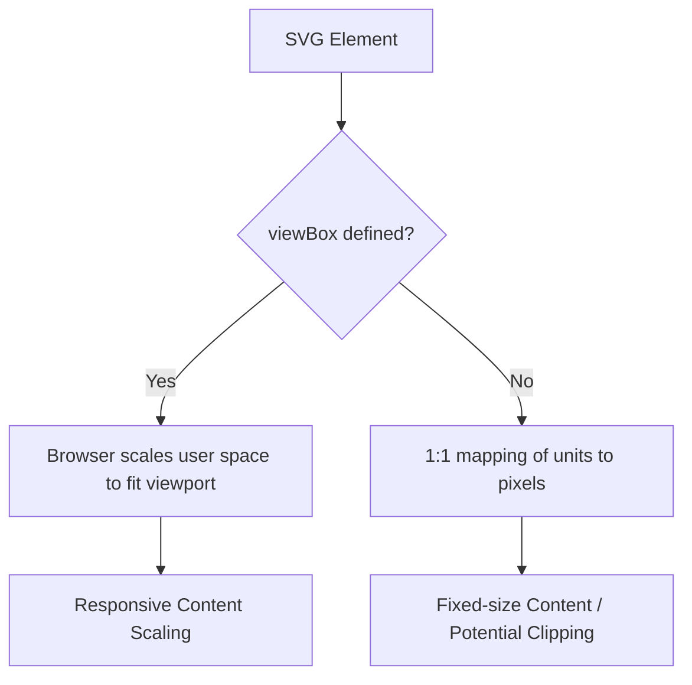

# viewBox

> An SVG attribute that defines the internal coordinate system and aspect ratio, allowing vector graphics to scale fluidly within any container

---

## What is viewBox?

The `viewBox` attribute acts as a virtual window over an SVG's artwork. It decouples the internal coordinate system (user space) from the physical dimensions of the SVG viewport. This ensures that graphics scale proportionally to fit their container without manual recalculation of coordinates.

Without this attribute, the SVG uses a 1:1 mapping between user units and viewport pixels. If the container size changes, the SVG viewport expands or shrinks, but the internal elements remain at their fixed absolute sizes. This often leads to "clipping" (if the container is smaller than the drawing) or excessive white space (if the container is larger). Adding a `viewBox` allows the browser to transform the internal coordinate system to fit the viewport dimensions.



---

## Why it matters

Fixed `height` and `width` attributes on an `<svg>` tag define the viewport's size but do not dictate how content scales. In responsive design, an SVG typically needs to occupy 100% of a fluid container's width.

A properly configured `viewBox` ensures that the internal geometry—paths, circles, and text—maintains its spatial relationship as the container scales. This is essential for cross-platform UI development, ensuring that a single icon asset looks identical on a 16px button and a 500px hero section.

---

## Syntax and structure

The syntax consists of four unitless values: `viewBox="min-x min-y width height"`.

- **min-x**: The left-most x-coordinate of the visible area.
- **min-y**: The top-most y-coordinate of the visible area.
- **width**: The horizontal span of the coordinate system.
- **height**: The vertical span of the coordinate system.

!!! note "Aspect Ratio Control"
    The `viewBox` works in tandem with the `preserveAspectRatio` attribute. If the aspect ratio of the `viewBox` does not match the aspect ratio of the SVG viewport (defined by `width` and `height` attributes or CSS), `preserveAspectRatio` determines whether to scale the image to fit (meet), fill the area by cropping (slice), or distort the image (none).

---

## Code example

This configuration enables the coordinate system to fill its parent container while maintaining a internal 100x100 grid:

```xml
<svg viewBox="0 0 100 100" width="100%" height="100%" aria-labelledby="svg-title">
  <title id="svg-title">A scalable circle graphic</title>
  <circle cx="50" cy="50" r="40" fill="#0078d4" />
</svg>
```

### Breakdown

- **`viewBox="0 0 100 100"`**: Defines a window from `(0,0)` to `(100,100)`.
- **`width="100%" height="100%"`**: Sets the SVG viewport to fill the parent container. The `viewBox` will stretch or shrink to fit this viewport.
- **`circle cx="50" cy="50" r="40"`**: Positions the circle relative to the 100-unit grid. Because `50,50` is the center of the `viewBox`, the circle remains centered regardless of the physical size of the SVG.

---

## Common pitfalls

### Negative Width or Height
In the `viewBox` attribute, the `width` and `height` parameters **must not be negative**. A negative value is a syntax error, causing the browser to ignore the `viewBox` entirely and revert to default 1:1 mapping.

### Zero Width or Height
If the `width` or `height` in the `viewBox` is set to `0`, the element will not be rendered.

### Overflow Clipping
By default, SVG content that falls outside the `viewBox` coordinates is often visible unless the SVG has `overflow: hidden` (the default in most browsers). However, it will not scale with the rest of the drawing.

---

## Tooling

- **Browsers**: Use the "Computed" tab in DevTools to see how `viewBox` transforms translate to actual pixel dimensions.
- **Optimization**: Tools like [SVGO](https://github.com/svg/svgo) can automatically calculate the tightest possible `viewBox` for a path, removing unnecessary whitespace.
- **Design Export**: When exporting from Figma or Illustrator, ensure "Include viewBox" is checked; otherwise, the tool may export fixed pixel dimensions only.

---

## Best practices

- **Use Unitless Values**: Values inside the `viewBox` attribute should always be unitless.
- **Remove Fixed Dimensions**: For maximum responsiveness in web projects, remove the `width` and `height` attributes from the `<svg>` tag (or set them to `100%`) and control the size via CSS.
- **Center via min-x/min-y**: If you want your coordinate `0,0` to be the center of your graphic, use a negative `min-x` and `min-y` (e.g., `viewBox="-50 -50 100 100"`).