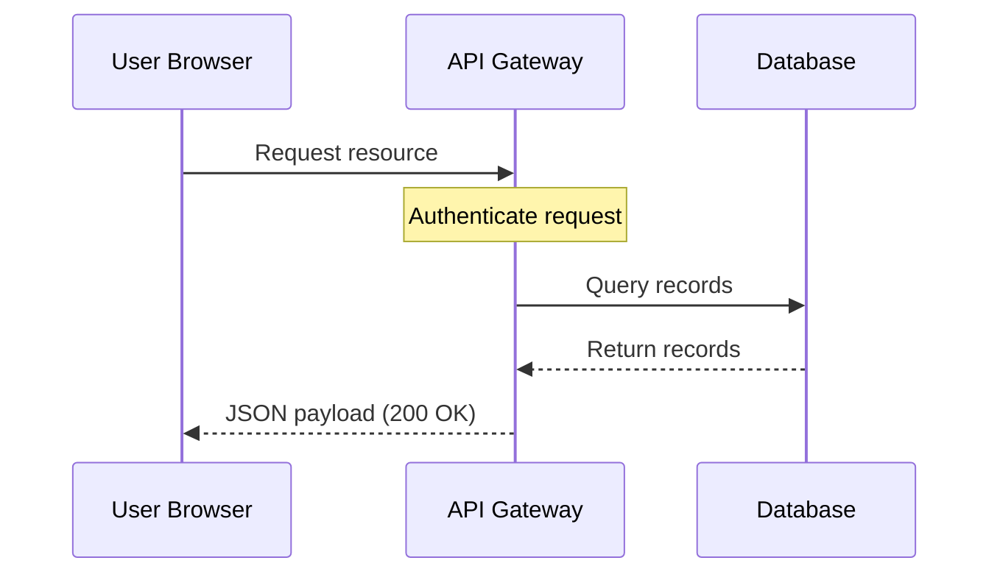

# Visual hierarchy

> *The arrangement of typography, color, and layout to prioritize information, helping users navigate complex documentation and immediately identify key details*

---

## Defining visual structure

Visual hierarchy dictates the order in which a user processes information. Instead of presenting technical content as an undifferentiated block of text, a strong hierarchy establishes a clear scanning path. By manipulating size, weight, color, and positioning, you signal the relative importance of each element, which distinguishes a high-level system warning from standard body text.

This approach manages cognitive load. When readers encounter a digital document, they immediately look for structure to categorize information. Cues such as heading depth and indentation transform dense data into an intuitive map, directly improving scannability for users who need to find specific technical specifications quickly.

---

## The cost of poor organization

Ignoring hierarchy forces the reader to expend working memory simply to distinguish between concepts, leading to rapid fatigue. For an engineer searching for a code block or a manager checking a release milestone, a lack of visual landmarks makes the content functionally inaccessible.

Predictable layouts reinforce information architecture (IA). When headings, lists, and callouts behave consistently, users build a reliable mental model of the content. This reduces cognitive friction, increases task success rates, and ultimately lowers support volume by making the documentation self-service.

---

## Core mechanics

Technical writers use several specific design tools to establish visual dominance:

- **Size and scale:** Largest elements attract the eye first. Top-level titles should be significantly larger than subheadings to indicate nesting.
- **Contrast and weight:** Bold type and heavy borders draw focus to critical actions or warnings, while lower-contrast elements are reserved for supporting context.
- **Proximity and grouping:** Physical distance signals relationship. A code snippet must be placed closer to its descriptive paragraph than to the following section.
- **Whitespace:** Generous margins force focus. Strategic negative space is as functional as the text itself.
- **Alignment:** Consistent vertical lines create order. Predictable alignment allows the eye to anchor to specific parts of the page.

---

## Design pattern example

The following comparison illustrates how structured layouts improve readability for installation steps.

=== "Unstructured layout"
    ### Installation
    To start, download the configuration package. This is essential for your server environment. Run the script. If you fail to run the script as an administrator, the installation will fail immediately. You will get a warning. Enter `sudo apt-get update` first. Next, install the server package by using the direct installer. After the terminal prompts you, press Y to confirm the installation. Finally, verify the system status.

=== "Structured layout"
    ## Installation
    Before you begin, ensure your server environment is active.
    
    !!! danger "Prerequisite: Administrator privileges required"
        You must run the installation script with `sudo` to avoid installation failure.
    
    To install the server package, complete the following steps:
    
    1. Update your package manager:
       ```bash
       sudo apt-get update
       ```
    2. Run the direct installer script:
       ```bash
       sudo ./install-server.sh
       ```
    3. When the terminal prompts you, press **Y** to confirm.
    
    ### Verification
    Once the installation finishes, verify the active system status:
    ```bash
    systemctl status server-package
    ```

---

### Implementation breakdown

The structured layout succeeds by applying these rules:

- **Type scale:** The H2 heading is visually dominant over the H3 subsection.
- **Visual grouping:** Lists separate discrete actions from conceptual descriptions.
- **Contrast callouts:** A high-contrast container (`!!! danger`) interrupts the scanning path to highlight risk.
- **Semantic styling:** Command-line strings and keyboard shortcuts (**Y**) are visually distinct from standard copy.

---

## User impact

Effective hierarchy serves two primary user behaviors:

1. Rapid orientation: Readers can determine the scope of a page in seconds by scanning titles and callouts.
2. Information retrieval: Returning users can skip prose and jump directly to visual anchors such as code samples or parameter tables.

---

## Best practices

- **Logical heading sequences:** Do not skip heading levels (for example, jumping from H1 to H3) for aesthetic reasons. Use the styling engine to manage appearance while maintaining semantic order.
- **Progressive disclosure:** Keep the main path clear by using expandable containers for advanced configurations or edge cases.

??? note "Example: View advanced configuration values"
    | Parameter | Type | Default | Description |
    | :--- | :--- | :--- | :--- |
    | `max_connections` | Integer | `100` | The maximum number of concurrent client connections. |
    | `timeout_seconds` | Float | `30.0` | Connection limit threshold before termination. |

- **Priority management:** If everything is highlighted, nothing is important. Limit bold text and callouts; a single page should rarely feature more than two high-priority warnings.
- **Visual translation:** Use diagrams to replace long paragraphs when describing complex system topologies.



---

## Common anti-patterns

- **The highlight desert:** Excessive formatting (too much bolding or multiple colorful alerts) causes the eye to move erratically as elements compete for attention.
- **The endless scroll:** Long passages of prose without subheadings or lists resemble unstructured specifications and discourage quick lookups.

---

## Testing usability

- **The squint test:** Step back and squint until the text blurs. You should still be able to identify main headings, code blocks, and primary callouts as distinct visual chunks. 
- **Task-based scanning:** Observe a colleague trying to find a specific detail, such as a port number. If they hesitate or scan aimlessly rather than jumping to a specific section, the hierarchy requires revision.