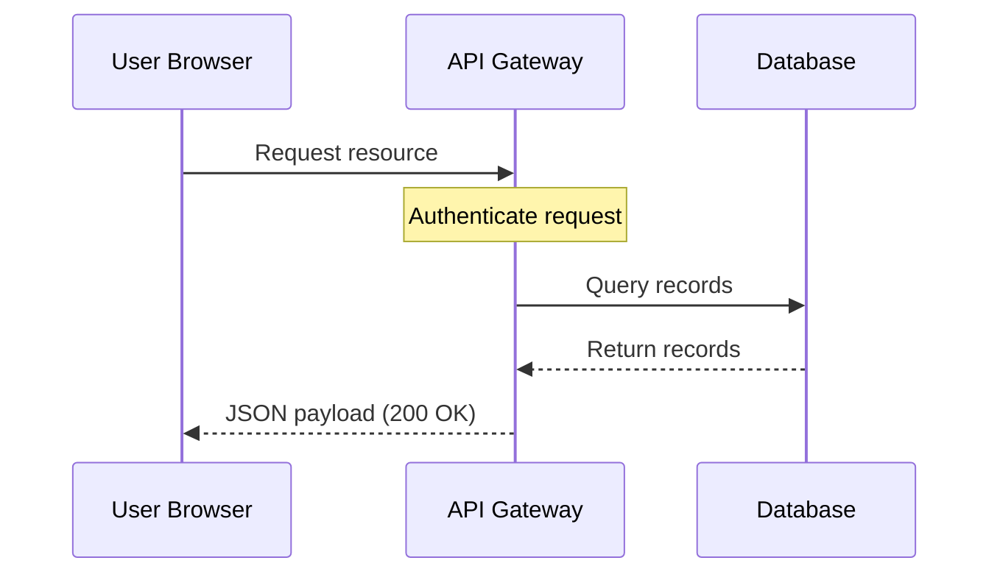

# Visual hierarchy

> The intentional arrangement of layout, typography, and color to guide a reader's eye toward the most critical technical details first

---

## What is visual hierarchy?

Visual hierarchy is a foundational concept in information design and visual communication. It determines the order in which users process information on a page or screen. Rather than presenting technical content as a uniform block of characters, use visual hierarchy to establish a clear path for the reader's eye. By adjusting size, weight, color, and positioning, you signal which elements are primary (such as headings or system warnings), secondary (such as subheadings or key terms), and tertiary (such as body text).

This design pattern is rooted in cognitive load theory. Users naturally seek structure to make sense of information. In a user interface (UI) or a digital document, structural cues allow readers to categorize information instantly. A strong visual structure transforms complex documentation into an intuitive experience. This structure directly improves scannability, allowing readers to browse documentation and find specific technical details quickly.

---

## Why it matters

When you ignore visual hierarchy, the usability of your document decreases. Without visual landmarks, your audience faces a dense wall of text. This lack of organization forces the reader to expend valuable working memory to distinguish between concepts, which leads to fatigue. For software engineers looking for a specific code block, or product teams checking a release milestone, poor hierarchy reduces findability.

Implementing a consistent hierarchy reduces cognitive friction. It reinforces your information architecture (IA) by establishing clear relationships between parent and child topics. When headings, lists, and callouts behave predictably, users build an accurate mental map of your content. This predictability keeps users engaged, increases task success rates, and reduces support ticket volume. 

---

## Core principles and anatomy

To build an effective hierarchy in technical writing, you must use specific design mechanics. These mechanics act as tools for establishing visual dominance:

  - **Size and scale:** Larger elements draw attention first. In a document layout, your top-level title must have the largest type. Subsequent headings should decrease in size proportionally to show their nested relationship.
  - **Contrast and weight:** Bold headings, heavy borders, and distinct color differences stand out against plain body text. High-contrast elements draw focus to critical actions, while lower contrast is reserved for supporting context.
  - **Proximity and grouping:** Place related items close to one another to signal their connection. For example, a code example must be physically closer to its descriptive paragraph than to the subsequent heading.
  - **Whitespace:** Surrounding an element with generous margins forces the eye to focus on that single element. Utilizing whitespace strategically is as important as choosing font size.
  - **Alignment:** Consistent vertical grid lines create anchors for the eye. Aligning elements predictably creates a sense of order that makes the document appear professional.

---

## Design pattern example

The following example compares how unstructured text and structured layouts present the same installation steps. 

=== "Unstructured layout"
    ### Installation
    To start, download the configuration package. This is essential for your server environment. Run the script. If you fail to run the script as an administrator, the installation will fail immediately. You will get a warning. Enter `sudo apt-get update` first. Next, install the server package by using the direct installer. After the terminal prompts you, press Y to confirm the installation. Finally, verify the system status.

=== "Structured layout"
    ## Installation
    Before you begin, ensure your server environment is active.
    
    !!! danger "Prerequisite: Administrator privileges required"
        You must run the installation script as an administrator to avoid installation failure.
    
    To install the server package, complete the following steps:
    
    1. Update your package manager:
       ```bash
       sudo apt-get update
       ```
    2. Run the direct installer script.
    3. When the terminal prompts you, press **Y** to confirm.
    
    ### Verification
    Once the installation finishes, verify the active system status.

---

### Breakdown of the pattern

In the structured layout, several hierarchy rules are active:
*   **Type scale:** The main heading (H2) is visually dominant over the subsection (H3).
*   **Visual grouping:** The list separates actions from conceptual paragraphs to prevent information overload.
*   **Contrast callouts:** The critical administrator warning uses a high-contrast container block (`!!! danger`) to interrupt the reader's scanning path, ensuring they see the risk before proceeding.
*   **Keyboard shortcuts and code blocks:** The command-line string and keyboard shortcut (**Y**) use distinct styling to separate them from the standard copy.

---

## Cognitive impact and user experience

A robust hierarchical structure helps readers achieve specific goals:

- **Rapid orientation:** Readers can determine the scope and relevance of a page within seconds. By scanning the title, headings, and callouts, they can identify if the page answers their question.
- **Efficient navigation and retrieval:** When users return to a document for a specific code sample or parameter, they often skip the surrounding text. They use visual anchors to jump to the relevant resource, often using search shortcuts like **Ctrl+F** to spot highlighted terms.

---

## Implementation best practices

To maintain a consistent content strategy, apply these rules across your layouts:

- **Follow a strict heading sequence:** Nest headings logically. Do not skip heading levels (for example, from H1 to H3) to achieve a specific font size. Use the styling engine to manage appearance while preserving semantic hierarchy.
- **Use progressive disclosure:** Do not present all technical data at once. Use expandable content containers to hide advanced configurations or edge cases, keeping the main reading path clear.

??? note "Example: View advanced configuration values"
    | Parameter | Type | Default | Description |
    | :--- | :--- | :--- | :--- |
    | `max_connections` | Integer | `100` | The maximum number of concurrent client connections. |
    | `timeout_seconds` | Float | `30.0` | Connection limit threshold before termination. |

- **Limit focal points:** If you highlight everything, nothing stands out. Limit the use of bold text, highlight colors, and warning boxes. A single page should rarely have more than two high-priority warning callouts.
- **Use diagrams for complex flows:** When documenting an intricate system topology or communication cycle, replace long paragraphs with a system diagram.



---

## Common anti-patterns

*   **The highlight desert:** This occurs when a page uses excessive formatting, such as bolding too many nouns or using multiple colorful alerts in a row. The reader's eye moves erratically because too many elements compete for attention.
*   **The endless scroll:** This pattern features long, uninterrupted passages of prose without clear subheadings, lists, or callouts. Even if the information is accurate, the absence of visual anchors makes the document look like an unstructured technical specification, discouraging quick lookups.

---

## How to validate and test usability

Evaluate your page layout’s visual strength with the following methods:

- **The squint test:** Step back from your screen and squint until the text becomes a blurry mass. Observe what stands out. You should still identify your main headings, code blocks, and primary callouts as distinct visual blocks. If the page blurs into a uniform gray rectangle, your hierarchy is weak.
- **Task-based scanning tests:** Ask a colleague to find a specific detail, such as a port number. Observe if their eyes move directly to the correct section or if they scan aimlessly. If they hesitate, consider revising your headings or adding a reference list.