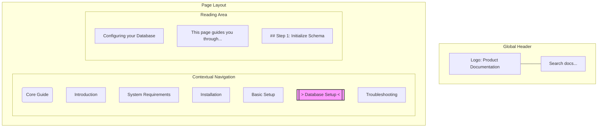

# Wayfinding

> The system of visual and structural cues used to orient users and guide their navigation through complex information environments

---

## The mechanics of digital orientation

Wayfinding is a concept borrowed from architecture and urban planning. Just as an airport uses signage and landmarks to move travelers toward a gate, technical documentation relies on structural indicators to help readers map out information architecture. 

When a developer lands on your site, they aren't just reading text; they are scanning for environmental cues. Effective wayfinding turns a sprawling documentation site into a predictable system. By organizing menus, page headers, and search boundaries into a cohesive framework, you minimize visual noise and allow readers to transition seamlessly from high-level overviews to granular technical tasks.

---

## Why orientation beats navigation

Navigation is the act of moving; wayfinding is the cognitive process of knowing where you are and where you can go. This distinction is critical because technical readers are already managing heavy mental workloads. When a site forces a user to guess their location, they hit "cognitive fatigue." This leads to choice paralysis—and eventually, abandoned sessions and unnecessary support tickets.

Most users bypass your homepage entirely, arriving at deep-linked pages via search engines. Without clear environmental cues, these pages become "black boxes." Wayfinding solves this by immediately communicating a page's place within the product ecosystem, providing the context necessary to complete a task without backtracking.

---

## Core principles

- **Semantic hierarchy:** Use typographical weight and logical heading levels to make relationships between topics obvious at a glance.
- **Visual anchors:** Persistent elements—like a fixed header or a highlighted "active" state in the sidebar—act as North Stars during long scrolling sessions.
- **Progressive disclosure:** Keep the interface clean by showing high-level summaries first, reserving advanced technical details for interactive, expandable sections.

---

## Applied design patterns

A well-architected layout uses several overlapping elements to keep the user grounded.

### Pattern breakdown

1. **Persistent top header:** Sets global context and ensures the search bar is always reachable, no matter the page depth.
2. **Active-state indicators:** Highlighting the current page in the sidebar (e.g., `> Database Setup <`) provides an immediate "You Are Here" marker.
3. **Structured reading area:** Consistent capitalization and whitespace guide the eye and separate core instructions from secondary information.

!!! tip "Contextual Search"
    Enhance the search experience by allowing users to filter results within their current directory or category, preventing them from losing their place.

---

## Implementation best practices

*   **Synched navigation:** Your sidebar should automatically expand and highlight the current section as the user scrolls. A static or closed menu leaves the reader without an anchor.
*   **Search landing identity:** Every page needs a clear identity. Include the product logo and parent-category breadcrumbs so users arriving from Google know exactly where they’ve landed.
*   **Visual hierarchy over dividers:** Use font size and weight to distinguish sections. Too many horizontal lines create "visual friction" that breaks the flow of reading.

---

## Common anti-patterns

*   **The "Deep Link" void:** A page that lacks a sidebar or breadcrumbs, leaving the user stranded with no way to see related content.
*   **Navigation bloat:** A "wall of links" where every single page in the hierarchy is visible at once. This overwhelms the user and obscures the primary path.

---

## Testing for usability

*   **The Squint Test:** Squint at the screen until the text blurs. If the main content, sidebar, and headers aren't still clearly distinguishable by their shape and position, your visual hierarchy is too weak.
*   **Context Restoration Test:** Send a colleague a link to a deep technical page. If they can’t identify the product name and the parent topic within 10 seconds, your wayfinding needs work.