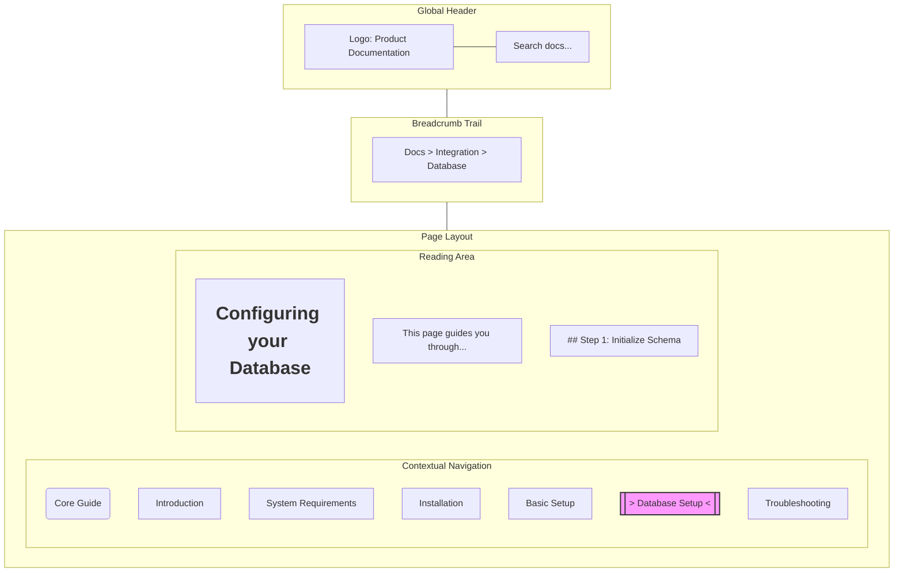
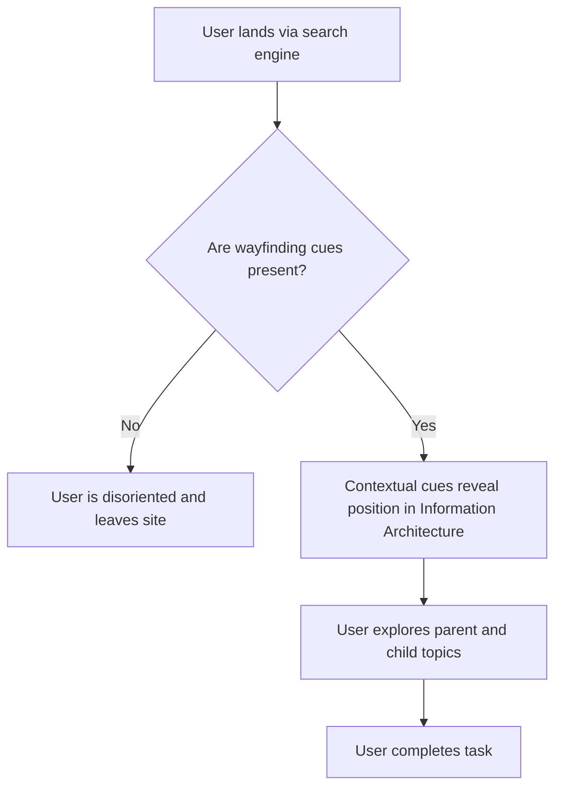

# Wayfinding

> The system of visual and structural cues used to orient users and guide their navigation through complex information environments

---

## The mechanics of digital orientation

Wayfinding is a concept borrowed from architecture and urban planning. Just as an airport uses signage and landmarks to move travelers toward a gate, technical documentation relies on structural indicators to help readers map out information architecture (IA).

When a developer lands on your site, they scan for environmental cues. Effective wayfinding turns a sprawling documentation site into a predictable system. By organizing menus, page headers, breadcrumbs, and search boundaries into a cohesive framework, you minimize cognitive load and allow readers to transition seamlessly from high-level overviews to granular technical tasks.

---

## Why orientation beats navigation

Navigation is the physical or digital act of moving between points; wayfinding is the cognitive process of determining one's current location and possible trajectories. This distinction is critical because technical readers manage high mental workloads. When a site forces a user to deduce their location, they experience "cognitive fatigue," leading to choice paralysis and abandoned sessions.

Most users bypass homepages, arriving at deep-linked pages via search engines. Without clear environmental cues, these pages become "black boxes." Wayfinding solves this by immediately communicating a page's position within the product ecosystem, providing the context necessary to complete a task without backtracking.

---

## Core principles

- **Semantic Hierarchy:** Use logical HTML heading levels (`<h1>` through `<h6>`) to establish a machine-readable and visually obvious relationship between topics. This ensures wayfinding remains functional for both sighted users and screen reader users.
- **Visual Anchors:** Persistent elements—like a fixed header or an "active" state in the sidebar—act as fixed reference points during long scrolling sessions.
- **Progressive Disclosure:** Manage navigation complexity by showing top-level categories first, using interactive "accordion" menus or drill-downs to reveal advanced technical details only when requested.

---

## Applied design patterns

A well-architected layout uses overlapping elements to keep the user grounded.

### Pattern breakdown

1. **Persistent Global Header:** Sets global context and ensures the search bar is always reachable, regardless of page depth.
2. **Breadcrumb Trails:** Provides a linear path back to the entry point, allowing users to move up the hierarchy (vertical navigation) immediately.
3. **Active-State Indicators (Scrollspy):** Highlighting the current page in the sidebar provides an immediate "You Are Here" marker that updates as the user scrolls through sub-sections.
4. **Structured Reading Area:** Consistent use of whitespace and typography separates core instructions from secondary information.

!!! tip "Contextual Search"
    Enhance the search experience by allowing users to filter results within their current directory or category, preventing "context switching" during the discovery phase.

---

## Implementation best practices

*   **Scroll-Active Navigation (Scrollspy):** The sidebar should automatically expand and highlight the current section as the user scrolls. A static menu leaves the reader without a current-location anchor.
*   **Search Landing Identity:** Every page must be self-describing. Include the product logo and parent-category breadcrumbs so users arriving from external search engines can orient themselves in less than two seconds.
*   **Logical Nesting:** Ensure that the sidebar structure matches the URL slug structure (e.g., `/docs/integration/database` should correspond to `Docs > Integration > Database` in the UI).

---

## Common anti-patterns

*   **The "Deep Link" Void:** A page that lacks a sidebar, breadcrumbs, or header, leaving the user stranded without a path to related content.
*   **Navigation Bloat:** A "wall of links" where every page in the hierarchy is visible at once, overwhelming the user and obscuring the primary path.
*   **Orphaned Pages:** Pages that exist in the search index but are not linked within the site's structural menus.

---

## Testing for usability

*   **The Squint Test:** Squint at the screen until the text blurs. If the main content, sidebar, and headers are not distinguishable by their shape and position, the visual hierarchy is insufficient.
*   **Context Restoration Test:** Send a colleague a link to a deep technical page. If they cannot identify the product name and the parent topic within 10 seconds, the wayfinding cues are failing.