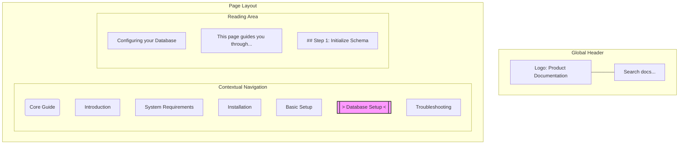

# Wayfinding

> The design of spatial and visual cues that help users determine their location, orient themselves, and navigate successfully through complex documentation

---

## What is wayfinding?

Wayfinding is a design concept adapted from architecture and urban planning. In physical spaces, signs, pathways, and landmarks help people navigate environments like airports or hospitals. In technical documentation, wayfinding refers to the organization and presentation of structural indicators that help readers build a mental model of your information architecture. 

When users visit your documentation, they scan the layout for clues to help them orient themselves. Effective wayfinding designs the entire workspace to provide context. By organizing menus, page headers, search boundaries, and interactive controls into a predictable system, you reduce visual confusion. This allows readers to move between high-level concepts and specific technical tasks.

---

## Why wayfinding matters

Wayfinding is essential for managing cognitive load. In technical documentation, readers already process complex code, APIs, and engineering concepts. If they must also expend energy to determine their location on your site, they experience cognitive fatigue. Documentation that ignores these principles leads to choice paralysis and poor scannability. This often results in users abandoning the site to file support tickets, which increases organizational costs.

Most users land directly on deep, nested pages through search engines rather than starting at the home page. If these pages lack clear environmental cues, they become "black boxes" where the user cannot determine the context. Effective wayfinding communicates where a page sits in the product ecosystem, helping users complete their tasks efficiently.

---

## Core principles and anatomy

- **Semantic hierarchy:** Organize content with logical, nested headings and clear typographical weight. This structure allows readers to scan the page and understand the relationship between topics and subtopics.
- **Visual anchors:** Use persistent, predictable design elements, such as a fixed navigation header, highlighted active states, and distinct icons. These elements anchor the user's vision during scrolling.
- **Progressive disclosure:** Shield the reader from overwhelming technical details by presenting high-level summaries first. Offer interactive options to expand advanced content only when it is necessary.

---

## Design pattern example

The following layout pattern shows how wayfinding elements work together to orient a user.

### Breakdown of the pattern

This pattern demonstrates how wayfinding elements orient a user:

1. **Persistent top header:** Establishes the global site context and provides immediate access to search, regardless of the user's depth in the hierarchy.
2. **Contextual sidebar navigation:** Uses an active state indicator (`> Database Setup <`) to show the user's exact location in the documentation ecosystem.
3. **Structured reading area:** Uses distinct heading weights, consistent capitalization, and whitespace to guide the reader and highlight key actions.

!!! tip "Keep users oriented"
    When you design your documentation layout, ensure the search bar preserves the user's current directory context if they choose to search within a specific section.

---

## Cognitive impact and user experience

- **Reduced cognitive friction:** A consistent interface eliminates the mental effort needed to learn how to use your site. The reader can focus entirely on the technical content.
- **Enhanced task-based usability:** Clear visual paths help users find instructions quickly, which improves the time to value for your product and reduces frustration.

---

## Implementation best practices

- **Maintain contextual sync:** Ensure your navigation menu automatically expands and highlights the active page as the user scrolls. If the sidebar remains static or closed, the user loses their primary anchor.
- **Design for search landings:** Every page must contain a structural identity, such as a logo and parent-category labels, to tell the user where they are immediately.
- **Establish a strong visual hierarchy:** Use distinct sizes and weights for different heading levels. Ensure your body text is legible, and use spacing instead of heavy divider lines to separate sections.

---

## Common anti-patterns

- **The disoriented deep link:** This occurs when a user lands on a page with no surrounding navigation or visual indicators of the parent topic. 
- **Navigation clutter:** Displaying every page of a massive documentation site at once creates a "wall of links" that causes choice paralysis and defeats the purpose of wayfinding.

---

## How to validate and test usability

- **Run a five-second squint test:** Open a documentation page and squint until the text is blurry. If you can still distinguish the main content area, sidebar, and headers, your visual hierarchy is effective.
- **Perform a context restoration test:** Give a participant a link to a deep technical page. Ask them to identify the product, the parent topic, and the troubleshooting section. If they cannot answer within 10 seconds, improve your wayfinding cues.