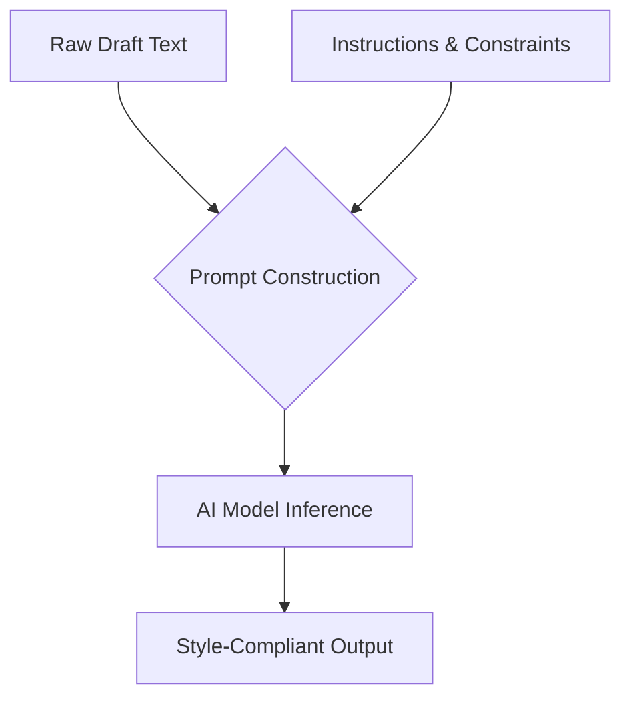

# Zero-shot prompting

> A technique where an AI model executes tasks using only natural language instructions, without needing prior examples or task-specific training data

---

## Direct instruction without examples

Zero-shot prompting leverages the weights and semantic associations a model acquired during pre-training to complete tasks without being shown "before and after" examples. While traditional machine learning often requires specialized datasets to learn a task-specific pattern, zero-shot relies on the model’s ability to generalize from its training distribution to interpret a command in context.

In technical writing, this enables instant linguistic transformations. You can shift a document from passive to active voice or simplify complex descriptions by providing a specific instruction set. Because the logic is handled by the model's inference engine, it removes the need for complex regex patterns or hard-coded translation databases for many content-shaping tasks.

---

## Efficiency in the documentation pipeline

Manual editing is often the primary bottleneck in **Docs as Code (DaC)** workflows. By automating the alignment of draft content with corporate style guides, teams can redirect focus toward information architecture and user research. 

Integrating zero-shot automation allows style and consistency checks to happen at the point of creation—often via CI/CD hooks or IDE plugins—ensuring the "human in the loop" focuses on technical accuracy rather than rote grammar policing.

---

## Structural anatomy of a prompt

A functional zero-shot prompt provides the model with clear boundaries through a structured syntax:

*   **Persona:** Sets the professional context and tone (e.g., "You are an expert technical editor").
*   **The Command:** A direct, action-oriented instruction in the imperative mood.
*   **Constraints:** Explicit rules that define the output, such as character limits, forbidden words, or specific tone requirements.
*   **Input/Context:** The raw source text to be processed, often delimited to separate it from instructions.

---

## Design pattern example

This flowchart illustrates how raw text and instructions are combined into a single prompt for the model to process.



=== "The Prompt (Input)"
    ```markdown
    Role: You are an expert technical editor.
    Task: Rewrite the input text below to comply with plain language standards.
    
    Constraints:
    - Use active voice.
    - Keep the sentence under 15 words.
    - Avoid nominalizations (e.g., use "Verify" instead of "Perform verification" or "Utilization").
    
    Input: "Utilization of the system interface should be initiated by the operator upon receipt of the verification token."
    ```

=== "The Response (Output)"
    ```markdown
    "Verify the token to start using the system."
    ```

By removing passive phrasing and nominalizations in a single inference step, the model acts as a real-time filter. The **Constraints** serve as guardrails, preventing the model from adding conversational filler or ignoring style rules.

---

## Impact on content usability

Automating these edits directly improves how users consume information:

- **Scanability:** Simplifying language allows developers to quickly locate commands without parsing dense paragraphs.
- **Direct Action:** Converting passive instructions into direct, imperative steps reduces the cognitive effort required for a reader to determine their next move.

---

## Best practices for implementation

To achieve consistent results across different LLMs, apply these tactical rules:

- **Use imperative verbs:** Start instructions with *Rewrite*, *Format*, or *Convert*. Avoid soft phrasing like "Please try to make this better."
- **Define negative constraints:** Explicitly state what the model should avoid (e.g., "Do not change the code snippets within backticks").
- **Use Delimiters:** Use Markdown delimiters, such as triple backticks (```) or XML tags (<text></text>), to ensure the model doesn't confuse instructions with the input text.

!!! tip "Style integration"
    Instead of writing new rules from scratch, provide the model with a specific excerpt from your organization's style guide as context. This forces the model to apply your team's specific standards to the draft.

---

## Potential pitfalls

Poorly designed zero-shot prompts can degrade content quality through:

- **Vague commands:** Instructions like "polish this draft" lack the specificity needed for the model to make logical choices, often resulting in "hallucinated" details.
- **Conflicting constraints:** Demanding extreme brevity while also requiring detailed technical explanations often causes the model to truncate critical information.

---

## Validation and testing

Because LLMs are non-deterministic, you must validate outputs:

- **Automated Readability Auditing:** Use tools (like Vale or Hemingway) to verify that the output actually meets the targeted reading grade level.
- **Regression Testing:** Maintain a "golden set" of prompt-response pairs to ensure that model updates or prompt tweaks do not degrade the quality of common edits.