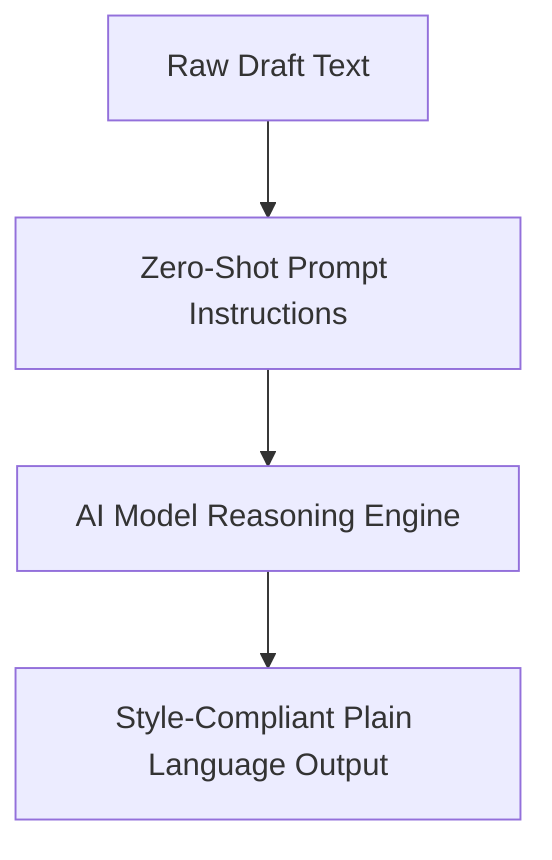

# Zero-shot prompting

> Instructing AI models to execute editorial tasks relying purely on built-in linguistic training without provided examples

---

## What is zero-shot prompting?

Zero-shot prompting is a technique in AI where you instruct a generative model to complete a specific task without providing examples or task-specific training data in the prompt. Instead of showing the model "before" and "after" examples of a translation, you rely on the model's pre-existing parameters and semantic understanding to interpret and execute your request. 

In technical writing, you can use this approach to perform instant linguistic transformations, such as converting instructions to the active voice or simplifying complex technical jargon. Unlike traditional automation that might require regular expressions or translation databases, zero-shot prompting uses natural language instructions to shape content.

---

## Why it matters

Zero-shot prompting reduces the mental effort required to edit and maintain large documentation suites. By automating repetitive tasks—such as aligning draft content with a corporate style guide or translating industry jargon into accessible language—you can focus on structural planning and content design.

According to cognitive load theory, minimizing the mental energy required for rote editing frees up creative resources for more complex tasks like user journey mapping and audience analysis. If documentation teams ignore these automation strategies, they risk creating bottlenecks in **Docs as Code (DaC)** pipelines with manual reviews. This delay can lead to outdated documentation, high maintenance costs, and a fragmented user experience.

---

## Core principles and anatomy

A successful zero-shot prompt uses a structured syntax that gives the model clear boundaries. 

*   **Role definition (The persona):** Set a professional context (for example, "You are an expert technical editor") to align the model's tone.
*   **The command (The instruction):** Use a clear, action-oriented direction in the imperative mood to describe exactly what to do.
*   **Contextual constraints:** Define rules that limit the output, such as length restrictions, tone guidelines, or formatting rules.
*   **Input payload:** Provide the raw source text or data to process.

---

## Design pattern example

The following flowchart shows the process of using a zero-shot prompt to transform complex technical language into plain language.



=== "The Prompt (Input)"
    ```markdown
    Role: You are an expert technical editor.
    Task: Rewrite the input text below to comply with plain language standards.
    
    Constraints:
    - Use active voice.
    - Keep sentences under 15 words.
    - Avoid nominalizations (for example, use "verify" instead of "perform verification").
    
    Input: "Utilization of the system interface should be initiated by the operator upon receipt of the verification token."
    ```

=== "The Response (Output)"
    ```markdown
    "Enter the verification token to start using the system."
    ```

### Breakdown of the pattern

In the example above, the prompt guides the model to remove passive phrasing and unnecessary complexity.

1. The **Role** sets the expectation for professional, clear communication.
2. The **Task** states the primary objective.
3. The **Constraints** act as guardrails, preventing the model from generating conversational filler or leaving passive structures in place. 
4. The **Input** provides the raw material, allowing the model to perform the task in a single step.

---

## Cognitive impact and user experience

Integrating zero-shot automation into your writing workflow improves how readers interact with your content.

- **Reduced mental fatigue:** By converting passive instructions into direct, action-oriented steps, you ensure readers do not have to deconstruct complex sentences to determine their next steps.
- **Improved information scanability:** Simplifying language allows developers and engineers to scan a page quickly, locate the commands they need, and return to their work.

---

## Implementation best practices

To get consistent results from zero-shot prompts across different tools and platforms, follow these rules:

- **Use strong action verbs:** Start your instructions with direct commands like *Rewrite*, *Format*, or *Convert*. Do not use passive requests like "Can you try to make this easier to read?"
- **State negative constraints clearly:** Tell the model what it must *not* do. For example, specify: "Do not alter any command-line code blocks or variable names."
- **Keep instructions separate from content:** Use Markdown markers, such as blockquotes or code fences, to separate your instructions from the text you want to edit.

!!! tip "Style integration"
    You can paste rules from your organization's style guide into your prompt. This ensures the model applies your team's specific spelling, capitalization, and formatting standards to the draft.

---

## Common anti-patterns

When zero-shot prompts are poorly designed, they can introduce errors and reduce content quality.

- **The vague command:** Asking the model to "make this text better" or "polish this draft." Without explicit constraints, the model might make arbitrary changes or introduce inaccurate information.
- **Constraint overload:** Including too many conflicting instructions in a single prompt. If you ask the model to be extremely concise while also asking it to explain every technical detail, the quality of the output will decrease.

---

## How to validate and test usability

Because zero-shot prompting relies on natural language, you must test the outputs to ensure they are safe and accurate.

- **Perform a readability check:** Run automated readability tests on the output to ensure the model lowered the reading difficulty and simplified the grammar.
- **Conduct collaborative usability testing:** Have a team member follow the generated instructions. If they hesitate or make mistakes, refine the constraints in your prompt template.