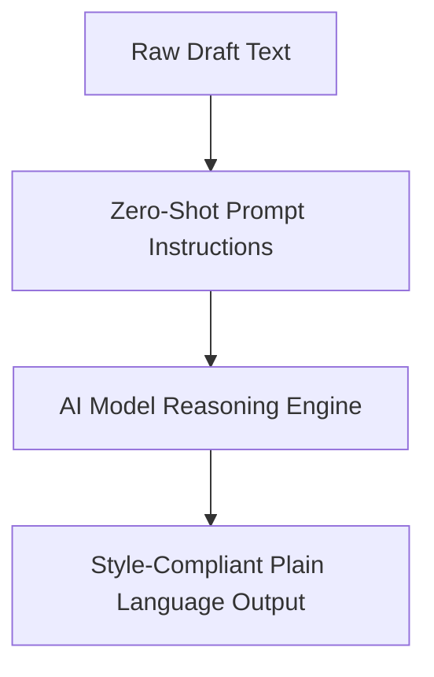

# Zero-shot prompting

> A technique where an AI model executes tasks using only natural language instructions, without needing prior examples or task-specific training data

---

## Direct instruction without examples

Zero-shot prompting leverages a generative model's internal parameters to complete tasks without being shown "before and after" examples. While traditional machine learning requires datasets to learn a pattern, zero-shot relies on the model’s semantic understanding to interpret a command.

In technical writing, this translates to instant linguistic transformations. You can shift a document from passive to active voice or de-jargonize complex descriptions simply by asking. Because it removes the need for regex or custom translation databases, it acts as a flexible layer for shaping content on the fly.

---

## Efficiency in the documentation pipeline

Manual editing is often the primary bottleneck in **Docs as Code (DaC)** workflows. By automating the alignment of draft content with corporate style guides, teams can redirect focus toward information architecture and user research. 

Relying on manual reviews for rote tasks—such as checking for accessible language or terminology consistency—increases maintenance costs and risks delayed releases. Integrating zero-shot automation allows these checks to happen at the point of creation, ensuring the "human in the loop" focuses on high-level accuracy rather than grammar policing.

---

## Structural anatomy of a prompt

A functional zero-shot prompt provides the model with clear boundaries through a structured syntax:

*   **Persona:** Sets the professional context (e.g., "You are an expert technical editor").
*   **The Command:** A direct, action-oriented instruction in the imperative mood.
*   **Constraints:** Rules that define the output, such as character limits or specific tone requirements.
*   **Input:** The raw source text to be processed.

---

## Design pattern example

This flowchart illustrates the transition from a raw technical draft to a simplified output using a single instruction set.



=== "The Prompt (Input)"
    ```markdown
    Role: You are an expert technical editor.
    Task: Rewrite the input text below to comply with plain language standards.
    
    Constraints:
    - Use active voice.
    - Keep sentences under 15 words.
    - Avoid nominalizations (for example, use "verify" instead of "perform verification").
    
    Input: "Utilization of the system interface should be initiated by the operator upon receipt of the verification token."
    ```

=== "The Response (Output)"
    ```markdown
    "Enter the verification token to start using the system."
    ```

By removing passive phrasing and unnecessary complexity in one step, the model acts as a real-time filter. The **Constraints** serve as guardrails, preventing the model from adding conversational filler or ignoring style rules.

---

## Impact on content usability

Automating these edits directly improves how users consume information:

- **Scanability:** Simplifying language allows developers to quickly locate commands without parsing dense paragraphs.
- **Direct Action:** Converting passive instructions into direct steps reduces the cognitive effort required for a reader to determine their next move.

---

## Best practices for implementation

To achieve consistent results across different LLMs, apply these tactical rules:

- **Use imperative verbs:** Start instructions with *Rewrite*, *Format*, or *Convert*. Avoid soft phrasing like "Please try to make this better."
- **Define negative constraints:** Explicitly state what the model should avoid (e.g., "Do not change the code snippets within backticks").
- **Separate instructions from content:** Use Markdown delimiters, such as blockquotes or triple backticks, to ensure the model doesn't confuse your instructions with the text it is supposed to edit.

!!! tip "Style integration"
    Instead of writing new rules, try pasting a specific section of your organization's style guide into the prompt. This forces the model to apply your team's specific standards to the draft.

---

## Potential pitfalls

Poorly designed zero-shot prompts can degrade content quality through:

- **Vague commands:** Instructions like "polish this draft" lack the specificity needed for the model to make logical choices. This often results in "hallucinated" details or arbitrary stylistic changes.
- **Conflicting constraints:** Demanding extreme brevity while also requiring detailed technical explanations often causes the model to fail at both.

---

## Validation and testing

Because natural language is non-deterministic, you must validate AI-generated outputs:

- **Readability auditing:** Use automated tools to verify that the output actually lowered the reading grade level as requested.
- **Peer verification:** Have a subject matter expert follow the generated instructions. If the instructions lead to confusion, the prompt constraints need refinement.