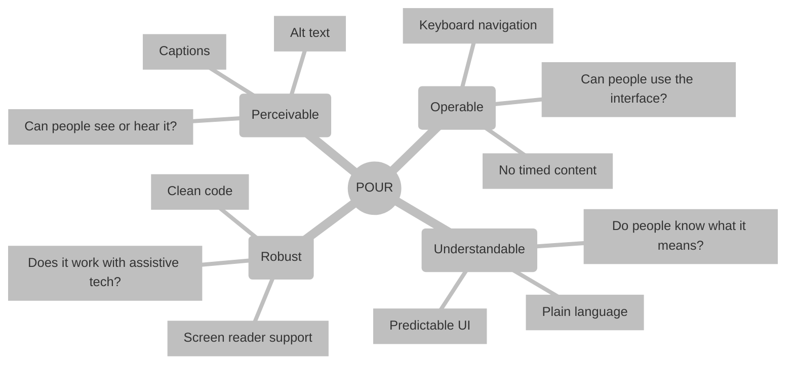

# Document accessibility standards
*Making documentation inclusive and accessible for people with disabilities*

---

In [technical communication](../technical-writing/basics.md), accessibility (abbreviated as **a11y**) is a fundamental requirement, not an optional feature. Documentation that a screen reader cannot read or that a user cannot navigate by using a keyboard is, by definition, incomplete.

Making your [knowledge base](../doc-stack/kb-architecture.md) accessible means removing barriers for people with visual, auditory, motor, or cognitive disabilities. 

This guide provides a compliance framework based on international standards to make sure your documentation is inclusive for everyone in the technical community.

---

## Compliance framework (W3C)

The [World Wide Web Consortium (W3C)](https://www.w3.org/){: target="_blank" rel="noopener" } is the international body that develops web standards. Its primary contribution to accessibility is the [Web Content Accessibility Guidelines (WCAG)](https://www.w3.org/WAI/standards-guidelines/wcag/){: target="_blank" rel="noopener" }, which provide the benchmarks used by governments and corporations worldwide to measure digital inclusivity.

### The four principles of a11y

The POUR acronym represents the four functional categories of a11y. For documentation to be accessible, it must meet all four of these requirements.

*   **Perceivable:** Content must be presented in a way that people can see or hear. This involves providing alternatives for non-text content, such as alternative text (alt text) for images and captions for videos.
*   **Operable:** People must be able to use the interface and navigate the content. This means making sure all functionality is available from a keyboard and avoiding content that uses a timer or expires too quickly.
*   **Understandable:** People must be able to understand the information and the operation of the user interface (UI). You can achieve this by using [plain language](../technical-writing/plain-language.md) and making sure the UI behaves in predictable ways.
*   **Robust:** Content must be compatible with a wide variety of technologies, such as screen readers and other assistive tools. This requires using clean code and [standard markup](../doc-stack/markup-languages.md) so that assistive technology can interpret the data reliably.



---

## Structural checklist (headings and navigation)

People who use screen readers do not read a page line by line from the beginning. Instead, they use heading navigation to move through the structure of an article, similar to the way a sighted user might scan a table of contents.

- **Logical heading rank:** Always use a linear hierarchy (for example, Heading 1 > Heading 2 > Heading 3). Do not select a heading level based on the font size. Skipping from Heading 2 to Heading 4 confuses the map that assistive software generates.
- **Descriptive links:** Do not use generic link text such as "click here" or "read more." Link text must be meaningful out of context.

```markdown
❌ To see the API, [click here](url).
✅ Review the [API Endpoint Specification](url) for more details.
```

- **List structures:** Always use Markdown list syntax (`-` or `1.`). This allows screen readers to announce the number of items in a list. For example, a screen reader might say "List, 5 items," which helps the user manage their [cognitive load](../technical-writing/cognitive-load.md).

---

## Visual and media checklist (alt text and color)

You must translate visual information into text to make it perceivable by people who are blind or have low vision. This process involves providing text alternatives for non-text elements such as screenshots, diagrams, and icons. 

When you include descriptive text, you make sure that assistive technologies can communicate the purpose and meaning of the visual to the user. This approach also benefits people who use high-contrast modes or those who work in environments where images do not load correctly.

### Meaningful alt text

Every image that conveys information must have an `alt` description. If an image is purely decorative, such as a separator line, it should have an empty alt attribute (`alt=""`) so the screen reader skips it.

### Color and contrast

- **Contrast ratio:** Body text must maintain a contrast ratio of at least **4.5:1** against the background. For large text, a **3:1** ratio is acceptable.
- **Color dependency:** Do not use color as the only way to convey meaning.

!!! danger "Accessibility failure"
    *"Required fields are highlighted in **red**."*

    **Why this fails:** Colorblind users or those who use high-contrast modes might not see the red highlight. 

    **Fix:** *"Required fields are marked with an asterisk (`*`) and highlighted in red."*

---

## Alt text blueprint

Writing alt text for technical documentation is an art that requires you to balance brevity with the specific details a person needs to understand a concept. 

Effective alt text provides the same information to a person who uses a screen reader that a sighted person receives from the image. 

When you describe technical visuals, such as architecture diagrams or UI screenshots, focus on the function and the key information the image conveys. Your goal is to be concise while making sure you do not omit necessary context.

| Image type | Avoid (non-descriptive) | Use (functional) |
| :--- | :--- | :--- |
| **Simple icon** | "icon_12.svg" | "Information icon" or "Warning icon" |
| **Screenshot** | "Settings page" | "The Settings page with the 'Enable dark mode' toggle set to 'On'." |
| **Flowchart** | "Workflow diagram" | "Process flow: The user submits the form, the system validates the data, and a success message appears." |

---

## Screen reader optimization

Hearing a document is different from seeing it. Use the following techniques to optimize the auditory experience:

- **Acronym awareness:** Spell out the first instance of an acronym, such as *user interface (UI)*. This makes sure the screen reader pronounces it correctly rather than trying to read it as a word.
- **Table headers:** Use the proper table syntax with a header row. Screen readers repeat the header name as the user moves through cells, which helps the user keep track of their location in a large data set.
- **Code block hints:** Always include the language hint in your code fences, such as ` ```python `. Many screen readers use this to change their reading cadence. They treat symbols such as `{` or `=>` appropriately for that specific language.

??? note "Note on mathematical formulas"
    If you use complex math, make sure you render it by using tools that support [MathML](https://www.w3.org/Math/){: target="_blank" rel="noopener" }. This allows screen readers to read the equation logically (for example, *"a squared plus b squared"*) rather than as a string of random characters.

---

## Final validation checklist

Before pushing your article to the [repository](../doc-stack/git.md), perform this quick audit to make sure you are following WCAG standards.

- [ ] **Headings:** Verify the Heading 1 > Heading 2 > Heading 3 structure with no skipped levels.
- [ ] **Images:** Make sure all functional images have descriptive `alt` text.
- [ ] **Links:** Make sure all link texts describe the destination instead of using "click here."
- [ ] **Contrast:** Check the text and background contrast by using a [contrast checker](https://webaim.org/resources/contrastchecker/){: target="_blank" rel="noopener" }.
- [ ] **Code:** Make sure all code blocks have a language identifier.
- [ ] **Lists:** Make sure all lists use standard Markdown syntax.
- [ ] **Color:** Do not convey information by using color alone.

!!! tip "Professional validation tools"
    To perform a deep-dive audit, use [Lighthouse](https://developers.google.com/web/tools/lighthouse){: target="_blank" rel="noopener" } (built into [Chrome DevTools](https://developer.chrome.com/docs/devtools/){: target="_blank" rel="noopener" }) or the [WAVE Evaluation Tool](https://wave.webaim.org/){: target="_blank" rel="noopener" }. For a true test, turn on your computer's built-in screen reader ([VoiceOver](https://www.apple.com/accessibility/vision/){: target="_blank" rel="noopener" } on macOS or [Narrator](https://support.microsoft.com/en-us/accessibility/windows/narrator/complete-guide-to-narrator){: target="_blank" rel="noopener" } on Windows) and try to navigate your page with your eyes closed.