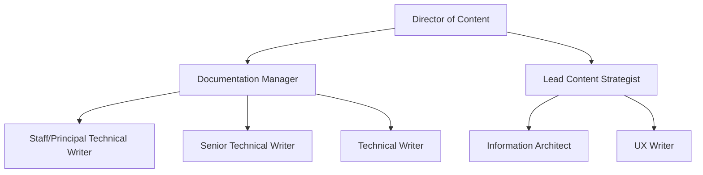

# Roles in technical communication
*An overview of career paths, required skill sets, and modern workflows in the documentation industry*

---

[Technical communication](../technical-writing/basics.md) is an evolving ecosystem. For technical writers, the career path has shifted from being a generalist who creates manuals to becoming a specialist integrated into the software development lifecycle (SDLC). 

As products adopt cloud-native and API-first architectures, technical writers are increasingly required to work directly in codebases and manage content as a strategic asset.

---

## Product-focused roles

The following roles are embedded within engineering and product teams. The focus is on reducing user friction through clear instruction and seamless interface copy.

| Job title | Primary output | Key tools |
| :--- | :--- | :--- |
| **Technical writer** | User guides, release notes, troubleshooting articles | Markdown, static site generators (SSGs), Git, VS Code, GitHub Copilot |
| **API documentation writer** | OpenAPI specifications, reference documentation, integration guides | Swagger, Postman, JSON/YAML, Stoplight, Redocly |
| **UX writer / Content designer** | Microcopy, error messages, onboarding flows | Figma, Sketch, design systems, Writer.com |

### Role deep dive

- **Technical writer:** This is the core role in most software companies. Modern technical writers often follow a [Docs as Code](../doc-stack/docs-as-code.md) workflow, which involves treating documentation files like source code and storing them in a repository (for example, GitHub), using [version control](../doc-stack/git.md), and running [automated tests](../doc-stack/prose-linting.md) for broken links or style violations.
- **API documentation writer:** These writers must understand the request-response cycle and be comfortable reading code snippets in languages such as Python, Java, or JavaScript. API documentation writers often manage OpenAPI files to generate interactive reference documentation where developers can test endpoints in real time.
- **UX writer:** Also known as a content designer, this role focuses on the language within the product itself. UX writers advocate for the user during the design phase, ensuring that the interface is intuitive. They use tools such as Figma to collaborate with designers on the logical flow of information.

---

## Education and training roles

Education and training roles focus on the long-term acquisition of skills. While technical writing provides *just-in-time* information, these roles provide *just-in-case* knowledge through structured paths.

| Job title | Primary output | Key tools |
| :--- | :--- | :--- |
| **Instructional designer** | Web-based training, certification exams, learning paths | Articulate Storyline, Adobe Captivate, Camtasia |
| **Technical trainer** | Live workshops, webinars, lab environments | Microsoft Teams, Hands-on Labs, LMS platforms (Docebo, Workday) |

### Learning hierarchy

- **Online learning (e-learning):** This is the broad category for any digital education. For technical writers, this often means converting static documentation into interactive video or quiz-based content.
- **Web-based training (WBT):** These are self-paced modules accessed by using a browser. Modern WBT often includes sandbox environments where users can practice technical tasks in a safe, virtualized version of the software.
- **Instructional design vs. technical writing:** While a technical writer documents how a feature works, an instructional designer identifies the learning gap and creates a curriculum to bridge it.

---

## Strategic and structural roles

These senior roles focus on the big picture, managing the systems and data structures that allow content to scale across global organizations.

| Job title | Primary output | Key tools |
| :--- | :--- | :--- |
| **Information architect** | Taxonomies, site maps, metadata schemas | Lucidchart, Microsoft Excel, Paligo (CCMS) |
| **Content strategist** | Content audits, governance plans, omnichannel strategy | Google Analytics 4 (GA4), Contentful (Headless CMS), SEMRush |
| **Documentation manager** | Team budgets, return on investment (ROI) reports, hiring rubrics | Jira, Confluence, Power BI |

### Strategic impact

- **Information architect:** These specialists focus on findability and scalability. They decide how content should be tagged and organized so that search engines and AI chatbots can retrieve the most relevant answers. 
- **Content strategist:** This role ensures that content meets business objectives. In a modern context, they often manage *omnichannel delivery*, which means writing content once and deploying it to multiple platforms (web, mobile app, and PDF) simultaneously.
- **Documentation manager:** Beyond people management, these leaders focus on the ROI of documentation. They use data to show how good documentation reduces support tickets and increase product adoption, securing the budget for the team's tools and headcount.

---

## Career hierarchy

The following diagram illustrates a standard reporting structure in a mature documentation department.

The hierarchy is led by a director of content who oversees two primary branches: documentation management and content strategy. 

* **Management branch:** The documentation manager leads the production team, which includes staff or principal technical writers, senior technical writers, and technical writers. This branch focuses on the execution, maintenance, and delivery of documentation.
* **Strategy branch:** The lead content strategist oversees specialized roles that define the structure and user experience of content. This includes the information architect, who manages data models and findability, and UX writers, who focus on the product interface.

---

## Professional advancement pathways

Growth in the technical communication field requires staying current with both technology and community standards.

=== "Certification"
    ### Professional certification and certificates

    Modern professional development has shifted toward university-backed programs and specialized industry credentials. These programs focus on practical application in high-tech environments, emphasizing skills such as API documentation, structured authoring, and UX content design.

    !!! info "Top industry credentials"
        1.  **University professional certificates:** Programs from institutions such as the [University of California](https://ce.lsu.edu/public/category/courseCategoryCertificateProfile.do?method=load&certificateId=1007830){: target="_blank" rel="noopener" }, [California State University](https://www.csudh.edu/ccpe/technical-writing/){: target="_blank" rel="noopener" }, or [University of North Texas](https://class.unt.edu/tech-comm/gac-technical-writing.html){: target="_blank" rel="noopener" } provide rigorous, peer-reviewed credentials recognized by major technology employers.
        2.  **Google technical writing certificates:** The [Google Technical Writing curriculum](https://developers.google.com/tech-writing){: target="_blank" rel="noopener" } is the industry benchmark for core writing standards and is frequently used by hiring managers to evaluate a candidate's foundational knowledge.
        3.  **UX Content Design certification:** Programs from organizations such as the [UX Writing Hub](https://uxwritinghub.com/){: target="_blank" rel="noopener" } provide specialized training for writers who want to validate their skills in product design and user experience.

=== "Community"
    ### Write the Docs (WTD)

    While Special Interest Groups (SIGs) are excellent for niche networking, [Write the Docs](https://www.writethedocs.org/){: target="_blank" rel="noopener" } has become the primary global community for modern technical writers. Their Slack channel and annual conferences focus on the Docs as Code philosophy and the intersection of writing and software engineering.
    
    - **API documentation:** Highly active discussions on OpenAPI and developer portals.
    - **Documenting AI:** A growing focus on how to document Large Language Models (LLMs) and use AI for content generation.
    - **Career advice:** A dedicated space for salary transparency and job listings.

=== "Skill mastery"
    ### The T-shaped professional

    To reach the Staff or Principal level, technical writers should aim for a T-shaped skill set:
    
    - **The horizontal bar:** Broad knowledge of the entire documentation lifecycle (writing, editing, search engine optimization (SEO), and basic HTML/CSS).
    - **The vertical bar:** Deep expertise in one technical niche. For example, becoming an expert in Git-based workflows, GraphQL API documentation, or AI prompt engineering for content automation.

---

!!! tip "Expert advice"
    When reviewing job descriptions, look for keywords such as "developer experience" (DX) or "content design." These terms often signal that a company values technical writers as strategic partners rather than just support staff. Identifying these roles early can lead to better career growth and higher compensation.