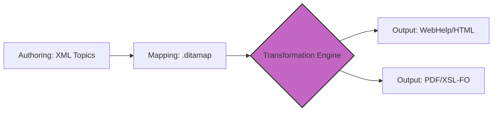

# Darwin Information Typing Architecture (DITA)
> *Overview of the DITA framework for managing large-scale, complex documentation through structured authoring and XML*

---

DITA is an [XML](https://www.w3.org/XML/){: target="_blank" rel="noopener" }-based data model for authoring and publishing. Unlike traditional word processors, which display documentation as a continuous stream of pages, DITA is built on the principle of [topic-based authoring](../references/structured-authoring.md). 

DITA is designed to handle large, complex documentation sets where you must reuse content across different products, translate it into dozens of languages, and publish it to multiple formats (PDF, HTML, and mobile devices) simultaneously.

---

## Core philosophy: Topic-based authoring

The fundamental shift in DITA is moving from linear books to modular *chunks*. Instead of writing a 100-page manual in a single file, you create 100 separate XML files. Each file contains one specific topic. A topic is a discrete unit of information that is self-contained and focuses on a single objective. 

In this model, you write content so that it can stand alone without relying on the context of the surrounding pages. This modularity makes it easier to update specific sections and ensures that information is easy for users to find and consume.

### The map concept

Topics are self-contained, so they require a method for organization. 

A **DITA map** (`.ditamap`) is an XML file that acts as the blueprint for your documentation. It does not contain the actual content (text or images); instead, it contains pointers to individual topic files and organizes them into a specific hierarchy, such as a table of contents.

Think of the map as a playlist and the topics as individual songs. You can create different playlists using the same songs in different orders.

### Example of a DITA map structure

The following example shows a basic map for a product user guide. It organizes a concept, a task, and two reference topics into a logical order.

```xml
<?xml version="1.0" encoding="UTF-8"?>
<!DOCTYPE map PUBLIC "-//OASIS//DTD DITA Map//EN" "map.dtd">
<map>
  <title>Cloud Storage User Guide</title>

  <!-- Introductory concept -->
  <topicref href="concepts/overview.dita" />

  <!-- A task with nested sub-topics -->
  <topicref href="tasks/setting-up-account.dita">
    <topicref href="tasks/verifying-email.dita" />
    <topicref href="references/password-requirements.dita" />
  </topicref>

  <!-- Technical specifications section -->
  <topicref href="references/api-limits.dita" />
</map>
```

### Key components of the map

- **`<map>`:** The root element that contains the entire document structure.
- **`<title>`:** The name of the deliverable (for example, the title that appears on a PDF cover or a website header).
- **`<topicref>`:** The most important element. The `href` attribute points to the file location of a specific topic.
- **Nesting:** By placing one `<topicref>` inside another, you create a parent-child relationship. In the example above, "Verifying your email" becomes a sub-section of "Setting up your account" in the final table of contents.

### Advanced map features

As your documentation grows, you can use more advanced elements to manage complexity:

- **Relationship tables (`<reltable>`):** Define "See also" links between topics in one central place rather than hard-coding links inside individual topics.
- **Submaps:** You can reference another `.ditamap` inside a master map. This allows different teams to manage their own chapters independently before they are combined into a final manual.
- **Attributes:** You can add attributes, such as `audience="admin"`, to a `<topicref>` to conditionally include or exclude that topic when you publish the document.

### Content reuse and single-sourcing

DITA enables true single-sourcing, which means you maintain one source of truth for every piece of information. This is achieved by using two primary methods: content references and key references.

- **Content references (conrefs):** Use a `conref` to pull a specific paragraph, table, or note from one file into another. If a common warning or a legal disclaimer changes, you update the source file once. The change is automatically reflected across every manual that references that specific section of code.
- **Key references (keyrefs):** Use a `keyref` to act as a variable for information that changes depending on the context, such as a product name or a version number. You can define the key in your map file. When you publish the document, DITA replaces the key with the correct text.

### Conditional processing

Beyond simple reuse, DITA allows you to use *attributes* to filter content. You can tag a paragraph as `audience="administrator"` and another as `audience="end-user"`. 

When you generate the output, you can tell the [transformation engine](../doc-stack/tech-stack.md#transformation-engines-and-api-documentation) to include or exclude specific tags. This allows you to manage content for different products, platforms, or audiences within the same set of files, which reduces the need to maintain multiple versions of the same document.

---

## CTR model (information typing)

At the heart of DITA is the concept-task-reference (CTR) model. This model requires you to categorize information based on its purpose. This ensures that users get the specific type of information they need without unnecessary information.

=== "Concept"
    **Explains what or why**

    Concepts provide the background information, theories, and logic behind a feature. They do not contain steps.

    - **Goal:** To build the user's mental model.
=== "Task"
    **Explains how**

    Tasks provide step-by-step instructions. They use a strict structure of `<prereq>`, `<context>`, `<steps>`, and `<result>`.

    - **Goal:** To help the user complete a specific action.
=== "Reference"
    **Explains facts**
    
    Reference topics are for quick lookups. They contain data such as API tables, hardware specifications, or error codes.

    - **Goal:** To provide technical data for experienced users.

---

## DITA tech stack

DITA relies on several XML standards to function. While you may use a specialized editor to hide the code, these four technologies power the underlying pipeline.

| Tool or standard | Purpose in DITA |
| :--- | :--- |
| **[XML Schema Definition (XSD)](https://www.w3.org/TR/xmlschema-1/){: target="_blank" rel="noopener" }** | **Definitions:** An XSD defines which elements (such as `<title>` or `<step>`) are allowed to ensure every writer follows the same structure. |
| **[Extensible Stylesheet Language Transformations (XSLT)](https://www.w3.org/TR/xslt/){: target="_blank" rel="noopener" }** | **Converter:** This programming language transforms raw DITA XML into HTML, help files, or other digital formats. |
| **[Extensible Stylesheet Language Formatting Objects (XSL-FO)](https://www.w3.org/TR/xsl/){: target="_blank" rel="noopener" }** | **Printer:** This specific type of XSL formats XML content for professional PDF output. |
| **[XML Localization Interchange File Format (XLIFF)](https://en.wikipedia.org/wiki/XLIFF){: target="_blank" rel="noopener" }** | **Translator:** This industry-standard format exports DITA content for translation, which preserves the code while content is localized. |

---

## Publishing workflow

The DITA workflow is a pipeline that moves from structured code to a finished document. This process is often automated by using a build server or the [DITA Open Toolkit (DITA-OT)](https://www.dita-ot.org/){: target="_blank" rel="noopener" }.



1.  **Authoring:** You create topics (concept, task, or reference) that are validated in real time against the XSD.
2.  **Mapping:** You organize the validated topics into a map file to define the structure of the document.
3.  **Transformation:** The engine (DITA-OT) reads the map and pulls in the referenced topics.
4.  **Rendering:** Stylesheets (XSLT or XSL-FO) are applied to the raw data to create the final output.

---

## Strategic benefits for enterprises

Why do organizations choose the complexity of DITA over simpler formats? 

The value lies in the three pillars of enterprise documentation:

<div class="grid cards" markdown>

-   :lucide-globe: __Localization at scale__
    
    By using XLIFF, companies can manage more than 30 languages simultaneously. DITA identifies individual sections of content, so only the modified sections are sent to translators, which drastically reduces costs.

-   :lucide-shield-check: __Strict consistency__
    
    The XSD forbids you from skipping steps or adding unauthorized formatting, such as changing a text color manually, so every document maintains a uniform brand voice and structure.

-   :lucide-refresh-cw: __Multi-channel publishing__
    
    DITA enables true single-sourcing. You write the content once and use different XSLT stylesheets to publish it to a customer-facing website, a PDF service manual, and an in-app help widget simultaneously.

</div>