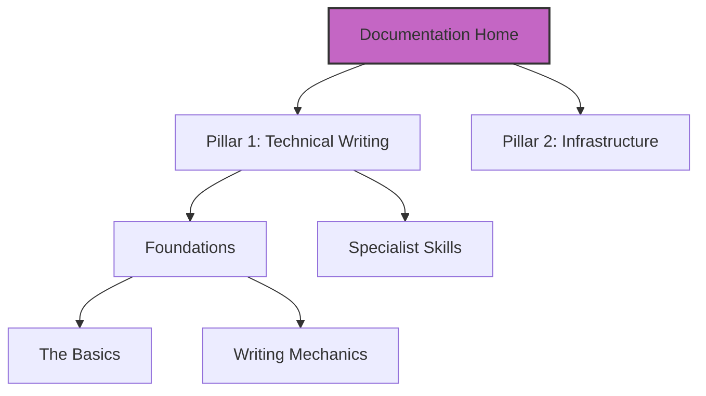

# Information architecture for documentation
> *Organizing documentation navigation, taxonomy, and internal linking for findability*

---

Information architecture (IA) is the structural design of shared information environments. In technical documentation, IA is the invisible skeleton that determines whether a user finds an answer in seconds or exits the product in frustration. 

A well-architected knowledge base does more than store files; it mirrors the user’s mental model, reduces [cognitive load](../technical-writing/cognitive-load.md), and provides a clear map for navigating complex technical landscapes.

---

## Sidebar hierarchy

The sidebar is the primary tool for discovery. It sets the user's expectations about what the documentation covers and how topics relate to one another.

### Designing for user intent

Users typically arrive at documentation with one of two mindsets: a learning mindset or a task mindset. Your IA must accommodate both types of users.

- **Learning mindset:** *"I want to understand the system from scratch."* Users with this mindset need a sequential logic (Tutorials and Onboarding).
- **Task mindset:** *"I have a specific problem to solve right now."* Users with this mindset need a categorical logic (Reference and API).

### The three-level rule

Deeply nested folders make it difficult for users to find content. To help users maintain their sense of place, limit the hierarchy to three levels. 

The following diagram illustrates a structure where a user can reach a specific article, such as "The Basics," by navigating from the home page through a pillar and a subcategory.

### Logic types for sidebars

To organize a sidebar effectively, choose a logic that matches the goals of your audience. The structure helps users predict where to find specific information based on their current task. You can use different logic types for different sections of your documentation to provide the best user experience.

=== "Sequential"
    This logic works best for content that has a clear beginning and end. It guides users through a specific workflow or learning path.

    **Best for tutorials and guides.** Topics move from easy to difficult or follow a chronological installation path.

    - *Example:* Installation > Configuration > First Project.
=== "Categorical"
    This logic organizes information into logical groups based on functionality or product area. It is effective for users who need to find specific details about a feature or component.

    **Best for technical references.** Groups content by feature, module, or functional group.

    - *Example:* Authentication > Database > API Endpoints.
=== "Alphabetical"
    This logic is best for long lists where the user knows the specific name of an item. It provides a familiar and predictable way to browse lists of terms, error codes, or functions.

    **Best for glossaries and indexes.** Use this when the user already knows exactly what word they are looking for.

    - *Example:* A through Z Industry Terms.

---

## Naming conventions

Naming conventions are the DNA of your documentation. They ensure that your file structure is predictable for both the human writer and the machine rendering the site.

### Slugs and file names

In modern documentation, `kebab-case` (for example, `audience-analysis.md`) is the industry standard for file naming. 

- **Predictability:** It makes URLs easy to read and type.
- **SEO:** Search engines treat hyphens as word separators, whereas underscores (`_`) are often treated as single strings.
- **Consistency:** Avoid mixing `CamelCase` or `snake_case` with `kebab-case`.

### The one-to-one rule

To prevent "title drift," make sure your file name matches the H1 title of your document.

- **H1:** Audience Analysis Frameworks
- **File:** `audience-analysis-frameworks.md`

!!! WARNING
    **Avoid spaces and special characters.** Spaces in file names lead to messy URLs containing `%20`, which can break internal links and make documentation harder to share.

---

## Taxonomy versus searchability

While taxonomy and searchability are two sides of the same coin, they serve different user behaviors. Understanding the balance between browsing and finding is the hallmark of advanced technical writers.

### Taxonomy

Taxonomy is the classification of your content. A strong taxonomy allows for serendipitous discovery. This occurs when a user finds a related topic (for example, [Prose Linting](../doc-stack/prose-linting.md)) while they were originally just browsing [Markdown Basics](../doc-stack/markup-languages.md).

### Searchability

Searchability relies on metadata, H1 titles, and keyword density. A user who uses the search box is usually an experienced user who knows exactly what they need but does not want to dig through the sidebar.

| Feature | User goal | Best for |
| :--- | :--- | :--- |
| **Sidebar** | Discovery | New users learning the system |
| **Search** | Specificity | Experienced users looking for error codes or specific APIs |

!!! TIP
    Use keywords in your frontmatter or YAML data that might not appear in the title but are common synonyms. For example, on a page titled "Lightweight Markup," add "Markdown" and "AsciiDoc" to the search keywords.

---

## Wayfinding and orientation

Wayfinding refers to the visual cues that tell a user *where they are*, *where they have been*, and *where they can go next*.

### Breadcrumbs

Breadcrumbs provide a horizontal trail that allows users to jump back to a higher-level parent category instantly without using the Back button.

- **Format**: *Home > Documentation Stack > Static Site Generators*

### Pagination

At the bottom of every page, include Next and Previous buttons. This is essential for learning paths where the order of operations matters. This design follows the traditional mental model of reading a book page by page.

### Internal contextual linking

Contextual links (links within the body text) are the most powerful way to connect related concepts.

- **Golden rule:** Only link to a related page on its first mention in the article. 
- **Avoid pogo-sticking:** If you find yourself linking to the same five pages constantly, consider whether those pages should actually be a single, unified guide.

---

## IA quality checklist

To ensure your documentation remains findable as it scales, use the following self-assessment checklist for every new page you create.

???+ abstract "IA self-assessment checklist"
    Use these checkboxes to audit the findability of your current page before publishing.

    - [ ] **File name alignment:** Does the file name use `kebab-case` and match the H1 title?
    - [ ] **Nesting depth:** Is this article accessible in three clicks or fewer from the home page?
    - [ ] **Search keywords:** Did I include synonyms in the metadata for terms not in the H1?
    - [ ] **Breadcrumb trail:** Does the page clearly show its parent category?
    - [ ] **Pagination:** If this is part of a series, are **Next** and **Previous** links present?
    - [ ] **Internal links:** Are there at least two to three links to related sibling topics in the body text?
    - [ ] **Link integrity:** Press **Ctrl** and click all internal links to ensure there are no 404 errors.

-   :lucide-globe: __Localization at scale__
    
    By using XLIFF, companies can manage more than 30 languages simultaneously. DITA identifies individual sections of content, so only the modified sections are sent to translators, which drastically reduces costs.

    [:octicons-arrow-right-24: Learn about XLIFF](https://docs.oasis-open.org/xliff/xliff-core/xliff-core.html){: target="_blank" rel="noopener" }

-   :lucide-shield-check: __Strict consistency__
    
    The XSD forbids you from skipping steps or adding unauthorized formatting, such as changing a text color manually, so every document maintains a uniform brand voice and structure.

    [:octicons-arrow-right-24: View XML Standards](https://www.w3.org/TR/xmlschema-1/){: target="_blank" rel="noopener" }

-   :lucide-refresh-cw: __Multi-channel publishing__
    
    DITA enables true single-sourcing. You write the content once and use different XSLT stylesheets to publish it to a customer-facing website, a PDF service manual, and an in-app help widget simultaneously.

    [:octicons-arrow-right-24: Explore DITA-OT](https://www.dita-ot.org/){: target="_blank" rel="noopener" }

