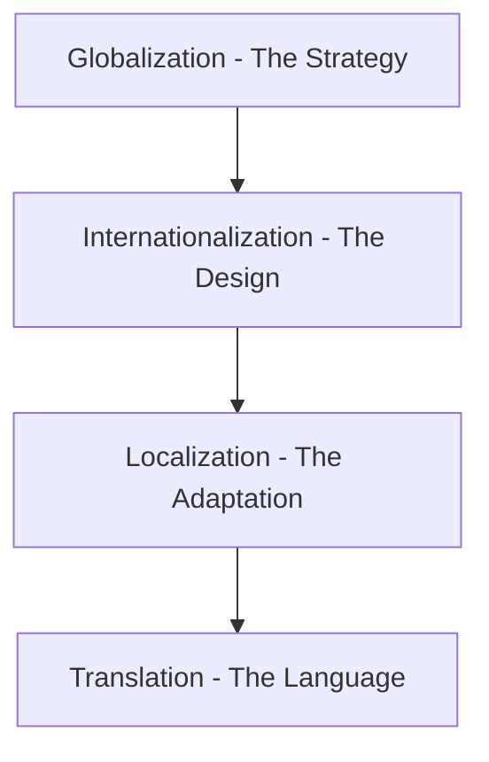
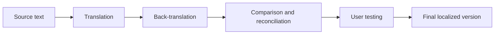

# Global industry standards
> *Understanding international standards and regulations for technical documentation*

---

International industry standards are the invisible guardrails of the global economy. For technical writers, adhering to these standards is more than a matter of quality. It is often a legal requirement. 

International standards ensure that your information is safe, interoperable, and ready for a worldwide audience whether you are documenting a medical device, a software platform, or heavy machinery.

---

## GILT framework

To prepare a product for the global market, organizations follow the GILT framework. This four-pillar strategy ensures that content is not just translated but is culturally and technically integrated into the target market.

- **Globalization (g11n):** The high-level business strategy. It involves the planning and logic required to conduct business in multiple countries.
- **Internationalization (i18n):** The engineering and design phase. For technical writers, this means creating neutral documentation that avoids local idioms and leaves physical space for text expansion (some languages can be 30% longer than English).
- **Localization (l10n):** The process of adapting the product to a specific locale (a combination of language and region). This includes changing date formats, currency symbols, and cultural references.
- **Translation (t9n):** The literal conversion of text from the source language to the target language while maintaining the original meaning.

---

## Regulatory registry (ISO)

The [International Organization for Standardization (ISO)](https://www.iso.org/){: target="_blank" rel="noopener" } and the [International Electrotechnical Commission (IEC)](https://www.iec.ch/){: target="_blank" rel="noopener" } provide the global standards for the technical communication industry.

| Standard number | Category | Importance |
| :--- | :--- | :--- |
| **IEC 82079-1** | Preparation of instructions | The global benchmark for all manuals. It dictates everything from minimum font sizes to the logical structure of safety warnings. |
| **ISO 82045-1** | Document management | Focuses on the metadata of the document. It sets rules for how document lifecycles and versions are tracked across global systems. |
| **ISO 20607** | Machinery safety | A legal necessity for the European market. It specifies how safety-related information must be presented in machinery handbooks. |
| **ISO/IEC 26514** | Software engineering | Provides specific requirements for the design, development, and user testing of software documentation. |

---

## Technical interoperability standards

Interoperability is the ability of different systems to exchange and use information. For documentation to move seamlessly between a technical writer's editor and a translator's software, the documentation must follow specific technical rules.

- **Internationalization Tag Set (ITS):** Developed by the [W3C](https://www.w3.org/){: target="_blank" rel="noopener" }, ITS defines how to tag XML and HTML content. These tags tell translation software which parts of a file are translatable and which are code that must remain untouched.
- **Standardized schemas:** By using industry-standard schemas, such as those discussed in [Darwin Information Typing Architecture (DITA)](../references/dita.md) or [OpenAPI Specification (OAS)](../doc-stack/openapi.md), documentation becomes portable. It can be moved between different content management systems (CMS) without losing its structure or meaning.

!!! NOTE
    Interoperability prevents vendor lock-in, allowing companies to switch translation agencies or software tools without having to rebuild their entire knowledge base.

---

## Global ecosystem (vendors and systems)

Managing global documentation requires a specialized ecosystem of organizations and software. This integrated network connects technical writers with language experts and automation tools to handle high-volume content across dozens of languages. 

By using this ecosystem, organizations can maintain a [continuous delivery pipeline](../doc-stack/cicd.md#the-pipeline-concept) for their documentation. This approach ensures that technical information remains accurate, culturally relevant, and synchronized across every market the company serves.

- **Globalization and Localization Association (GALA):** [GALA](https://www.gala-global.org/){: target="_blank" rel="noopener" } is the leading non-profit association for the language sector. It provides the latest research and networking for professionals who manage global content.
- **Language Service Provider (LSP):** These are external agencies that specialize in technical translation. Aside from translating words, an LSP also provides subject matter experts (SMEs) who understand the engineering or medical logic of the source text.
- **Translation Management System (TMS):** A TMS is a software platform that automates the workflow. When a technical writer pushes a new Markdown file to a repository, the TMS can automatically notify the LSP, track the translation progress, and pull the localized version back into the system.

---

## Quality assurance and compliance testing

Organizations must implement a specialized quality assurance (QA) process to verify the technical accuracy of content across multiple languages. This rigorous review ensures that translated documentation remains as reliable and safe as the source material. 

By prioritizing compliance testing, companies can mitigate risks associated with mistranslation and ensure that the final output aligns with international regulatory requirements.

### Linguistic validation testing

Linguistic validation testing (LVT) is a rigorous quality control process. It ensures that technical documentation is accurate and safe for the intended audience. High-stakes industries, such as medical device manufacturing and pharmaceuticals, use this method to go beyond standard grammar and spell checks.

The LVT process typically follows these steps:

- **Back-translation:** A second independent translator converts the localized text back into the original source language. This step allows technical writers to identify any shifts in meaning or technical drift that occurred during the initial translation.
- **Comparison and reconciliation:** Experts compare the back-translated version with the original source text. If they find discrepancies, they adjust the translation to ensure it is technically accurate.
- **User testing:** Native speakers who are also subject matter experts review the content. These experts verify that the instructions are easy to understand and that the technical terminology is correct within the local context.

By using LVT, organizations can prevent dangerous misunderstandings. This process ensures that products are used correctly and safely in every region.

### Standardized terminology roadmap

To maintain compliance, technical writers use terminology management tools. This ensures that a critical term, such as Emergency Stop, is translated consistently across every page.

???+ tip "Compliance audit path"
    If you are tasked with auditing a document for global compliance, follow these three steps:

    1.  **Check the 82079-1 alignment:** Does the manual contain the mandatory safety chapters required by the IEC?
    2.  **Verify the terminology:** Is the glossary centralized and used by both the writers and the LSP?
    3.  **Run a linguistic audit:** Did the localized content undergo LVT to ensure technical safety in the target language?

---

## Summary of global readiness

Preparing content for a worldwide audience requires a structured approach to bridge the gap between business strategy and technical execution. You can achieve global readiness by focusing on these four areas:

- **Globalization:** Establish the high-level business logic and strategy for entering new markets.
- **Internationalization:** Create a flexible and neutral design that supports various languages and regional requirements.
- **Localization:** Adapt the product and its documentation for specific regional, cultural, and technical contexts.
- **Translation:** Convert the source text accurately into the target language while maintaining the original meaning.

Adhering to ISO and IEC standards ensures that your documentation meets international safety and quality requirements. By following these benchmarks and using a TMS, you maintain consistency, reduce costs, and ensure legal compliance across every market.