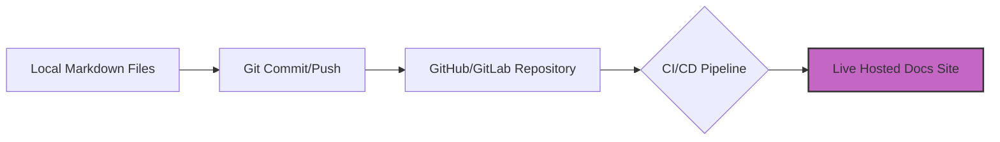

# Technical writing portfolios
> *A strategic guide for learners and career changers on building a professional Docs as Code portfolio*

---

In the modern hiring landscape, a technical writing portfolio is more than a collection of writing samples. It is a technical proof of concept. For career changers and junior writers, your portfolio is the first piece of documentation a recruiter will evaluate.

To stand out in a developer-centric environment, your portfolio must demonstrate that you do not just know how to write. You must also know how to integrate into a modern [Docs as Code](../doc-stack/docs-as-code.md) engineering workflow.

---

## The purpose of a modern portfolio

The goal of your portfolio is to answer one fundamental question for a hiring manager: *"Can this person work in our environment without needing constant technical supervision?"*

*   **Proof of process:** Hiring managers want to see your ability to handle technical complexity. It is better to have one deep-dive guide on a complex topic than ten shallow articles on simple ones.
*   **The technical bar:** A PDF or a folder of Word documents is no longer sufficient for software companies. A live, hosted documentation site proves you understand the web, hosting, and [information design](../references/ia-design.md).
*   **Visibility:** By hosting your portfolio on a platform such as [GitHub](https://github.com){: target="_blank" rel="noopener" }, you make your source code available for technical review. This proves your proficiency with the tools of the trade.

---

## Showcasing Docs as Code skills

Building your portfolio as a [static site generator (SSG)](../doc-stack/ssg.md) project is the most effective way to prove your technical readiness. This approach demonstrates mastery of three core industry competencies:

1.  **Markdown:** Proving you can write content in a lightweight, [machine-readable format used by developers](../doc-stack/markup-languages.md) worldwide.
2.  **Static site generators:** Showing you can configure, theme, and deploy a site using modern tools, such as [Hugo](https://gohugo.io){: target="_blank" rel="noopener" }, [Docusaurus](https://docusaurus.io){: target="_blank" rel="noopener" }, or [MkDocs](https://www.mkdocs.org){: target="_blank" rel="noopener" }.
3.  **Version control (Git):** Demonstrating that you can [manage content in repositories](../doc-stack/git.md). These are the standard workflow for professional documentation teams.

### Docs as Code workflow

The following diagram illustrates the automated path that documentation takes from a local computer to a live website.

1.  **Local Markdown files:** The process begins with content created in Markdown on a local machine.
2.  **Git commit and push:** The technical writer uses Git to save changes and upload them to a remote server.
3.  **GitHub or GitLab repository:** The files are stored in a centralized version control system.
4.  **CI/CD pipeline:** An automated [continuous integration and continuous delivery](../doc-stack/cicd.md) process triggers to build and test the files.
5.  **Live hosted docs site:** The pipeline publishes the final content to a web server for users to access.

---

## Essential portfolio components

A balanced portfolio shows a T-shaped skill set: a broad understanding of documentation types with a deep specialization in one area.

| Component | What it proves |
| :--- | :--- |
| **API reference** | You can document endpoints, explain JSON schemas, and understand the "contract" of software. |
| **How-to tutorial** | You can guide a user through a complex task from start to finish with no missing steps. |
| **Concept page** | You can explain abstract technical logic or architecture clearly to non-experts. |
| **Release note** | You can communicate product changes, bug fixes, and breaking changes to an existing user base. |

---

## The "About this site" page

The most underrated section of a Docs as Code portfolio is the "About this site" page. This is your meta-sample, which is a document where you explain the technical choices you made while building the portfolio itself.

This page signals to a recruiter that you are not just a writer. You are a documentation engineer who understands the infrastructure behind the words.

### What to detail

*   **Architecture:** Why did you choose your specific SSG over a traditional content management system (CMS)?
*   **CI/CD pipeline:** How is the site deployed? Example: *"This site uses [GitHub Actions](../doc-stack/cicd.md#github-actions-for-writers) to automatically deploy to [Netlify](https://www.netlify.com){: target="_blank" rel="noopener" } on every push."*
*   **Style guide:** Provide a link to the internal rules you followed for grammar, tone, and formatting.

---

## Content selection strategy

Quality and diversity always beat quantity. A recruiter will likely only look at two of your samples; make sure they are high-impact.

*   **Solve a real problem:** Instead of a generic "How to use a calculator," document a small open-source project or create a guide for a complex command-line interface (CLI) tool.
*   **The "before and after":** If you are transitioning from another field, include a rewrite project. Show a confusing technical paragraph from a public source and explain how you transformed it using [plain language](../technical-writing/plain-language.md) and [active voice](../technical-writing/active-passive.md).
*   **Communicate visually:** Do not rely solely on text. Use [Mermaid.js](https://mermaid.js.org){: target="_blank" rel="noopener" } diagrams or well-annotated screenshots to prove you can communicate through multiple channels.

---

## Portfolio launch checklist

Before you send your portfolio link to a hiring manager, perform this final audit to ensure your site meets professional standards.

!!! example "Final polish checklist"
    - [ ] **Live link deployment:** Is the site hosted on a reliable platform such as Netlify, Vercel, or GitHub Pages?
    - [ ] **Mobile responsiveness:** Did you check the sidebar and font sizes on a mobile device?
    - [ ] **Search integrity:** Does the search bar return relevant results for your keywords?
    - [ ] **Source code access:** Is there a visible link to the GitHub repository so recruiters can see your Git history?
    - [ ] **Navigation logic:** Can a user get back to the home page in one click from any article?
    - [ ] **Markdown hygiene:** Did you check for broken links or improperly formatted code blocks?
    - [ ] **Contact visibility:** Is your resume and LinkedIn profile accessible in the footer or on a contact page?

!!! tip "A note on privacy"
    If you have written documentation for a previous employer that is behind a firewall, **do not post it**. Instead, create a sanitized version that removes all company secrets, or create a new sample from scratch that mimics the technical complexity of your previous work. Protecting the intellectual property (IP) of a previous employer is a sign of professional integrity.