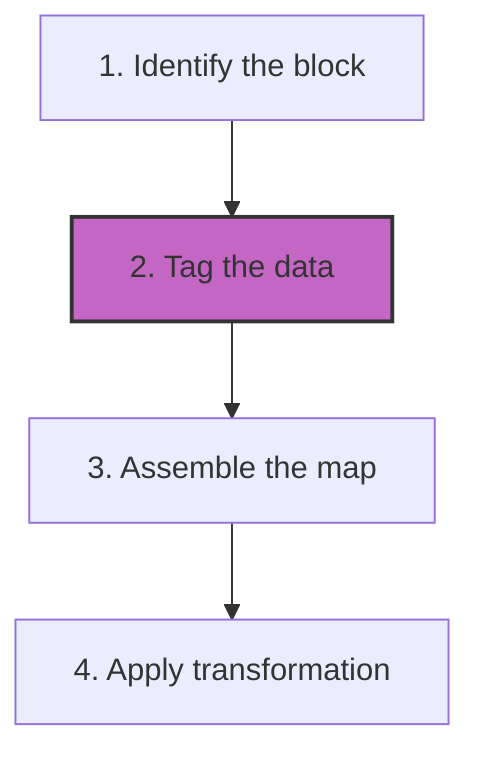

# Structured authoring frameworks
*An introduction to information mapping and topic-based authoring for reusability*

---

Structured authoring is a strategic approach to content creation that prioritizes the meanings and relationships of information over its visual presentation. In a structured environment, content is treated as modular, searchable, and reusable data.

This methodology represents a shift from document-centric writing (writing a book) to data-centric writing (managing a database of knowledge).

---

## Structured versus unstructured content

The difference between traditional word processing and structured authoring lies in how information is stored and formatted.

| Feature | Unstructured (for example, Microsoft Word) | Structured (for example, XML, JSON, and DITA) |
| :--- | :--- | :--- |
| **Storage** | A single, large document file | A collection of small, discrete topics |
| **Formatting** | Hard-coded directly into the text (for example, choosing 12-point Arial) | Separated from the text and controlled by external stylesheets (CSS/XSLT) |
| **Data Nature** | Presentation-heavy: Focused on how it looks | Meaning-heavy (semantic): Focused on what the data is |
| **Reuse** | Manual copy and paste | Single-sourcing: Content is referenced by a unique ID |

---

## Information mapping

Information mapping is a system used to analyze and organize technical information for better scannability and comprehension. By breaking complex subjects into discrete, self-contained blocks, you can provide users with specific information at the exact moment they need it. This structure helps reduce [cognitive load](../technical-writing/cognitive-load.md) and makes content easier to update.

### Anatomy of a map

- **Content blocks:** These are the smallest modular units of information. Each block focuses on a single purpose or idea, such as a specific warning or a data table.
- **Maps:** These are files that act as blueprints. [A map](../references/dita.md#the-map-concept) organizes different content blocks into a logical hierarchy to produce a specific output, such as a user guide or a help article.

### Common block types

In a structured environment, you categorize blocks by the type of information they provide:

- **Procedure:** Provides a chronological sequence of steps to complete a task.
- **Process:** Explains how a system, function, or workflow operates.
- **Principle:** Outlines rules, policies, or constraints that a user must follow.
- **Fact:** Lists objective data, such as technical specifications, part numbers, or reference values.
- **Concept:** Provides background information or definitions to help a user understand a new subject.

### Example: A procedure block

The following example shows how a "How-to" block is structured in a data-centric environment.

**Source data (simplified XML):**

In the background, the writer creates the content using semantic tags. This allows the system to recognize the *action* and the *result* as distinct data points.

```xml
<procedure id="proc_402">
  <title>Change your password</title>
  <step>
    <action>In the <b>Security</b> menu, select <b>Reset</b>.</action>
    <result>A confirmation code is sent to your email.</result>
  </step>
</procedure>
```

**Rendered output:**
When the system publishes the file, it applies a stylesheet to the source data to produce a polished result for the user.

> **Change your password**
>
> 1. In the **Security** menu, select **Reset**.
>
>    *Result: A confirmation code is sent to your email.*

Because this information exists as a standalone block (ID: `proc_402`), a writer can reuse this exact password procedure across a mobile app, a website, and a PDF manual without rewriting the steps.

---

## Architecture standards

To ensure that content remains future-proof and compatible across different software systems, structured authoring relies on established architectural standards.

### Media independence architecture 

The media independence architecture (MIA) approach ensures that content is authored in a manner that is completely independent of its final output. By stripping away visual formatting, the same source file can be rendered as a high-resolution PDF for print, a responsive website for mobile, or a raw data stream for an AI chatbot.

### Text Encoding Initiative

While [Text Encoding Initiative (TEI)](https://tei-c.org/){: target="_blank" rel="noopener" } is widely known in the humanities and linguistics, it provides a critical international standard for representing complex documents in digital form. TEI uses a robust XML framework to tag document structures, including headers, citations, and bibliographic data. This makes the content machine-readable and highly searchable.

---

## Benefits of data-driven content

Moving to a structured framework requires an initial investment in architecture, but the long-term benefits for the enterprise are significant.

- **Content reuse:** By using single-sourcing, you can update a safety warning in one file and have it populate across 100 different manuals instantly.
- **Automated translation:** Translating small, discrete blocks of data is significantly faster and more cost-effective than translating entire books.
- **Multichannel publishing:** Content is authored once and automatically transformed for web, print, and mobile platforms via the MIA approach.
- **Strict consistency:** Structured frameworks use a schema (a set of rules) that prevents writers from adding unauthorized formatting, ensuring a perfectly uniform brand voice.

---

## Structured authoring workflow

The transition from a blank page to a published document in a structured environment follows a rigorous, four-step lifecycle.



1.  **Identify the block:** Determine the purpose of the information. Is this a task (how-to), a concept (what-is), or a reference (facts)?
2.  **Tag the data:** Instead of using visual tags, such as bold or italics, use semantic tags. For example, wrap a prerequisite in `<prereq>` and an action in `<step>`.
3.  **Assemble the map:** Use a map file to link these discrete blocks together into a hierarchy that makes sense for the user's journey.
4.  **Apply the transformation:** Use a build engine to apply a stylesheet to the raw data. This skins the XML or Markdown into its final, polished format.

---

## Implementation roadmap

??? note "Is structured authoring right for your project?"
    Consider these three criteria to determine if you should move beyond standard word processing:

    **1. High content volume**  
    Are you managing thousands of pages across multiple product lines? Structured authoring thrives in environments with high overlap where content is shared between products.

    **2. Localization requirements**  
    Do you need to publish in 10 or more languages? If so, the modular nature of structured authoring can save up to 40% in translation costs by avoiding the retranslation of identical blocks.

    **3. Multichannel output**  
    Do you need the same content to appear in a PDF, on a website, and inside a mobile app? If the answer is yes, a MIA is the most efficient solution.