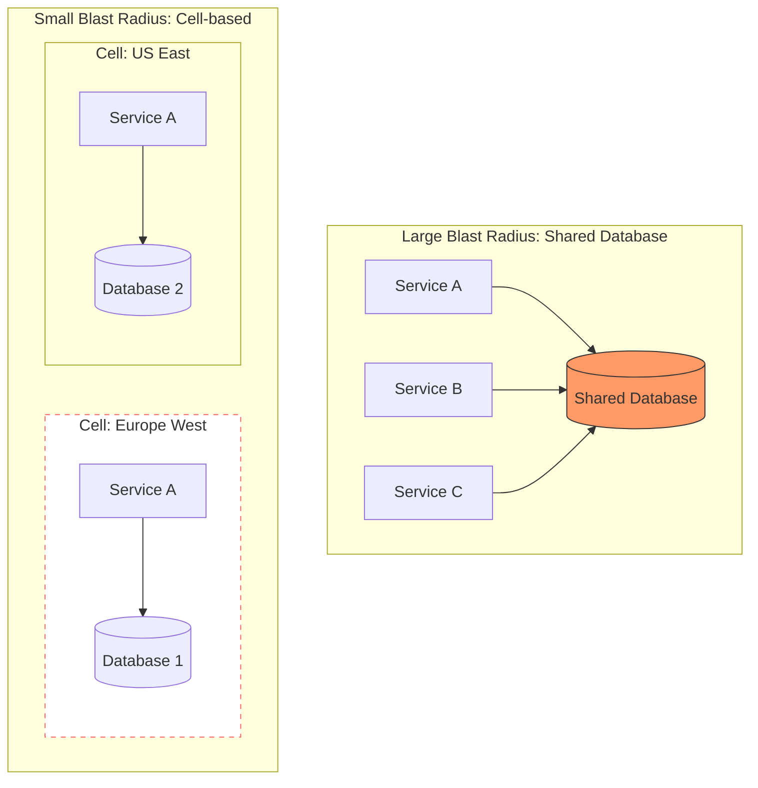

# Blast radius

Blast radius is the maximum potential impact of a software deployment, configuration update, or component failure across connected systems. For technical writers and engineering teams, documenting system dependencies and containment boundaries is essential to minimize and manage the consequences of system changes.

---

## How blast radius affects software

In distributed systems, a small change in one module can ripple through connected APIs, databases, and microservices. Tightly coupled architectures allow the blast radius of a single failure to expand rapidly, potentially disabling unrelated features.

The following examples illustrate the difference in scale:

- **Small blast radius:** A cell-based architecture isolates user data into distinct groups (cells). If a server in the `europe-west` cell fails, only users in that cell are affected. Users in the `us-east` cell continue to use the system.
- **Large blast radius:** A shared database configuration is updated incorrectly. Since all microservices depend on this single database, the entire platform goes offline.

---

## Documentation as a risk management tool

Product teams use documentation to map and limit the impact of technical changes:

*   **Deployment runbooks:** Explicitly state the potential blast radius of each step in a deployment process. If a step involves a database migration, include a warning about which upstream services might experience latency or errors.
*   **Dependency maps:** Keep architecture diagrams updated. If developers need to update Service A, they should use the documentation to see that Services B, C, and D depend on it. This prevents unexpected outages.
*   **Change risk categorization:** In internal release plans, classify updates by their potential blast radius. Low-impact updates, such as CSS styling tweaks, require minimal verification. High-impact updates, such as changing an authentication protocol, require extensive staging tests and rollback plans.

!!! warning "Documentation blast radius"
    Documentation changes have their own blast radius. If you rename a parameter in an API reference, you must update every conceptual guide, tutorial, and code example that references that parameter. Overlooking these references leads to broken links and developer frustration.

---

## Containment boundaries

Software engineers use containment strategies to minimize the blast radius. Your documentation must reflect these boundaries so teams do not accidentally bypass them during development:

*   **Bulkheads:** This pattern isolates resources to prevent a single failure from cascading. For example, if you allocate separate thread pools for different API endpoints, document these allocations so developers do not assign unrelated background tasks to critical pools, causing resource exhaustion.
*   **Rate limiting and quotas:** Document API rate limits. If a single client sends too many requests, rate limits ensure the impact is contained to that specific user, protecting platform stability.
*   **Canary deployments:** Document the rollout process. A canary deployment releases updates to a small percentage of users first. If errors occur, the blast radius is limited to that small group, allowing for a safe rollback.

---

## Impact of mapping the blast radius

*   **Faster incident resolution:** When a failure occurs, operators use dependency documentation to isolate the root cause and determine the extent of the damage.
*   **Safe deployments:** Engineers can deploy code with more confidence when they understand the boundaries and failover systems intended to contain failures.
*   **Targeted customer communication:** Understanding the blast radius allows support teams to send incident notifications only to affected users, rather than the entire customer base.