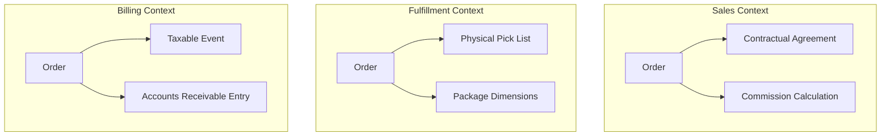

# Bounded context

A bounded context defines the semantic boundary where a domain model and its [ubiquitous language](../systems-thinking/domain-driven-design.md#strategic-design-ubiquitous-language) remain consistent. While a bounded context often aligns with physical boundaries—such as a microservice or a specific module's source code—it is primarily a linguistic boundary used to ensure that a specific term has a single, unambiguous meaning.

Within a large system, terms that look identical often represent different concepts. Defining these contexts prevents the "Big Ball of Mud" pattern where a single model becomes too bloated to be maintainable. This practice ensures that logic, validation rules, and schemas remain isolated and valid within their specific scope.

---

## Solving linguistic ambiguity

As systems scale, the meaning of terms often diverges depending on the domain. In [domain-driven design (DDD)](../systems-thinking/domain-driven-design.md), failing to account for these shifts creates "polysemes"—words with multiple meanings. These are a primary source of logic bugs and developer confusion.

Consider the term "order." Its definition changes based on the perspective of the context:

Trying to force a single, enterprise-wide definition of an "order" creates a model that is either too generic or incorrectly coupled. A warehouse engineer requires the weight and dimensions found in the fulfillment context; they should not be forced to navigate the legal signatures or commission structures relevant only to sales.

---

## Mirroring boundaries in information architecture

Documentation should reflect the bounded contexts of the system. To maintain clarity, align your [information architecture (IA)](../references/ia-design.md) with these established domain boundaries.

- **Namespace-driven documentation**: Organize content by domain, such as `/docs/billing/order` or `/docs/fulfillment/order`. This creates a direct mapping between the documentation and the specific domain services.
- **Context-specific glossaries**: Avoid a global, enterprise-wide glossary. Instead, maintain localized glossaries that define the ubiquitous language of that specific domain to prevent cross-context confusion.
- **Isolated schemas**: Ensure [API documentation](../industry-terms/api-documentation.md) reflects context-specific data structures. An identity context "user" object focuses on authentication (MFA) and credentials, whereas a support context "user" object focuses on ticket history and service-level agreement (SLA) tiers.

!!! warning "The canonical data model trap"
    Resist the urge to document a universal object model (a single schema used by all departments). Universal models result in "fat" schemas filled with nullable fields that weaken type safety. Instead, document the specialized model required for the specific context to minimize implementation errors.

---

## Navigating dependencies with context maps

A context map tracks how different bounded contexts integrate. Documentation must bridge these gaps to help developers navigate workflows that cross semantic boundaries.

- **Upstream and downstream flow**: Define the relationship between contexts. If billing (downstream) consumes events from sales (upstream), the documentation should reside where the dependency is managed—typically describing how the downstream context interprets the upstream data.
- **Translation strategies**: 
    - **Anti-corruption layers (ACL)**: When a system consumes data from a legacy or external context, document the ACL logic. This translation layer ensures that external definitions do not "pollute" or leak into the internal domain model.
    - **Shared kernels**: If two contexts share a common subset (such as a shared library or database schema), document this as a "Shared Kernel." This requires explicit documentation of the coordination required between teams, as a change by one team affects the other.

---

## Impact on system maintenance

Explicitly documenting bounded contexts ensures model integrity. This allows developers to work within a specific service without causing unintended side effects in unrelated domains. This isolation reduces [cognitive load](../technical-writing/cognitive-load.md) because engineers only need to master the terminology and logic relevant to their immediate context. Furthermore, it enables decoupled maintenance; for instance, the tax logic in the billing context can be updated without requiring a logic or documentation audit for the fulfillment or sales contexts.