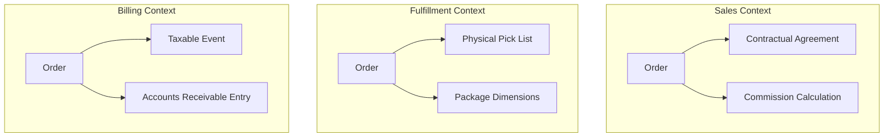

# Bounded context

A bounded context defines the specific boundary, both conceptual and physical, where a domain model and its ubiquitous language remain consistent. [Ubiquitous language](../systems-thinking/domain-driven-design.md#strategic-design-ubiquitous-language) is a common, shared language used by developers and domain experts to ensure clear communication. 

Within a large system, terms that look identical often have different meanings. Defining these contexts prevents the documentation from becoming a model that is too broad to be useful. This practice ensures that logic and schemas remain isolated.

---

## Solving linguistic ambiguity

As systems scale, technical terms often change. In [domain-driven design (DDD)](../systems-thinking/domain-driven-design.md), failing to account for this change creates ambiguous terms. These terms are the primary source of logic bugs and developer confusion.

Consider the term "order." Its definition changes based on the perspective of the user:

Trying to force a single, enterprise-wide definition of an order creates documentation that is either too generic or inaccurate for specific teams. A warehouse engineer needs the weight and dimensions found in the fulfillment context. They do not need to navigate the legal signatures or commission structures relevant only to sales.

---

## Mirroring boundaries in information architecture

Documentation should reflect the architecture of the system. To maintain clarity, align your [information architecture (IA)](../references/ia-design.md) with these established domain boundaries.

- **Namespace-driven documentation**: Organize content by domain, such as /docs/billing/order or /docs/fulfillment/order. This creates a direct mapping between the documentation and the microservices or modules they describe.
- **Localized glossaries**: Do not use a global glossary. Instead, maintain context-specific glossaries to define the ubiquitous language of that specific domain.
- **Isolated schemas**: Make sure [API documentation](../industry-terms/api-documentation.md) reflects context-specific data. An identity context user object likely focuses on multi-factor authentication (MFA) and credentials. However, a support context user object focuses on ticket history and service-level agreement (SLA) tiers.

!!! warning "The canonical data model trap"
    Resist the urge to document a universal object model. Universal models result in large schemas filled with nullable fields. Instead, document the specialized model required for the specific context to minimize implementation errors.

---

## Navigating dependencies with context maps

A context map tracks how different bounded contexts integrate. Documentation must bridge these gaps to help developers navigate workflows that cross boundaries.

- **Upstream and downstream flow**: If billing (downstream) consumes events from sales (upstream), the documentation must explicitly map the data transformation.
- **Translation strategies**: 
    - **Anti-corruption layers (ACL)**: When a system pulls data from a legacy or external source, document the translation logic. This prevents external definitions from affecting the internal domain model.
    - **Shared kernels**: If two contexts share a library or database table, document this shared subset as a distinct entity that requires coordination between teams for any change.

---

## Impact on system maintenance

Explicitly documenting bounded contexts ensures model integrity. This allows developers to work within a specific service without causing unintended effects in unrelated domains. This isolation reduces [cognitive load](../technical-writing/cognitive-load.md) because engineers only need to learn the terminology relevant to their immediate task. Furthermore, it enables decoupled maintenance. A change to tax logic in the billing context can occur without a documentation audit for fulfillment or sales.