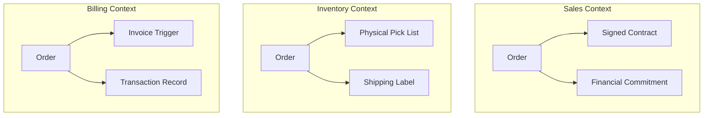

# Bounded context

A *bounded context* is an explicit conceptual boundary where a specific domain model applies. In technical documentation, defining these boundaries prevents terminology conflicts by isolating concepts that have different meanings in different parts of a system.

---

## The problem of semantic collisions

As a system grows, a single word often takes on multiple, conflicting meanings. In software engineering and technical writing, this is a *semantic collision*.

Consider how different departments define the word *Order*:

Creating a single "Order Management Guide" to cover all these perspectives results in documentation that is difficult to navigate. Developers integrating with a shipping API must filter out irrelevant payment processing rules and contractual definitions.

---

## Structure information architecture to reflect boundaries

To avoid terminology overlap, align the information architecture (IA) of the documentation with the bounded contexts of the system.

*   **Separate documentation sets:** Instead of one folder for the entire developer portal, divide guides by service or domain boundary (such as `/docs/billing` and `/docs/fulfillment`).
*   **Isolate glossaries:** Avoid a single, global glossary for a complex enterprise system. Create context-specific glossaries or explicitly tag terms, such as `Order [Fulfillment Context]` versus `Order [Billing Context]`.
*   **Name APIs and endpoints contextually:** Ensure API documentation reflects the bounded context. For example, document `/billing/accounts` and `/identity/accounts` as distinct entities with unique schemas.

!!! note "The danger of shared models in documentation"
    Avoid documenting a "universal" object model to satisfy every team. This often results in complex schemas with many optional fields. Documenting these bloated models makes integration difficult and increases the risk of developer errors.

---

## Map relationships with context maps

In domain-driven design (DDD), teams use a *context map* to show how different bounded contexts share data. Technical writers use context maps to determine how information flows between different documentation sets.

*   **Identify dependencies:** If the Billing service (downstream) relies on data from the Identity service (upstream), the documentation must explain how data from one context translates to the other.
*   **Document translation layers:** When systems share data across boundaries, they often use an *anti-corruption layer* or a *shared kernel*. Document these integration layers so developers understand when and how a term's meaning changes as data crosses system boundaries.

---

## Benefits of bounded contexts in documentation

Respecting bounded contexts in documentation provides several benefits:

*   **Reduced cognitive load:** Developers and users read only the information relevant to their current task.
*   **Simplified maintenance:** When engineers update the business logic in a specific service, you only need to update the documentation for that bounded context.
*   **Improved search accuracy:** Documentation portals deliver more relevant results when articles are categorized by domain.