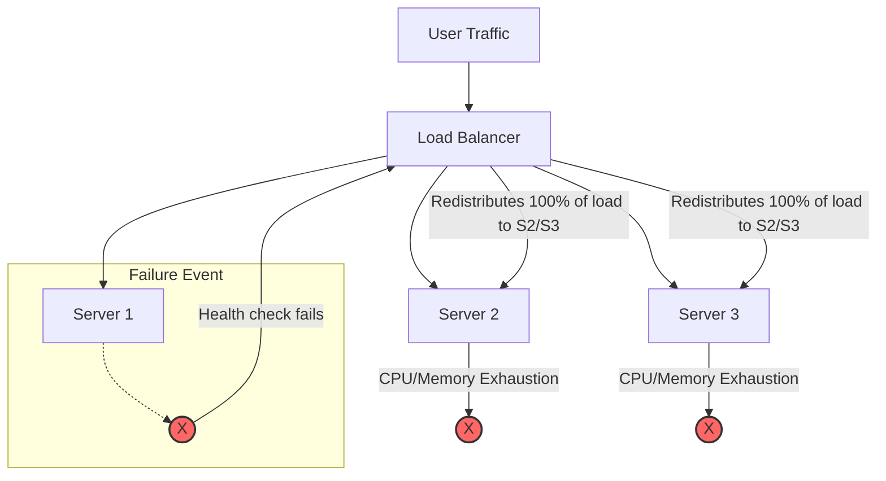

# Cascading failure

A cascading failure occurs when a failure in one component of a system triggers consecutive failures in other dependent components through a positive feedback loop. To prevent these failures from disabling an entire system, you must document dependency chains, load-management policies, and structured recovery steps.

---

## How cascading failures occur

In distributed systems, components often share a common pool of resources or depend on one another's availability. When one node or service fails, the total system capacity decreases, but the incoming demand typically remains constant. The traffic or workload previously handled by the failed node is redistributed to the surviving nodes. This sudden increase in resource demand (CPU, memory, or connection pools) can exceed the capacity of the remaining components, causing them to fail and further shrinking the available capacity until the entire system collapses.

Common triggers for cascading failures include:

*   **Resource exhaustion:** A slow database query consumes all available worker threads or database connections. Upstream services waiting for responses continue to hold their own connections open while waiting for a timeout, eventually exhausting their own connection pools and crashing.
*   **Unchecked retry storms:** When a downstream service experiences high latency or brief downtime, upstream clients may automatically retry failed requests. Without exponential backoff and jitter, these retries multiply the total request volume, preventing the downstream service from recovering.
*   **Improper fallback configurations:** If a cache layer fails and the system is configured to "fail open" by routing all traffic to the origin database without throttling, the database—which was sized only for the "cache miss" percentage—will immediately crash under the full production load.
*   **Latency-induced failures:** If a service slows down but does not crash, upstream services may continue to send requests until their request queues are full, leading to increased memory usage and eventual failure of the upstream service.

---

## Preventing cascades through technical documentation

To prevent cascading failures, document system limits, circuit breakers, and architecture boundaries before an incident occurs:

*   **Map upstream and downstream dependencies:** Ensure system architecture documentation explicitly shows hard dependencies (required for the system to function) and soft dependencies (non-essential features). This helps engineers understand the potential blast radius.
*   **Document Circuit Breaker patterns:** Define the thresholds at which a service should stop calling a failing downstream dependency. Documentation should specify the "open," "closed," and "half-open" states for these breakers to prevent a failing service from dragging down its callers.
*   **Document load-shedding and backpressure policies:** Describe how the system handles overload. If an API drops requests (load-shedding) or signals upstream systems to slow down (backpressure), document these mechanisms. This helps developers handle the resulting [HTTP status codes](https://developer.mozilla.org/en-US/docs/Web/HTTP/Status), such as `429 Too Many Requests` or `503 Service Unavailable`.
*   **Publish retry guidelines:** Ensure developer guides require **exponential backoff with jitter** for all API client integrations. This spreads out retry attempts over time and prevents synchronized "retry spikes" from becoming a self-inflicted distributed denial of service (DDoS) attack.

!!! warning "The thundering herd and cache stampedes"
    A "thundering herd" occurs when many processes wait for an event (like a service restart or a lock release) and all attempt to process it simultaneously. A similar issue is the **cache stampede**, where a popular cache key expires and multiple workers simultaneously attempt to recompute the value and write it to the database. Runbooks must include strategies to "warm" caches or use locks to prevent these surges.

---

## Writing runbooks to stop active cascades

When a cascading failure occurs in production, standard "restart everything" procedures can worsen the situation. Your operational documentation must guide engineers through safe, phased recovery:

*   **Document the shutdown sequence:** Sometimes, the only way to stop a cascade is to "cut the line"—disabling upstream traffic to allow downstream services to clear their queues. Your runbook should list the specific commands to drop traffic at the edge or load balancer.
*   **Specify a phased restart order:** Provide a clear, step-by-step startup sequence. For example: 
    1. Start the database.
    2. Pre-warm the cache with critical data.
    3. Enable internal service traffic.
    4. Gradually open the load balancer to public traffic in increments (e.g., 5%, 25%, 100%).
*   **Identify operational kill switches:** Document feature flags that let teams disable non-essential, high-resource features (e.g., recommendation engines, complex analytics, or non-critical logging). This preserves CPU and RAM for core transactions during an incident.

---

## Why documenting cascades matters for product teams

By documenting dependency relationships and cascading prevention tactics:

*   **Operators** can resolve complex incidents by identifying the "root" of the cascade rather than just restarting the most recently failed node.
*   **Product managers** can define "graceful degradation" policies, deciding which features can be sacrificed to maintain the availability of core business functions.
*   **Developers** can implement resilient integration patterns like timeouts, circuit breakers, and bulkhead isolation to ensure a single component failure is contained.