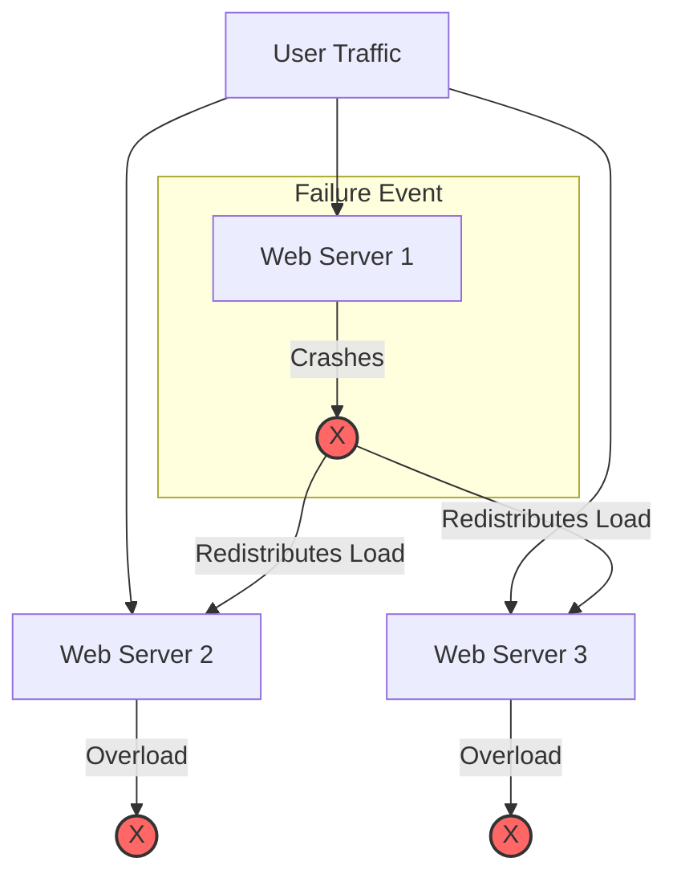

# Cascading failure

A cascading failure occurs when a failure in one component of a system triggers consecutive failures in other dependent components. To prevent these failures from disabling an entire system, you must document dependency chains, load-management policies, and structured recovery steps.

---

## How cascading failures occur

In tightly coupled or distributed systems, components depend on one another. When one node or service fails, its workload often shifts to neighboring nodes. This sudden increase in traffic or resource demand can overload the surviving components, causing them to fail as well.

Common triggers for cascading failures include:

*   **Resource exhaustion:** A database query gets stuck and consumes CPU. Upstream services waiting for responses continue to spawn processes or hold connections, which exhausts memory and crashes those servers too.
*   **Unchecked retry storms:** When a downstream service has brief downtime, upstream clients might immediately retry their requests. Without rate limits or delay strategies, this wave of retries overwhelms the recovering service and keeps it offline.
*   **Improper fallback configurations:** If a cache fails and the system automatically routes all traffic directly to a database without throttling, the database can instantly crash under the load.

---

## Preventing cascades through technical documentation

To prevent cascading failures, document system limits, fallbacks, and architecture boundaries before an incident occurs:

*   **Map upstream and downstream dependencies:** Make sure your system architecture documentation explicitly shows dependencies. This helps engineers understand the potential blast radius of a single service failure.
*   **Document backpressure and load-shedding policies:** Describe how the system handles overload. If an API drops requests (shedding load) or signals upstream systems to slow down (backpressure), document these mechanisms. This helps developers handle the resulting [HTTP status codes](https://developer.mozilla.org/en-US/docs/Web/HTTP/Status){: target="_blank" rel="noopener" }, such as `429 Too Many Requests` or `503 Service Unavailable`.
*   **Publish retry guidelines:** Make sure your developer guides require exponential backoff with jitter for all API client integrations. This spreads out retry attempts and prevents client applications from creating a self-inflicted distributed denial of service (DDoS) attack.

!!! warning "The thundering herd problem"
    When a failed system restarts, many waiting clients might attempt to reconnect and submit data simultaneously. This is the thundering herd problem. If you restart a crashed service without limiting incoming traffic, the sudden surge might crash it again immediately.

---

## Writing runbooks to stop active cascades

When a cascading failure occurs in production, standard runbook procedures can sometimes worsen the situation. Your operational documentation must guide engineers through safe, phased recovery steps:

*   **Document the shutdown sequence:** Sometimes, the only way to stop a cascade is to turn off upstream services or block incoming traffic. Your runbook should list the command-line inputs or dashboard controls to isolate the failing component.
*   **Specify a phased restart order:** Provide a clear, step-by-step startup sequence. For example, instruct engineers to start the database first, then pre-warm the cache, and finally open the gates to public traffic in increments (such as 10%, then 50%, then 100%).
*   **Identify operational kill switches:** Document any feature flags or operational "kill switches" that let teams disable non-essential features, such as recommendation engines or audit logging. This saves CPU and RAM for core workflows during an incident.

---

## Why documenting cascades matters for product teams

By documenting dependency relationships and cascading prevention tactics:

*   **Operators** can resolve complex incidents faster without causing more damage.
*   **Product managers** can make informed decisions about feature degradation. They can choose which non-essential features to disable during high-traffic events to protect the stability of the core platform.
*   **Developers** can write more resilient integration code by incorporating circuit breakers and retry logic that respect downstream resource limits.