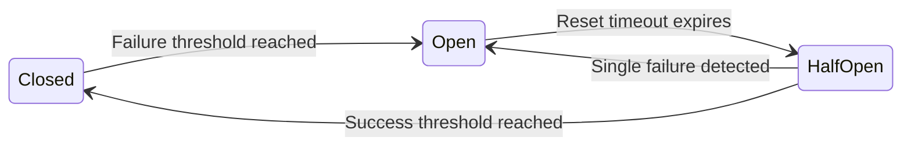

# Circuit breaker pattern

The circuit breaker pattern is a software design pattern used to detect failures and encapsulate the logic of preventing a failure from constantly recurring during maintenance, temporary external system failure, or unexpected system difficulties. Documenting how your system implements this pattern helps application programming interface (API) consumers, operators, and integration developers understand system behavior during downstream service outages.

---

## The three states of a circuit breaker

A software circuit breaker acts as a state machine that wraps protected function calls. It operates in three distinct states:

- **Closed:** The system operates normally. Requests are routed to the downstream service. The circuit breaker maintains a count or sliding window of successes and failures. The breaker only counts meaningful failures, such as timeouts or 5xx status codes, while ignoring 4xx client errors.
- **Open:** If the failure threshold is reached (for example, 50% failure rate or $N$ consecutive failures), the breaker trips. In this state, the breaker fails fast. All requests are intercepted and rejected immediately without attempting to contact the downstream service. This prevents resource exhaustion (such as thread pool saturation) and gives the downstream service time to recover.
- **Half-open:** After a configurable reset timeout (the cooldown period), the breaker enters the half-open state. It allows a limited, controlled number of trial requests to pass through. If these requests meet a specific success threshold (often 100% success for the trial batch), the breaker closes and restores normal traffic. If any trial request fails, the breaker immediately returns to the Open state and restarts the reset timeout.

!!! note "Fail-fast mechanism"
    When the breaker is Open, it does not attempt to connect to the downstream service. Your API responds immediately with an error. This prevents the queuing effect where client requests hang until they hit a connection timeout, which is the primary cause of cascading failures in microservices.

---

## What to document for developers and operators

When a system uses circuit breakers, the documentation must provide specific operational details so integration developers can implement appropriate retry and recovery logic.

- **Fallback behaviors:** Document the system behavior for an Open circuit. Specify if the API returns a stubbed response, cached data (stale-while-revalidate), a partial response (degraded user interface (UI)), or a hard error.
- **Error codes and response headers:** Document the exact error response. While `503 Service Unavailable` is standard, best practice dictates including a `Retry-After` header to inform the client when the reset timeout is expected to expire. If custom headers are used (for example, `X-Circuit-Breaker-State`), document their values.
- **Trip and reset configurations:** For operators, document the specific criteria used to change states. This includes the failure rate percentage, the minimum number of calls required before the threshold is calculated (to avoid tripping on a single early failure), and the duration of the Open state.

---

## Designing documentation for graceful failure

Map operational changes to the end-user experience to assist support and product teams:

- **Update troubleshooting guides:** Define which features are circuit-broken independently. For example, explain that the Search functionality may be unavailable while Checkout remains functional if they are protected by different breakers.
- **Provide links to status pages:** Ensure error messages point to a system status page. This allows developers to distinguish between a tripped circuit (a known platform issue) and an integration error in their own code.