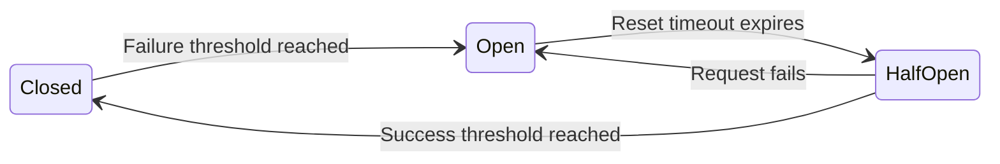

# Circuit breaker pattern

The circuit breaker pattern is a software design pattern that prevents an application from repeatedly trying to execute an operation that is likely to fail. Documenting how your system implements this pattern helps API consumers, operators, and integration developers understand system behavior during downstream service outages.

## The three states of a circuit breaker

Like a physical circuit breaker in electrical engineering, a software circuit breaker interrupts the flow of requests to protect the system. It operates in three distinct states:

- **Closed:** The system operates normally. Requests flow to the downstream service. The circuit breaker monitors the success and failure rates of these requests.
- **Open:** If the failure rate exceeds a specified threshold, the circuit breaker trips. In this state, the breaker fails all requests immediately without sending them to the downstream service. This prevents overwhelming the downstream service and releases system resources.
- **Half-Open:** After a reset timeout, the circuit breaker enters the half-open state. It allows a limited number of test requests to pass through. If these requests meet the success threshold, the breaker closes and restores normal traffic. If they fail, the breaker returns to the **Open** state and restarts the timeout.

!!! note "Why breakers block requests instantly"
    When the breaker is **Open**, it does not attempt to connect to the downstream service. Your API responds instantly with an error instead of letting client requests wait until they time out. This prevents thread-pool exhaustion and cascading failures in your infrastructure.

## What to document for developers and operators

When a system uses circuit breakers, the documentation must provide more than a high-level architectural explanation. Integration developers and system operators need specific operational details to handle triggered circuits.

- **Fallback behaviors:** Document the system behavior when the circuit breaker is open. For example, explain if the API returns cached data, returns a partial response, or fails completely. Describe the expected experience for both developers and end users.
- **Error codes and response headers:** When the breaker blocks a request, document the exact error response. Typically, APIs return `503 Service Unavailable`. If you use custom error headers, such as `X-Circuit-Breaker-State: Open`, document them so developers can write code to parse the state.
- **Tripping and reset thresholds:** For internal engineering or system operator guides, document the configuration values. Specify the failure rate percentage that trips the breaker (for example, a 50% failure rate over a 10-second sliding window) and the duration of the **Half-Open** cooling-off period.

## Designing documentation for graceful failure

When a circuit breaker trips, the user experience changes. Help product and engineering teams by mapping these operational changes to user guides:

- **Update troubleshooting guides:** Create clear troubleshooting steps for when specific features degrade. For example, explain what to do if the payment portal returns a "Service temporarily unavailable" message while other platform features continue to work normally.
- **Provide links to status pages:** Ensure error messages and reference guides point to your system status page. This helps integration developers verify if a feature failure is due to a tripped circuit breaker on your side or an issue in their own code.