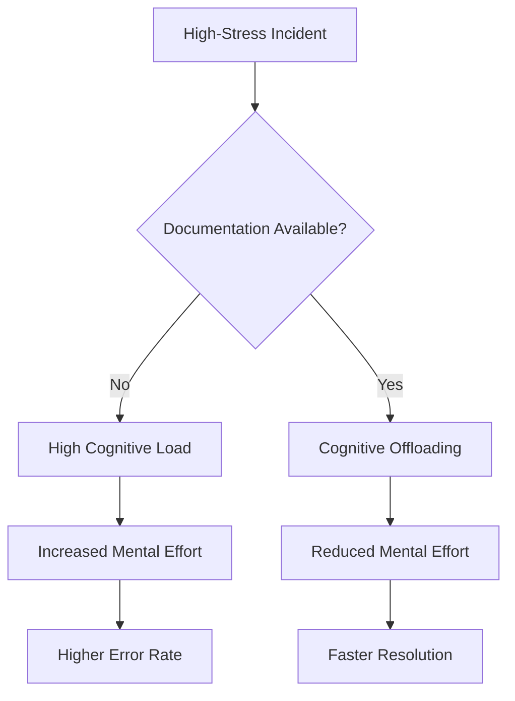

# Cognitive offloading

Cognitive offloading is the use of external tools—such as checklists, runbooks, and diagrams—to reduce the mental processing burden on users. Documenting critical information offloads memory requirements to external sources, which helps engineers avoid errors during high-pressure incidents.

---

## How stress impacts cognition

During a system outage or production failure, stress triggers a physiological response that reduces cognitive capacity. Working memory is naturally limited, typically holding only a few items at a time. Stress further constricts this capacity.

If an engineer must rely on memory or derive complex commands from first principles while a system is down, the likelihood of errors increases. Well-designed technical documentation acts as an external memory source. It handles the processing work, which allows the user to focus on execution rather than recall.

---

## Designing documentation for low cognitive load

To support cognitive offloading, ensure documentation is easy to scan, interpret, and act on.

- **Use strict chronological sequencing**: Write procedures in the exact order the user must execute them. Do not include historical context, design theory, or optional side notes within a troubleshooting procedure.
- **Chunk information**: Break long, complex procedures into smaller subtasks. A list of five tasks containing five steps each is easier to process than a single list of 25 consecutive steps.
- **Provide expected results**: For every command, show an example of a successful response. This removes the mental effort required to verify if a step succeeded.
- **Make warnings highly visible**: Use visual cues to highlight destructive actions, such as dropping a database or restarting a service, before the user reaches those steps.

!!! warning "Avoid inline branching"
    Do not write steps like: "If you are on version A, run command X. If you are on version B, run command Y." This forces the user to maintain multiple logic paths. Instead, split these scenarios into separate procedures or self-contained sections.

---

## Formats that support cognitive offloading

Different document formats serve different cognitive needs during system operations:

- **Interactive checklists**: Use checkable steps during a release or rollback to prevent users from skipping critical verification steps.
- **Architecture diagrams**: High-level visual maps help engineers trace data paths and dependencies without needing to reconstruct the infrastructure layout from text or source code.
- **Runbooks and playbooks**: Step-by-step instructions for specific alerts remove the need for creative problem-solving during active incidents.

---

## Maintaining offloading tools

An outdated tool increases cognitive load rather than reducing it. If an engineer runs a command from a runbook and it fails, their confusion and stress increase.

To keep offloading tools effective, perform regular dry runs of incident guides to verify that commands and environment variables are current. After resolving an incident, identify which sections of the documentation were confusing or slow to use, and update those documents immediately.