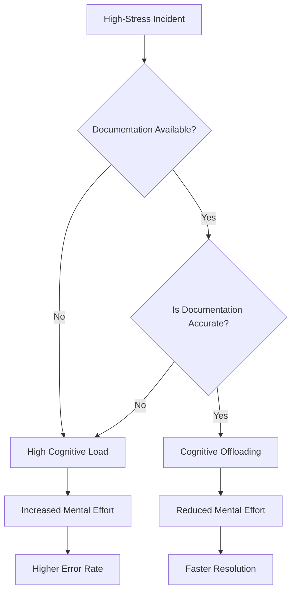

# Cognitive offloading

Cognitive offloading is the use of external tools, such as checklists, runbooks, and diagrams, to reduce the mental processing burden on users. Documenting critical information offloads memory requirements to external sources, which helps engineers avoid errors during high-pressure incidents by shifting the cognitive task from retrieval and inference to recognition and execution.

---

## How stress impacts cognition

During a system outage or production failure, stress triggers a physiological response that reduces cognitive capacity. Working memory is naturally limited, typically holding only a few chunks of information at a time. Stress further constricts this capacity by prioritizing immediate threat response over complex analytical reasoning.

If an engineer must rely on memory or derive complex commands from fundamental concepts while a system is down, the likelihood of errors increases. Well-designed technical documentation acts as an external memory source. It minimizes the need for internal retrieval, allowing the user to focus on execution and system observation.

---

## Designing documentation for low cognitive load

To support cognitive offloading, ensure documentation is easy to scan, interpret, and act on.

- **Group information**: Break long, complex procedures into smaller subtasks with clear headings. A list of five tasks containing five steps each is easier to process than a single list of 25 consecutive steps, because it provides logical pause points.
- **Use strict chronological sequencing**: Write procedures in the exact order the user must execute them. Move historical context, design theory, or non-critical background information to an appendix or separate conceptual article.
- **Provide expected results and state changes**: For every command, show an example of a successful response or describe the expected change in system state (for example, the status field should now transition to healthy). This removes the mental effort required to verify if a step succeeded.
- **Make warnings highly visible**: Place warnings *before* the step they refer to. Use visual cues to highlight destructive actions, such as dropping a database or restarting a service, so the user encounters the risk assessment before the execution command.

!!! warning "Minimize inline branching"
    Avoid writing steps with high cyclomatic complexity. For example, avoid instructing users to run command X for version A and command Y for version B. This forces the user to maintain multiple logic paths in working memory. Instead, use an entry-point selection (for example, prompt the user to select their version to see the relevant procedure) or provide separate, self-contained sections for different environments.

---

## Formats that support cognitive offloading

Different document formats serve different cognitive needs during system operations:

- **Interactive checklists**: Use checkable steps during a release or rollback to track state and prevent users from skipping critical verification steps.
- **Architecture diagrams**: High-level visual maps help engineers trace data paths and dependencies. This allows for spatial reasoning, which is often more resilient under stress than linguistic or symbolic reasoning.
- **Runbooks and playbooks**: Precomputed instructions for specific alerts remove the need for creative problem-solving and troubleshooting from fundamental concepts during active incidents.

---

## Maintaining offloading tools

An outdated tool increases cognitive load more than a total lack of documentation. If an engineer runs a command from a runbook and it fails, they must perform context recovery to determine why the tool failed while simultaneously troubleshooting the original incident.

To keep offloading tools effective, perform regular game day exercises or test runs of incident guides to verify that commands, dependencies, and environment variables are current. After resolving an incident, identify which sections of the documentation were ambiguous or slow to use, and update those documents as part of the post-incident review process.