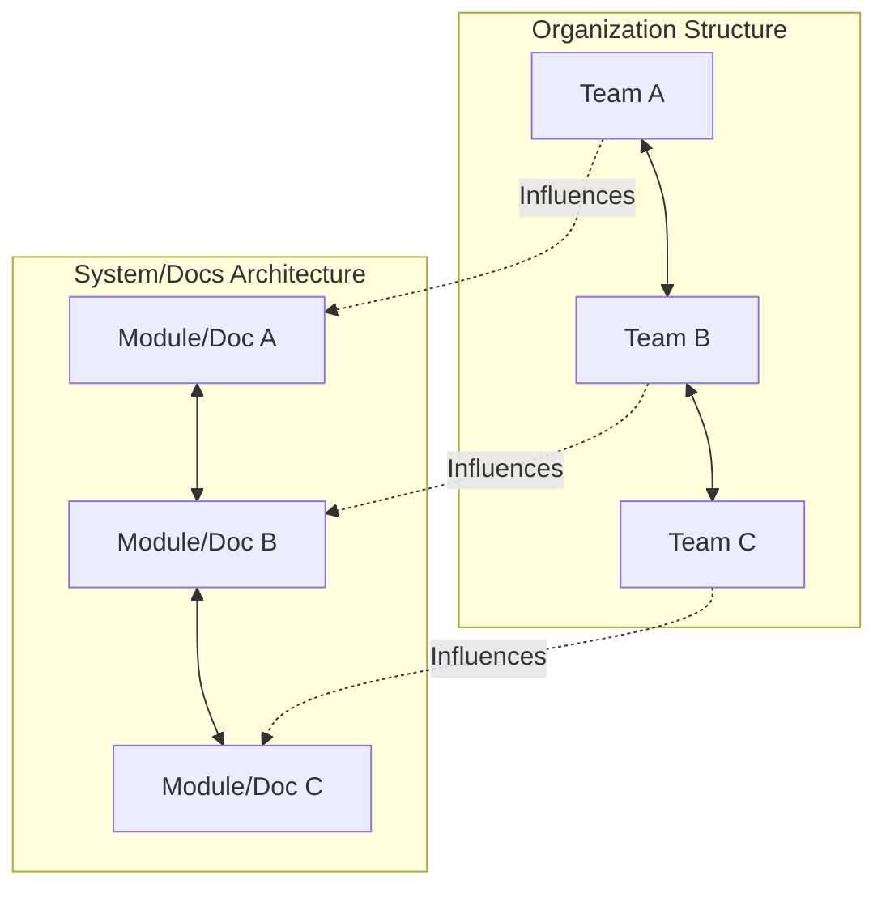

# Conway's law

Conway’s Law states that organizations design systems and documentation structures that mirror their internal communication patterns. If teams operate in isolated silos, the resulting technical systems and documentation typically reflect those divisions.

---

## How communication shapes systems

In 1967, programmer Melvin Conway observed that system design is a copy of an organization's communication paths. For example, if four separate engineering teams build a compiler, the result is likely a four-pass compiler.

This law applies to technical documentation. If front-end and back-end teams rarely collaborate, you might produce two separate documentation portals that use different terminology and lack a unified flow. However, customers experience your product as a single application. Disjointed documentation makes it difficult for them to achieve their goals.

---

## Identifying Conway’s Law in documentation

Look for these symptoms in your information architecture to detect the influence of Conway’s Law:

- **Inconsistent terminology**: Different squads use different names for the same core system component in their respective documentation sections.
- **Navigation silos**: Users must understand your internal company structure to find information because directories are organized by department or squad names rather than by user tasks.
- **Information gaps**: Transition points between systems, such as passing a payload from an API gateway to a background worker, are poorly documented because neither team owns the interface boundary.

---

## The Inverse Conway Maneuver

Instead of letting internal communication structures dictate your architecture, use Conway’s Law to your advantage. This practice is the **Inverse Conway Maneuver**.

By changing how teams interact and how you organize documentation projects, you can guide the final system toward a better design. In technical writing, implement this by creating cross-functional documentation working groups, establishing shared goals, and structuring your documentation portal around customer workflows rather than organizational charts.

!!! tip "Prevent documentation silos"
    To prevent Conway’s Law from fragmenting your documentation, establish a shared style guide, set up cross-team peer reviews, and use a unified search index. These practices help writers and engineers build a cohesive experience regardless of team boundaries.

---

## Aligning team structures and documentation

To apply Conway’s Law, adjust your documentation processes to mirror your desired user experience:

- **Organize by user tasks**: Group content by user goals—such as integration, deployment, or troubleshooting—rather than internal engineering squads, such as the database or security teams.
- **Foster cross-team documentation reviews**: Have an engineer or writer from an upstream service review the downstream documentation. This helps identify gaps in integration handoffs before customers find them.
- **Build shared templates**: Use standardized formats for APIs, runbooks, and release notes across all squads so that the documentation feels unified.