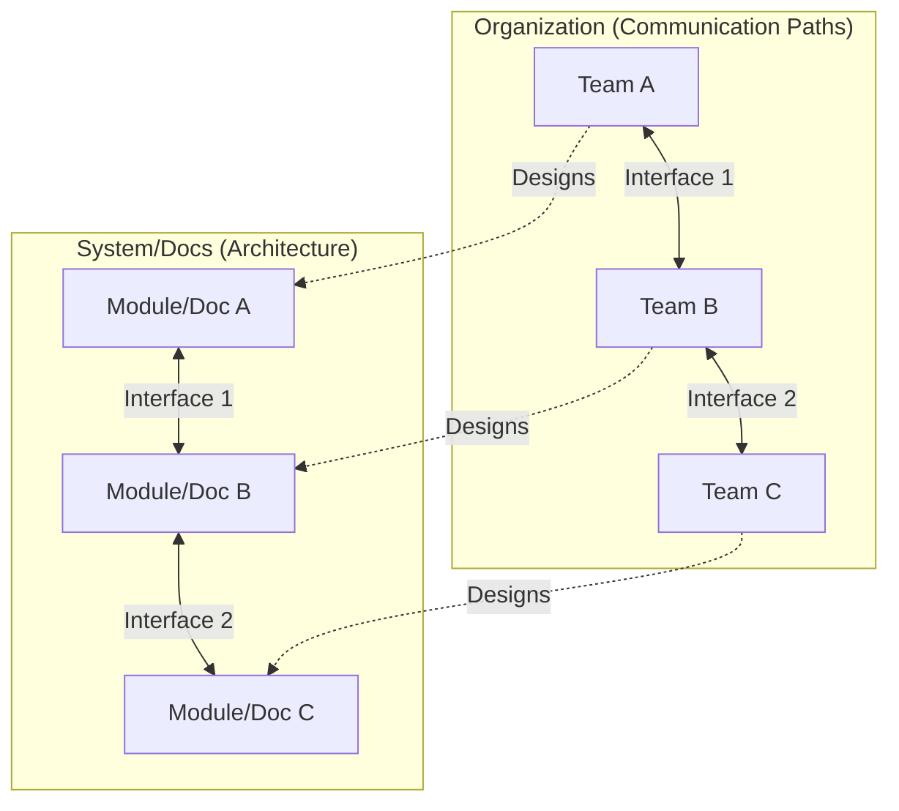

# Conway's law

Conway's law states that "organizations which design systems... are constrained to produce designs which are copies of the communication structures of these organizations." While originally applied to software architecture, this observation extends to technical documentation: the way information is structured and delivered typically mirrors the internal communication paths of the teams that created it.

---

## How communication shapes systems

In 1967, programmer Melvin Conway observed that a system's design is a functional map of the organization's communication patterns. His classic example noted that if four separate teams are assigned to build a compiler, the resulting software will likely be a four-pass compiler, with each pass corresponding to a specific team's boundary.

This law applies directly to technical documentation. If front-end and back-end teams operate in isolation with minimal interaction, the documentation often manifests as two distinct portals or sections. These sections frequently use conflicting terminology and lack a unified user journey, even though the end user perceives and uses the product as a single, integrated application.

---

## Identifying Conway's law in documentation

Symptoms of isolated organizations appearing in information architecture include:

- **Inconsistent terminology**: Disparate teams develop internal terminologies, leading to the same core system component (for example, a User ID versus a Principal String) being named differently across documentation sections.
- **Isolated navigation**: Users are forced to understand the internal company hierarchy to find information because the documentation is organized by department or squad names rather than by user goals or product features.
- **Interface gaps**: Integration points, such as the handoff of a JavaScript Object Notation (JSON) payload from an application programming interface (API) gateway to a background worker, are often undocumented because the communication gap between the two responsible teams results in neither team taking responsibility for the documentation for the boundary.

---

## The inverse Conway maneuver

The inverse Conway maneuver is a strategy in which an organization is restructured to promote a desired system architecture. If you want a decoupled, microservices-based architecture, you must first organize your teams into small, decoupled, cross-functional units.

In the context of documentation, you apply this maneuver by organizing documentation contributors around the customer journey rather than the engineering hierarchy. By forming cross-functional documentation working groups that share a single repository and a unified release process, you force the technical content to converge into a cohesive system, regardless of which engineering team built the underlying code.

!!! tip "Mitigating isolated documentation"
    To decouple documentation from isolated organizations, establish a shared style guide, implement cross-team peer reviews (in which Team A reviews Team B's documentation), and maintain a unified search index. These practices simulate a single-team communication structure, leading to a more integrated reader experience.

---

## Aligning team structures and documentation

To apply the inverse Conway maneuver effectively, adjust processes to mirror the desired user experience:

- **Organize by user tasks**: Group content by functional goals, such as Authentication or Data Processing, rather than by internal engineering designations such as the Java team or the infrastructure squad.
- **Foster cross-team documentation reviews**: Require an engineer or writer from an upstream service to review downstream documentation. This identifies logic gaps in integration handoffs that mirror the communication gaps between those teams.
- **Build shared templates**: Standardize formats for API references, runbooks, and release notes. This ensures that even if components are built by different teams, the interface presented to the user is consistent and unified.