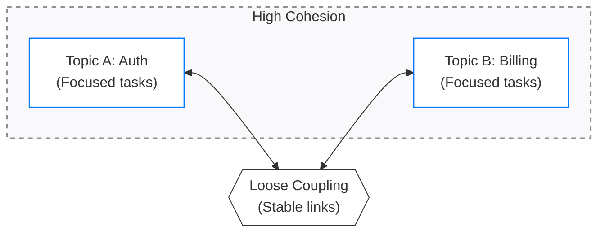

# Coupling and cohesion

Coupling measures the degree of dependency between system modules. Cohesion measures how focused the responsibilities of a single module are. In technical communication, these principles help you maintain, reuse, and scale documentation components without causing cascading updates.

---

## Foundations in software and documentation

In software engineering, developers aim for **loose coupling** and **high cohesion**. This design philosophy helps make sure that a change in one part of the codebase does not break another part, and that each class or function has one clear responsibility.

When you apply these concepts to technical communication, they govern how you structure information architecture, manage single-sourced content, and design navigation. 

- **Coupling in documentation** refers to how much a topic or content block relies on the context, structure, or existence of another.
- **Cohesion in documentation** refers to how well the content within a topic or module focuses on a single user goal or concept.

---

## The impact of coupling on documentation

Tightly coupled documentation is fragile. If you modify a product feature or rewrite an article, tightly coupled systems require you to update many other pages that seem unrelated.

### Indicators of tight coupling in documentation

- **Duplicate procedures:** Copying the same five-step configuration sequence across 10 different guides. If the UI changes, you must find and update every location.
- **Context-dependent snippets:** Using a single-source snippet that relies on the surrounding text for grammatical or structural meaning. If you move the snippet to a different page, it might not make sense or could break the formatting.
- **Fragile cross-references:** Linking to specific anchor tags inside volatile procedural topics rather than to stable, high-level conceptual landing pages.

### Strategies for loose coupling

To design loosely coupled documentation, establish clean interfaces between your content modules.

- **Programmatic cross-referencing:** Link to topics as independent entities. If your publishing system supports it, use unique resource identifiers, such as cross-reference IDs, rather than hard-coded relative file paths that break when you reorganize folders.
- **Reference by reference:** Instead of embedding detailed prerequisites in every tutorial, link to a dedicated setup guide.
- **Standalone reuse units:** Make sure that any reusable component, such as a warning note or a code block, is self-contained. It must include the context necessary to stand alone, regardless of the topic that imports it.

!!! note "System thinking principle"
    Reducing coupling between documentation modules narrows the impact of a single product update. It allows you to update a topic and remain confident that you have not broken the integrity of the rest of the documentation.

---

## The impact of cohesion on documentation

Low-cohesion documentation is difficult to read and maintain because it covers too many subjects. Highly cohesive documentation aligns with the single responsibility principle: each topic focuses on one primary user intent.

### Indicators of low cohesion in documentation

- **The "Catch-all" page:** An article titled *Getting Started and Advanced Configurations* that contains quick starts, security policies, API members, troubleshooting tips, and billing instructions.
- **Mixed content types:** Mixing deep theoretical concepts, code snippets, and UI steps in the same narrative block. This slows down experienced users who only need the reference and overwhelms new users who only need a simple task.
- **Weak information architecture:** Topics that lack a clear purpose, leaving the user unsure whether they are reading a conceptual overview, a tutorial, or a technical specification.

### Strategies for high cohesion

You can achieve high cohesion by grouping related ideas and separating unrelated concerns.

**Apply the Concept-Task-Reference (CTR) model:** 

Separate your content into three types:

- **Concepts:** Explain why and how a system works.
- **Tasks:** Guide the user through how to achieve a specific goal.
- **Reference:** Provide data, such as API parameters, CLI commands, or error codes.

**Enforce strict topic boundaries:**

If you explain the theory of asymmetric encryption in the middle of a procedure about importing a certificate, move that theory to its own conceptual topic.

---

## Comparing coupling and cohesion states

The relationship between coupling and cohesion affects the health of your documentation. Use the following table to evaluate your content.

| State | Description | Impact on maintenance | User experience |
| :--- | :--- | :--- | :--- |
| **High Cohesion, Low Coupling (Ideal)** | Topics focus on a single goal and connect through stable links. | **Low maintenance.** You can rewrite or move topics independently. | **Excellent.** Users find what they need quickly. |
| **High Cohesion, High Coupling** | Topics are focused but depend on the wording or order of other topics. | **High risk of breakage.** Changing one topic requires updating several others. | **Good, but fragile.** Navigation is logical, but broken links can ruin the flow. |
| **Low Cohesion, Low Coupling** | Topics are disorganized but rarely link to each other. | **Moderate maintenance.** Files do not break each other, but finding where to add new information is difficult. | **Poor.** Users must scroll through long pages to find details. |
| **Low Cohesion, High Coupling** | Unstructured documents that copy and link to information constantly. | **Difficult.** Any product update triggers a massive, manual rewrite. | **Frustrating.** Information is repetitive and difficult to scan. |

---

## Actionable patterns: Refactoring your documentation

If you inherit a legacy documentation site with high coupling and low cohesion, use these refactoring patterns to restructure the information.

### Pattern 1: Extract concept from task

When a task is cluttered with background information, move the explanation to a separate topic.

- **Before:** A guide on configuring database replication that stops at Step 3 to explain the differences between synchronous and asynchronous replication modes.
- **After:** 
  - Keep the task focused on the configuration commands.
  - Move the explanation to a cohesive conceptual page titled *Database replication modes*.
  - Insert a link at the beginning of the task: "Before you configure replication, read about `[database replication modes](replication-modes.md)`."

### Pattern 2: Interface-driven linking

Avoid linking to specific UI steps within another guide. Instead, link to the parent entry point.

- **Before:** "Go to step 4 of the `[User Provisioning Guide](user-provisioning.md)` to assign roles." If the provisioning guide changes, this link might point to the wrong step.
- **After:** "Assign roles to the user. For more information, see `[Assigning roles](assign-roles.md)`."

### Pattern 3: Decouple snippets

Review your documentation snippets and single-sourced files to make sure they do not rely on local variables or specific context.

- **Before:** A reusable warning note that says: "This step is dangerous because of the settings you chose above."
- **After:** "This configuration can expose your API keys. Make sure you store keys in a secure vault before proceeding."