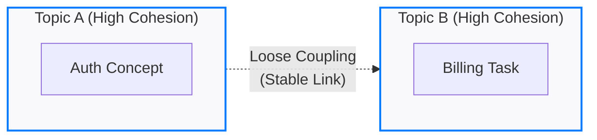

# Coupling and cohesion

Technical debt is not limited to source code; documentation often suffers from the same structural decay. By applying software engineering principles such as coupling and cohesion to [information architecture](../references/ia-design.md), you can create content that scales without becoming difficult to maintain.

Coupling describes how tightly two topics are linked. Cohesion describes how well the content within a single topic sticks to one purpose.

---

## Reduce fragility through loose coupling

Tightly coupled documentation is brittle. When you change a file path or reword a heading, you might inadvertently trigger a series of broken links and logical errors across the documentation set.

### Signs of high coupling

- **Positional reliance:** Phrases such as "as mentioned earlier" or "the table in the next section" fail when content is reordered or components are embedded elsewhere.
- **Path-heavy linking:** Linking by using hardcoded relative paths (for example, `../../setup.md`) makes the documentation structure rigid. If a file moves, the build might fail or links will break unless the environment handles path refactoring automatically.
- **Grammatical bleeding:** A reusable snippet that assumes it is part of a numbered list or depends on the context of the preceding paragraph cannot be reused effectively.

### Strategies for decoupling

To build a resilient documentation set, aim for stateless content.

- **Global identifiers and cross-references:** Use a [content management system (CMS)](../industry-terms/content-management-system.md) or [static site generator (SSG)](../doc-stack/ssg.md) that supports unique IDs or symbolic cross-references (for example, Hugo's `ref` or Sphinx's `:ref:`). This decouples the link from the physical file path or folder hierarchy.
- **Self-contained snippets:** Write reusable fragments that do not rely on outside pronouns or transitions. 
- **Link instead of duplicating:** Avoid content coupling, in which you type out the same prerequisite or procedure in multiple places. Point users to a [single source of truth](../doc-stack/git.md#the-single-source-of-truth) instead to ensure updates only need to happen in one location.

---

## Improve focus with high cohesion

Low cohesion creates monolithic pages. These topics are difficult to scan because they try to address multiple needs at once. High cohesion follows the Single Responsibility Principle: one topic, one intent.

### Identifying low cohesion

- **Overloaded pages:** A single 4,000-word article covering high-level sales pitches, deep-dive application programming interface (API) specifications, and basic installation.
- **Context switching:** When a procedural step is interrupted by three paragraphs of theoretical background, it breaks the flow for the user. 
- **Mismatched intent:** If a paragraph explains why something matters under a How to configure heading, that content belongs elsewhere.

### Information mapping for cohesion

The [Concept-Task-Reference (CTR) model](../industry-terms/concept-task-reference.md) is the standard fix for cohesion issues. By splitting content into theoretical background (concepts), step-by-step actions (tasks), and technical data (reference), you ensure each module has a singular, clear purpose.

---

## Documentation health matrix

| State | Maintenance cost | User experience |
| :--- | :--- | :--- |
| **High cohesion / Loose coupling** | **Low.** Topics are isolated units. You can update or move them without breaking the site. | **Seamless.** Navigation is logical and links are reliable. |
| **High cohesion / Tight coupling** | **High risk.** Reorganizing a folder or changing a URL breaks many dependencies. | **Functional but brittle.** It works until a writer moves a file. |
| **Low cohesion / Loose coupling** | **Moderate.** Files do not break, but finding where to update a specific fact is difficult. | **Poor.** Users must scan through large volumes of irrelevant information within a file to find what they need. |
| **Low cohesion / Tight coupling** | **Critical.** Every product change requires a manual audit of the entire documentation set. | **Frustrating.** Constant circular references and repetitive, contradictory text. |

---

## Refactoring patterns

### 1. Extract a concept 

When a task includes excessive theory, move the background information to its own module.

- **Problem:** A Create Cluster task pauses at step 2 to explain Paxos consensus algorithms.
- **Solution:** Keep the task focused on commands. Move the algorithm details to a Consensus concepts page and link to it for more information.

### 2. Decouple snippets

Make sure reusable content stands on its own.

- **Problem:** A snippet says, "After doing the steps above, click Submit."
- **Solution:** "After you enter the credentials, select **Submit**."

### 3. Interface-based linking

Avoid linking to volatile internal structures such as step numbers.

- **Problem:** "See step 5 in the Installation Guide."
- **Solution:** "Complete the `[Installation Guide]` before proceeding." By treating the topic as the interface, you do not need to worry if the internal implementation (the steps) is renumbered.