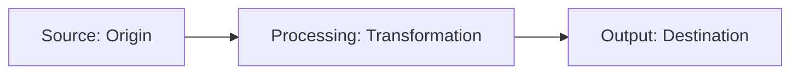

# Data lineage

Data lineage in documentation is the practice of tracking the origin, transformation, and final output of technical information across a documentation set. By mapping how data flows from its source (such as code or configuration files) to various published formats, you can ensure content remains consistent and programmatically synchronized as the product evolves.

---

## Why data lineage matters in documentation

If you manage a large documentation library, a single technical detail, such as an API rate limit, might appear on many pages: a getting started guide, a developer tutorial, a reference table, and a marketing data sheet.

If the engineering team changes that limit in the source code, manually updating every instance in the documentation is inefficient and prone to human error. Data lineage allows you to treat these values as data objects. By visualizing the flow, you can track where that detail originated, how it was parsed or transformed for different contexts, and which downstream documents are affected by a change at the source.

---

## The lifecycle of documented data

Data lineage tracks content assets through three main stages:

- **Source (Origin)**: The [single source of truth](../doc-stack/git.md#the-single-source-of-truth) for the technical detail. This is typically structured data or code, such as an OpenAPI (Swagger) specification, a database schema, or a central YAML/JSON configuration file.
- **Processing (Transformation)**: The stage where raw data is parsed, filtered, or formatted. For example, a static site generator (SSG) or a build script may ingest a JSON payload and use a template engine (like Liquid or Jinja) to transform it into a Markdown table or a code snippet.
- **Output (Destination)**: The final consumption point for the user, such as [developer portals](../doc-stack/developer-portals.md), in-app [tooltips](../doc-stack/terminology-tooltips.md), or PDF user guides.

---

## Best practices for implementing data lineage

To build a traceable and maintainable documentation system, use these methods:

- **Use variables and global definitions.** Instead of hard-coding values (literals), store shared parameters in centralized metadata files. Reference these variables within your documentation so that updating the source file automatically propagates changes to all output formats during the next build.
- **Automate reference documentation from source.** Use documentation generators that extract docstrings and schemas directly from the code base, such as [Sphinx](https://www.sphinx-doc.org/){: target="_blank" rel="noopener" } (for Python/reST), [JSDoc](https://jsdoc.app/){: target="_blank" rel="noopener" } (for JavaScript), or [Doxygen](https://www.doxygen.nl/){: target="_blank" rel="noopener" } (for C++/Java). This ensures the "Source" and "Output" remain coupled.
- **Implement a dependency graph.** Use build tools or custom scripts to maintain a Directed Acyclic Graph (DAG) of your content. This allows you to identify which tutorials or articles rely on specific API specifications, making it easier to perform impact analysis before a release.

!!! tip "Automating lineage validation"
    Use linters or contract testing tools to scan documentation for hard-coded strings that match protected variables. Automation ensures that documentation does not "drift" from the actual state of the application code.

---

## Reducing the impact of changes

When you understand the lineage of your data, you can perform effective impact analysis. When an engineering team announces an architectural change or a schema update, you do not have to manually search for affected content.

By tracing the lineage of the modified component downstream, you can programmatically identify every article, code sample, and diagram that requires a rebuild or manual review. This proactive maintenance ensures technical accuracy and prevents the publication of "stale" data or broken examples.