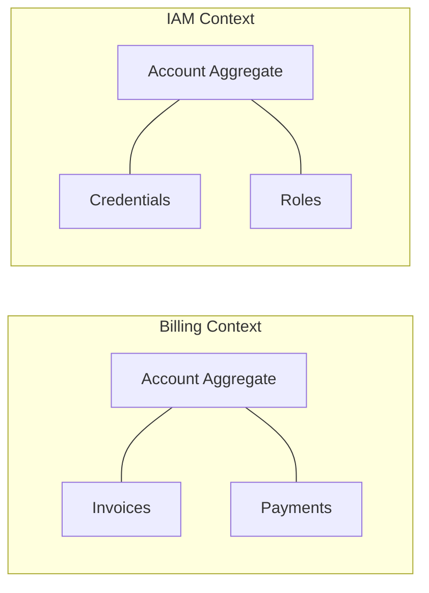

# Domain-driven design (DDD)

Domain-driven design (DDD) is not just a coding pattern; it is a strategy for managing complexity by pinning the architecture of the software to the evolving business model. 

In [technical communication](../technical-writing/basics.md), DDD prevents the model-code gap, which is the drift where documentation and code eventually describe two different systems. 

By treating documentation as an extension of the domain model, teams ensure that the vocabulary used by developers, stakeholders, and users remains consistent.

---

## Strategic design: Ubiquitous language

Ubiquitous language replaces generic glossaries with a rigorous, shared vocabulary embedded in the source code. If a term appears in a class name, method, or variable, it must be the exact term used in the documentation. 

Terminological drift, such as using *Tenant* in the code, *Subscriber* in the documentation, and *Client* in the UI, is a bug. It creates cognitive friction and leads to implementation errors.

*   **Codify the source of truth:** Technical writers should help formalize technical terms during the design phase rather than documenting them afterwards. 
*   **Treat mismatches as bugs:** Any discrepancy between an API parameter, such as `tenant_id`, and its documentation title is a technical defect.
*   **Focus on business invariants:** Documentation should explain the rules governing the domain (why a state change is allowed) rather than just listing UI buttons.

!!! tip "API and code alignment"
    Verify that [JSON payloads](../doc-stack/json-logic.md#anatomy-of-a-json-payload) match documentation labels. If the code uses `tenant_id`, the documentation should not call it a user account number unless the domain model explicitly treats them as synonyms.

---

## Bounded contexts and information architecture

In large systems, one word can mean different things depending on who is asking. DDD manages this through [bounded contexts](../systems-thinking/bounded-context.md), which are logical boundaries where a specific model applies.



An *Account* in the **Billing Context** is a financial record of invoices and payments. In the **Identity and Access Management (IAM) Context**, that same word refers to a security principal with credentials and Role-Based Access Control (RBAC) roles. Mixing these descriptions confuses the user and obscures the system logic.

*   **Mirror the information architecture:** Organize documentation categories to reflect the bounded contexts of the system. If the system uses microservices, the documentation hierarchy should likely follow suit.
*   **Enforce logical isolation:** Keep context-specific logic contained. A guide on billing should not leak authentication implementation details unless it is specifically describing the bridge between the two.
*   **Map the intersections:** Where contexts meet, use a context map. Explicitly document the Anti-Corruption Layer (ACL) that translates data from one model to another so developers understand how the transformation happens.

---

## Integrating DDD into the documentation workflow

### Active modeling

Technical writers should participate in [event storming](https://en.wikipedia.org/wiki/Event_storming){: target="_blank" rel="noopener" } sessions. By participating in domain modeling, writers can flag ambiguous terms or logic gaps before they are baked into the API contract.

### Parallel directory structures

Align the file structure of the documentation with the package organization of the repository. If the code lives in `src/shipping/` and `src/billing/`, the conceptual guides should follow the same path. This allows developers to find relevant documentation by following the logic of the codebase they are already navigating.

### Automated language enforcement

Standardize terms using linters such as [Vale](https://vale.sh){: target="_blank" rel="noopener" }. Instead of manual style checks, use automated rules to flag deprecated or non-domain terms in real-time.

```yaml
# Example Vale rule to enforce Ubiquitous Language
extends: substitution
message: "Use '%s' instead of '%s' to match the domain model."
level: error
ignorecase: true
swap:
  subscriber: tenant
  client: tenant
  user_account: tenant
```

By grounding documentation in DDD principles, the technical narrative becomes a functional part of the system architecture. This reduces the [cognitive load](../technical-writing/cognitive-load.md) on engineers and ensures that the documentation scales alongside the code.