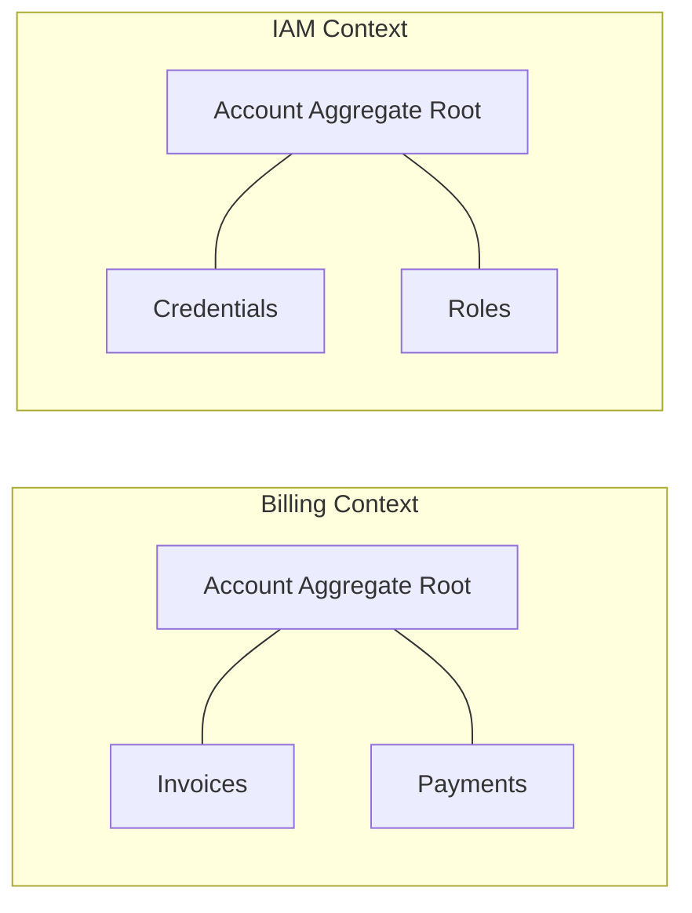

# Domain-driven design (DDD)

Domain-driven design (DDD) is a strategic architectural approach for managing complexity by connecting the implementation of the software directly to an evolving business model. 

In [technical communication](../technical-writing/basics.md), DDD prevents the model-code gap. This gap is a state of divergence where documentation and source code describe two different logical systems. By treating documentation as a formal representation of the domain model, teams ensure the vocabulary used by engineers, stakeholders, and end users remains synchronized.

---

## Strategic design: Ubiquitous language

Ubiquitous language replaces generic glossaries with a rigorous, shared vocabulary embedded directly into the source code and documentation. If a term is defined in the domain model, it must be the exact term used in class names, API endpoints, and technical guides.

Terminological drift (for example, using *Tenant* in the code, *Subscriber* in the docs, and *Client* in the UI) is a technical defect. This drift increases cognitive load and leads to logic errors during implementation.

-   **Codify the source of truth:** Technical writers should collaborate with domain experts to formalize terms during [event storming](https://en.wikipedia.org/wiki/Event_storming){: target="_blank" rel="noopener" } sessions, ensuring the language is consistent before the API contract is finalized.
-   **Treat mismatches as bugs:** Any discrepancy between a code-level identifier (for example, a `tenant_id` property) and its documentation label is a bug that must be resolved to maintain model integrity.
-   **Document domain invariants:** Documentation must focus on domain invariants, which are the business rules and consistency constraints that must always be satisfied by the model, regardless of state changes.

!!! tip "API and code alignment"
    Verify that [JSON payloads](../doc-stack/json-logic.md#anatomy-of-a-json-payload) match documentation labels. If the code uses `tenant_id`, the documentation should use Tenant ID. In DDD, value objects encapsulate the logic of a property but do not justify the use of synonyms. The ubiquitous language must remain identical across all artifacts to prevent cognitive friction.

---

## Bounded contexts and information architecture

In large systems, the same term can have different meanings and logic depending on the environment. DDD manages this through bounded contexts, which define the explicit logical boundaries where a specific model and its ubiquitous language are valid.



An *Account* in the billing context is a financial entity associated with invoices and payment methods. In the identity and access management (IAM) context, the same word refers to a security principal with credentials and role-based access control (RBAC) permissions. These models represent different concepts and must remain decoupled.

-   **Mirror the bounded contexts:** Organize documentation hierarchy to reflect the bounded contexts of the system. While microservices often align with these contexts, the documentation should focus on the logical boundary rather than the deployment unit.
-   **Enforce logical isolation:** Ensure that context-specific logic remains encapsulated. A billing integration guide should not reference IAM internal implementation details, such as password hashing algorithms, to prevent tight coupling between contexts.
-   **Map the intersections:** Where different contexts interact, document the context map, specifically the anti-corruption layer (ACL). This layer translates the semantics and data from an upstream model into the local downstream model, protecting the integrity of the local domain.

---

## Integrating DDD into the documentation workflow

### Active modeling

Technical writers should participate in the initial design phase to identify ambiguous terms or logic gaps before they are codified. If a business rule cannot be explained clearly in documentation, it usually indicates a flaw in the underlying domain model or a violation of an invariant.

### Parallel directory structures

Align the documentation file structure with the domain modules of the repository. If the code is organized by domain (for example, `src/shipping/` and `src/billing/`), the conceptual and reference documentation should follow the same path. This allows developers to navigate the doc-as-code structure using the same mental model they use for the codebase.

### Automated language enforcement

Use automated linters such as [Vale](https://vale.sh){: target="_blank" rel="noopener" } to enforce ubiquitous language. Rules can be configured to flag deprecated terms or leaked terms from other contexts.

```yaml
# Example Vale rule to enforce ubiquitous language
extends: substitution
message: "Use '%s' instead of '%s' to maintain ubiquitous language."
level: error
ignorecase: true
swap:
  subscriber: tenant
  client: tenant
  user_account: tenant
```

By grounding documentation in DDD principles, the technical narrative becomes a functional component of the system architecture, reducing [cognitive load](../technical-writing/cognitive-load.md) and ensuring scalability.