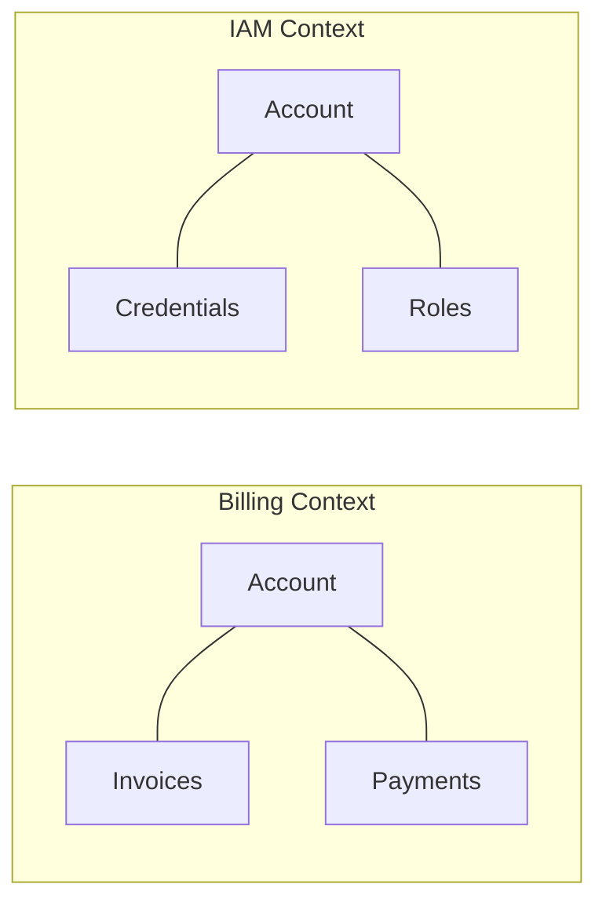

# Domain-driven design (DDD)

Domain-driven design (DDD) is a software development methodology that structures code and system architecture around a precise model of the business domain. In technical communication, DDD aligns documentation structure and terminology with defined business boundaries. This alignment ensures consistency across code, user interfaces, and technical guides.

---

## The foundation: Ubiquitous language

In DDD, engineering, product, and business teams agree on a single vocabulary to describe a specific bounded context, known as the ubiquitous language. If the codebase uses the term *Tenant*, but marketing materials use *Client* and the user documentation uses *Subscriber*, both developers and customers will struggle to understand the system.

Technical writers maintain this ubiquitous language. By capturing and formalizing this shared vocabulary, you help maintain consistency across teams.

- **Create a single source of truth:** Maintain a shared glossary that both technical and non-technical stakeholders review and use.
- **Ensure consistency in user interface (UI) and API design:** If you find a mismatch between a UI label, an API parameter, and a documentation topic, flag it as a bug. Consistent terminology reduces cognitive load for users.
- **Document domain rules instead of just features:** Explain why business rules exist in the domain, rather than only describing the buttons or options users can select.

!!! tip "Aligning API reference documentation"
    When writing API documentation, ensure that parameter names and descriptions match your team's ubiquitous language. If a [JSON](https://www.json.org/){: target="_blank" rel="noopener" } payload uses the key `customer_id` but the documentation refers to a "user account number," update the text to eliminate the discrepancy.

---

## Bounded contexts and information architecture

A core pattern in DDD is the bounded context. A bounded context defines the explicit boundary within which a domain model applies. 

In large systems, the same word can mean different things depending on the context. 



- In a **billing context**, an *account* contains invoices, payment methods, and billing cycles.
- In an **identity and access management (IAM) context**, an *account* contains login credentials, multi-factor authentication settings, and user roles.

Merging these concepts into a single, generic user guide confuses readers. Instead, use your information architecture to separate these contexts. 

- **Mirror the system architecture:** Structure documentation categories to match the bounded contexts of your microservices or system modules.
- **Avoid cross-context contamination:** Keep the documentation for different contexts separate. If a user needs to understand billing, keep IAM details out of that section.
- **Clarify touchpoints:** When contexts interact, document the interaction points clearly. Explain how data transforms as it moves from one context to another.

---

## Practical steps to implement DDD in documentation

Integrating DDD principles into your workflow prevents documentation drift and improves collaboration with engineering teams.

### 1. Participate in domain modeling sessions

When product and engineering teams map out new services or database schemas, join these sessions. Technical writers provide value by identifying ambiguous terms, overlapping definitions, or logical gaps before development begins.

### 2. Map documentation to your codebase

Work with engineers to understand how the directory structure of the repository matches the business domains. Aligning your documentation structure to this hierarchy makes it easier for developers to find the conceptual guides and API references that correspond to the code they are modifying.

### 3. Implement terminological linters

Use automated style checkers, such as [Vale](https://vale.sh){: target="_blank" rel="noopener" }, to scan documentation files for outdated or incorrect terms. You can create rules that flag deprecated vocabulary and suggest the correct domain-approved terms.

```yaml
# Example Vale rule to enforce ubiquitous language
extends: substitution
message: "Use '%s' instead of '%s' to match our domain model."
level: error
ignorecase: true
swap:
  subscriber: tenant
  client: tenant
```

---

## Why product teams and writers need DDD

Applying DDD to technical communication connects software implementation with real-world business needs. 

- **Engineers** find documentation that mirrors the codebase, which accelerates onboarding and simplifies troubleshooting.
- **Product managers** can verify that documented system behaviors align with the intended business requirements.
- **Technical writers** reduce the time spent refactoring documentation because clear boundaries prevent changes in one domain from affecting terminology in another.