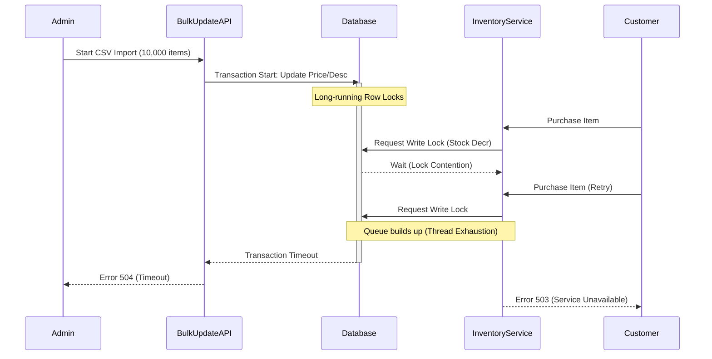

# System emergence or emergent behavior

System emergence is a phenomenon where complex behaviors, properties, or patterns arise from the interactions of individual components within a system. These emergent behaviors belong to the system as a whole; you cannot find or predict them by analyzing a single component in isolation.

---

## Understand emergence in software and hardware ecosystems

In technical environments, emergence explains why complex systems often behave in unexpected ways after deployment. Components designed and tested individually can interact in production to create entirely new system dynamics.

Emergent behavior falls into two main categories:

- **Functional emergence (Positive):** The intended functionality of a complex system. For example, when multiple independent microservices, messaging queues, and databases interact to create a responsive, auto-scaling e-commerce platform. No single microservice represents the platform, but the platform emerges from their combination.
- **Emergent misbehavior (Negative):** Unintended or catastrophic failures that arise from component interactions. Common examples include race conditions, thread contention, split-brain scenarios in distributed databases, and cascading failures like retry storms.

---

## Why emergence poses a challenge for technical communication

Technical writing often uses a reductionist approach: breaking a system into individual components and documenting each piece one by one. This includes listing API endpoints, describing UI buttons, or defining configuration fields. While this is necessary for reference manuals, it does not explain how the system behaves as a whole.

If your documentation covers components only in isolation, you might face the following issues:

- **Undocumented integration paths:** Users might understand how to call individual APIs but struggle to understand how those APIs interact over time to complete a complex business workflow.
- **Inadequate troubleshooting guides:** When emergent misbehavior occurs, operators cannot diagnose the issue by looking at a single component's error logs. The failure results from the relationship between components.
- **System-of-systems failures:** In a distributed network, a minor change in one service can propagate through other systems, leading to a major outage.

---

## Strategies for documenting emergent systems

To document systems characterized by emergent behavior, shift from component-focused writing to system-focused writing. Use the following strategies to address emergence in your documentation.

### 1. Document the architecture, not just the components

Make sure your documentation includes architectural overviews that explain the relationships, data flows, and communication protocols between components.

- **Use sequence and data flow diagrams:** Show how multiple components interact sequentially to handle a single request or transaction.
- **Explain deployment topologies:** Describe how components are distributed across networks. Explain how network latency, packet loss, or partitioning can alter system behavior.

### 2. Create pattern-oriented and scenario-based guides

Instead of organizing all your content around individual features, create guides based on common usage patterns and real-world scenarios.

- **End-to-end tutorials:** Write step-by-step guides that walk users through complete workflows involving multiple systems. For example, "Integrating Payment, Inventory, and Notification Services."
- **State transition maps:** Document how the state of the overall system changes as different components process data at different times.

### 3. Focus on "system-level" failure modes in troubleshooting

When writing troubleshooting and runbook documentation, address failures that emerge from component interactions.

- **Define multi-component root causes:** Do not limit troubleshooting steps to "restart the service." Explain how to diagnose systemic issues like thread pool exhaustion, deadlocks, or network split-brains.
- **Specify telemetry and observability rules:** Help operators identify emergent patterns by documenting how to correlate logs, metrics, and traces across different services.

---

## Real-world example: Emergent misbehavior in a distributed system

The following example shows how to document an emergent failure mode that arises when combining two individually correct features.

### Known issue: Lock contention during bulk imports

#### Components involved

- **Inventory Service:** Manages product stock levels. Features an automated lock mechanism to prevent two customers from buying the same item simultaneously.
- **Bulk Update API:** A utility used by administrators to update thousands of product prices and descriptions from a CSV file.

#### The emergent behavior

The following diagram illustrates how these two components interact to create a system-wide failure.

Individually, both components perform their tasks reliably and pass isolated unit tests. However, when an administrator runs a bulk update while customers are purchasing items, the system experiences database lock contention. This leads to timeouts and transaction failures across the entire storefront.

#### How to avoid this behavior

To prevent this emergent conflict, follow these guidelines:

- **Schedule bulk updates during off-peak hours:** Run imports when customer transaction volume is lowest.
- **Batch your payloads:** Limit bulk import files to a maximum of 500 records per batch. This allows the Inventory Service to acquire and release locks without causing queue delays.
- **Use read-only replicas:** Configure the Bulk Update API to read product descriptions from a read-replica database. This keeps the primary database free to process active inventory locks.