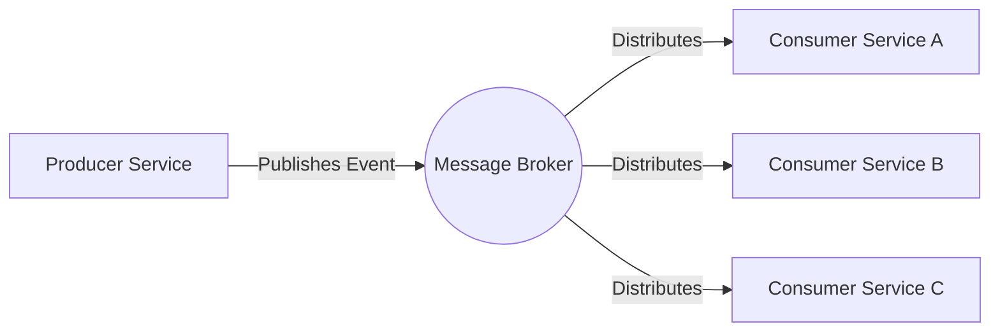

# Event-driven architecture (EDA)

Event-driven architecture (EDA) is a software design pattern where decoupled services communicate asynchronously by publishing and consuming events. Unlike synchronous request-response systems, EDA uses message brokers and event routers to distribute state changes across a system without requiring direct dependencies between services.

---

## Documenting asynchronous communication

In a REST API, documentation follows a linear path: a client sends a request to an endpoint, and the server returns a response. 

Event-driven communication is decoupled. A service publishes an event, such as `order.created`, to a message broker like Apache Kafka or RabbitMQ and resumes its process. The publishing service does not track which downstream services consume that event.

Because there is no direct, synchronous path between the sender and the receiver, you cannot document the system using only request-response tables. Instead, document the events as the primary interfaces of the system.

---

## Event documentation components

To help developers and product teams integrate with an event-driven system, provide documentation for these three core elements:

- **Event catalogs:** A registry of all available events. Each entry must specify the publishing service, the business action that triggers the event, and the intended consumers.
- **Event schemas:** The structure of the event payload. Define every field, its data type, and its requirement status (optional or required). Provide examples of the payload in formats such as JSON Schema or Apache Avro that are easy to copy and paste.
- **Channels and topics:** The routing paths for events. Specify the Kafka topic name, RabbitMQ exchange type, or specific event bus partitions.

!!! info "The AsyncAPI Specification"
    The **AsyncAPI Specification** is the industry standard for documenting event-driven APIs, similar to how the OpenAPI Specification (Swagger) functions for REST. Use AsyncAPI to define channels, payloads, and protocols in a machine-readable format (YAML or JSON) to generate interactive documentation.

---

## Resilience and failure states

Event-driven systems introduce specific failure modes. Technical documentation must provide guidance on handling these scenarios:

- **Idempotency:** Network latency or retries can cause a broker to deliver the same event multiple times. Document how consumers use unique event IDs to deduplicate requests and prevent redundant processing.
- **Out-of-order execution:** Events might arrive out of sequence—for example, `order.shipped` might arrive before `order.paid`. Explain how the system uses timestamps or sequence numbers to resolve these conflicts.
- **Dead-letter queues (DLQ):** If a service cannot process an event after several attempts, the broker routes the event to a DLQ. Document the alerting procedures and the steps for troubleshooting, retrying, or discarding these events.

---

## Event naming conventions

Use active, past-tense verbs for event names, such as `user.registered`, `payment.failed`, or `inventory.depleted`. This naming convention indicates that an event is an immutable record of a past occurrence rather than a command for future action.