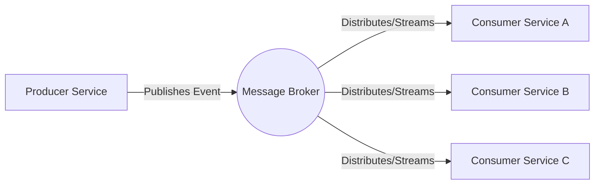

# Event-driven architecture (EDA)

Event-driven architecture (EDA) is a software design pattern where decoupled services communicate asynchronously by publishing and consuming events. Unlike synchronous request-response systems, EDA uses message brokers or event routers to distribute state changes across a system without requiring direct dependencies between services.

---

## Documenting asynchronous communication

In a REST API, documentation follows a linear path: a client sends a request to an endpoint, and the server returns a response. 

Event-driven communication is decoupled. A service publishes an event, such as `order.created`, to a message broker such as Apache Kafka or RabbitMQ and resumes its process. The publishing service typically has no awareness of which downstream services consume that event.

The system cannot be documented using only request-response tables because there is no direct, synchronous path between the sender and the receiver. Instead, document the events as the primary interfaces of the system.

---

## Event documentation components

To help developers and product teams integrate with an event-driven system, provide documentation for these three core elements:

- **Event catalogs:** A registry of all available events. Each entry must specify the publishing service, the business action that triggers the event, and the event's versioning history. Although consumers might be listed for discovery purposes, the event definition itself remains independent of downstream dependencies.
- **Event schemas:** The structure of the event payload. Define every field, its data type, and its requirement status (optional or required). Provide schema definitions in machine-readable formats such as JSON Schema, Apache Avro, or Protocol Buffers to ensure compatibility and support schema evolution.
- **Channels and topics:** The routing infrastructure for events. Specify the Kafka topic name (including partition strategy), RabbitMQ exchange type and routing keys, or specific cloud-native event bus Amazon Resource Names (ARNs).

!!! info "The AsyncAPI Specification"
    The AsyncAPI Specification is the industry standard for documenting event-driven APIs, similar to how the OpenAPI Specification (Swagger) functions for REST. Use AsyncAPI to define channels, payloads, and protocols in a machine-readable format (YAML or JSON) to generate interactive documentation and client code.

---

## Resilience and failure states

Event-driven systems introduce specific failure modes. Technical documentation must provide guidance on handling these scenarios:

- **Idempotency:** A consumer might receive the same event multiple times because of at-least-once delivery guarantees in many brokers. Document how consumers must use unique event IDs or business keys to deduplicate requests and ensure that processing the same event twice does not change the system state.
- **Out-of-order execution:** Events might arrive out of sequence because of network retries or parallel processing. For example, `order.shipped` might arrive before `order.paid`. Explain how the system uses sequence numbers, version clocks, or state-machine checks to resolve these conflicts.
- **Dead-letter queues (DLQs):** If a consumer cannot process an event after the maximum number of retries (because of data errors or logic bugs), the event is typically moved to a DLQ. Document the specific DLQ addresses, the alerting procedures for failed messages, and the manual or automated recovery steps for replaying these events.

---

## Event naming conventions

Use active, past-tense verbs for event names, such as `user.registered`, `payment.failed`, or `inventory.depleted`. This naming convention indicates that an event is an immutable record of a past occurrence rather than a command (for example, `register.user`) which would imply synchronous execution or tight coupling.