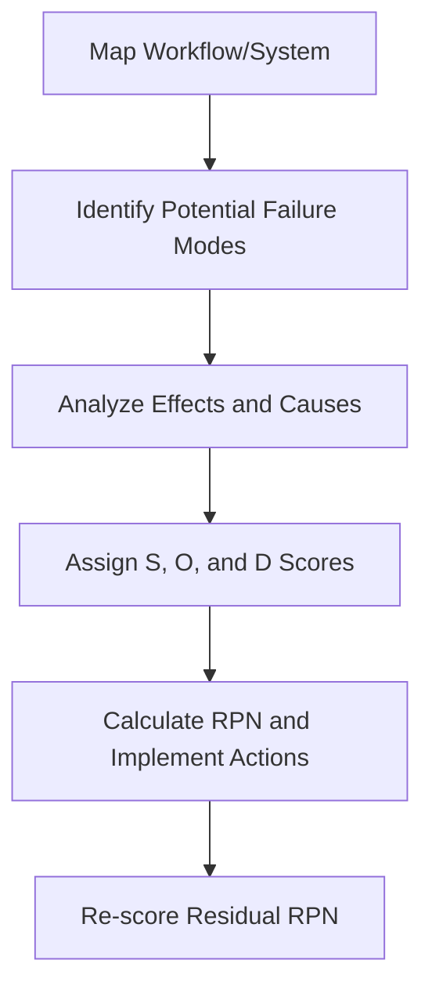

# Failure mode and effects analysis (FMEA)

Failure mode and effects analysis (FMEA) is a proactive, systematic method for evaluating a process or design to identify where and how it might fail and to assess the relative impact of different failures. For technical writers and product teams, FMEA provides a data-driven basis for prioritizing documentation, safety warnings, and recovery runbooks.

---

## The three dimensions of FMEA risk

FMEA is performed during the design or planning phase to prevent failures before they occur. Each potential failure mode is evaluated and scored across three dimensions:

- **Severity (S):** The impact of the failure on the system or end-user. (Scored 1 to 10; 10 is catastrophic/safety hazard).
- **Occurrence (O):** The likelihood that a specific **cause** will result in the failure mode. (Scored 1 to 10; 10 is almost certain).
- **Detection (D):** The effectiveness of **current controls** to detect the cause or the failure mode before the failure reaches the end-user. (Scored 1 to 10; 10 means the control is non-existent or certain to miss the failure).

The **Risk Priority Number (RPN)** is calculated by multiplying these three scores:

$$\text{RPN} = \text{Severity (S)} \times \text{Occurrence (O)} \times \text{Detection (D)}$$

A higher RPN indicates a higher risk. However, items with high Severity scores (e.g., 9 or 10) often require mitigation regardless of the resulting RPN.

!!! note "Using RPN to Prioritize Documentation"
    Technical writing teams can use RPN scores to prioritize a documentation backlog. For example, a failure mode with an RPN of 400 (S: 8, O: 5, D: 10) requires immediate mitigation through troubleshooting guides and telemetry alerts. After these controls are implemented and documented, the **Detection** score is reassessed, resulting in a lower "Residual RPN."

---

## How FMEA improves technical documentation

An FMEA provides the technical data needed to design effective information architecture:

- **Logic-based warning levels:** Use severity scores to align with ANSI/ISO warning standards. If a step could cause permanent data loss or hardware damage (Severity 8-10), use a `!!! danger` or `!!! warning` notice. For minor errors (Severity 1-3), a `!!! note` or `!!! tip` is appropriate.
- **Observability documentation:** If a failure mode has a high Detection score, documentation should focus on the specific metrics, logs, or error codes that allow an operator to identify the issue.
- **Fallback and recovery:** For failure modes that cannot be designed out (high Severity and Occurrence), write clear procedures for "graceful degradation" to ensure system availability in a limited state.

---

## Conduct an FMEA for technical workflows

FMEA can be applied to software architecture, hardware assembly, or human-centric processes like manual deployment workflows.

- **Map the workflow:** Break the process into discrete, sequential steps.
- **Identify failure modes:** For each step, ask "How could this fail to meet its intended function?"
- **Analyze effects and causes:** Identify the impact of the failure (Effect) and the underlying reason it would happen (Cause).
- **Assign S, O, and D scores:** Collaborate with Subject Matter Experts (SMEs). Occurrence is based on the Cause; Detection is based on the effectiveness of current diagnostic tools/processes.
- **Calculate RPN and implement actions:** Propose mitigations for high-risk items.
- **Re-score Residual RPN:** After implementing mitigations (such as new validation logic or improved documentation), re-evaluate the scores to ensure the risk has been reduced to an acceptable level.

---

## Why FMEA benefits cross-functional product teams

- **Proactive risk mitigation:** Identifies design flaws and information gaps early in the development lifecycle, reducing the "cost of quality."
- **Objective prioritization:** Using RPN provides a standardized numerical basis for resource allocation, removing subjective bias from engineering or documentation priorities.
- **Knowledge capture:** The FMEA document serves as a historical record of known risks and the rationale behind specific safety features and documentation.