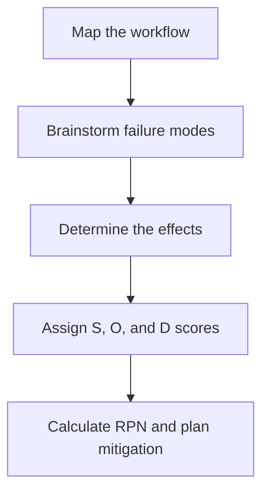

# Failure mode and effects analysis (FMEA)

Failure mode and effects analysis (FMEA) is a proactive process used to identify potential failure points in a design, system, or process and assess their impact. For technical writers and product teams, FMEA helps prioritize documentation, design safety warnings, and create recovery runbooks for high-risk scenarios.

---

## The three dimensions of FMEA risk

Unlike reactive methods such as root cause analysis, you conduct an FMEA before you deploy a system or finalize a process. You examine every workflow step or system component and score them based on three dimensions:

- **Severity (S):** How the failure affects the user or the business. (Scored 1 to 10, where 10 is catastrophic).
- **Occurrence (O):** How likely the failure is to occur. (Scored 1 to 10, where 10 is almost certain).
- **Detection (D):** How easy it is to detect the failure before it affects the user. (Scored 1 to 10, where 10 is extremely difficult to detect).

You calculate the **Risk Priority Number (RPN)** by multiplying these three scores:

$$\text{RPN} = \text{Severity (S)} \times \text{Occurrence (O)} \times \text{Detection (D)}$$

A higher RPN indicates a more urgent need to redesign the system or safeguard the process through documentation.

!!! note "Using RPN to Prioritize Documentation"
    Technical writing teams can use RPN scores to prioritize a backlog. For example, a component with an RPN of 400 (Severity 8, Occurrence 5, Detection 10) requires immediate, comprehensive documentation, such as troubleshooting guides and custom telemetry alerts. A feature with an RPN of 12 can use standard, lower-priority procedural steps.

---

## How FMEA improves technical documentation

An FMEA provides the data needed to create targeted technical content:

- **Placement of critical warnings:** Use severity scores to choose the right notice types. If a step in an installation guide could cause data loss (Severity 9), place a `!!! danger` or `!!! warning` box immediately before that step. If a step causes only minor frustration (Severity 3), use a `!!! note`.
- **Runbook alignment:** If a failure is difficult to detect (high Detection score), focus documentation on how to identify the failure using metrics, dashboards, or diagnostic logs.
- **Clear fallback procedures:** For failure modes with high severity scores, write clear procedures for graceful degradation so operators can maintain system functionality in a limited state.

---

## Conduct an FMEA for technical workflows

You can apply FMEA to software systems and human-centric workflows, such as manual software releases or hardware assembly.

- **Map the workflow:** Break the process into sequential steps.
- **Brainstorm failure modes:** For each step, identify how it could fail. (Example: "Developer forgets to run database migrations.")
- **Determine the effects:** Identify the consequences of each failure. (Example: "API queries fail because of a database schema mismatch.")
- **Assign S, O, and D scores:** Collaborate with developers, QA, and operations engineers to score each failure mode.
- **Calculate RPN and plan mitigation:** Focus on failure modes with the highest scores. Mitigation might involve automating the step, adding validation rules, or creating a peer-reviewed checklist.

---

## Why FMEA benefits cross-functional product teams

- **Proactive risk mitigation:** Teams fix design flaws and information gaps before customers encounter them, reducing production outages.
- **Standardized risk assessment:** Using a numerical formula (RPN) removes subjectivity when deciding which engineering or documentation tasks are most critical.
- **Improved system reliability:** Combining technical safeguards with targeted operational documentation ensures that when failures occur, they are resolved quickly.