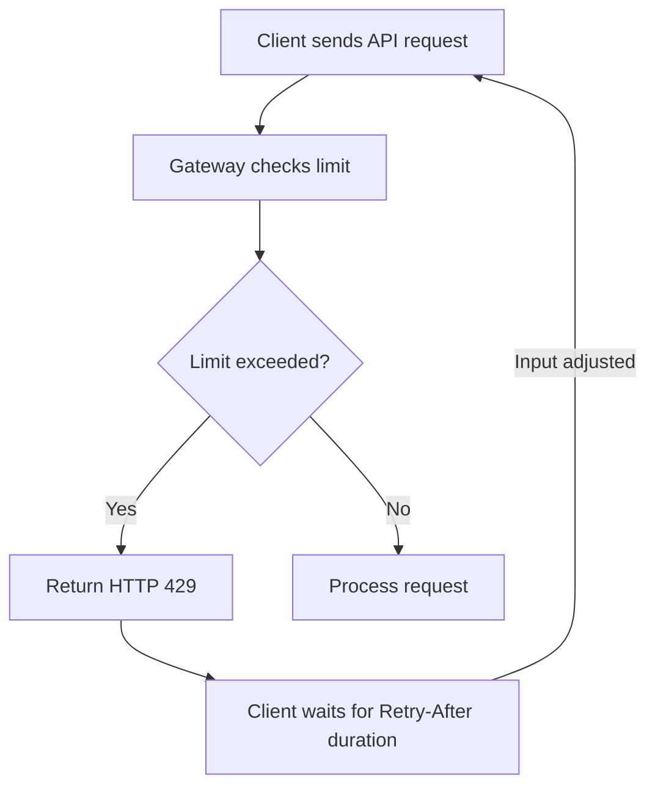

# Feedback loop

Feedback loops occur when a system's output is routed back as input to modify its future behavior. In software and systems engineering, feedback loops either stabilize a system (balancing) or amplify a behavior (reinforcing).

---

## Types of feedback loops in software systems

Identify the type of feedback loop in your system to write accurate operational guides, API references, and troubleshooting documentation.

### Balancing feedback loops

Balancing loops provide stability, self-regulation, and equilibrium. When a system parameter deviates from a desired state, a balancing mechanism triggers to return it to that state.

- **How it works:** The system detects an output that exceeds a threshold, which triggers an action to reduce or limit the input.
- **Examples:** 
    - **Rate limiting:** An API gateway detects high traffic volume (output) and returns `429 Too Many Requests` responses. This forces client applications to reduce their request rate (input).
    - **Auto-scaling:** A cloud monitor detects that CPU usage exceeds 80%. It provisions additional server instances to distribute the load, which lowers the average CPU utilization.

### Reinforcing feedback loops

Reinforcing loops amplify changes and push systems toward extreme states. If these loops continue without intervention, they can cause runaway growth, system-wide collapse, or resource exhaustion.

- **How it works:** An initial change produces an output that triggers more of the same behavior, compounding the effect.
- **Examples:**
    - **Retry storms:** A database experiences temporary latency and drops a connection. Client services immediately attempt to reconnect and retry failed queries. This surge in requests increases the database load, which causes more latency and triggers more retries.
    - **Cache stampedes:** A popular cached data item expires. Many concurrent requests bypass the empty cache and hit the database simultaneously. The database slows down, which delays the cache refresh and leads to even more direct database hits.

---

## How to document feedback loops

When you document a system that uses or is vulnerable to feedback loops, provide the information users need to design compatible client-side logic.

### 1. Document rate limits and backoff strategies

If your API implements rate limiting, describe more than just the error code. Explain the specific balancing feedback signals the system returns and how client systems must process them.

- **Detail the response headers:** Clearly explain headers such as `X-RateLimit-Limit`, `X-RateLimit-Remaining`, and `Retry-After`.
- **Provide client-side code examples:** Show developers how to parse these headers and implement exponential backoff with jitter to prevent retry storms.

```python
# Example of exponential backoff with jitter to handle rate limit feedback loops
import time
import random

def get_wait_time(retry_count):
    # Calculate base exponential backoff
    backoff = min(60, 2 ** retry_count) 
    # Add random jitter to prevent synchronized retry requests
    jitter = random.uniform(0, 1)
    return backoff + jitter
```

### 2. Specify thresholds and cooldown periods

For systems that use auto-scaling or circuit breakers, document the operational thresholds and timing rules.

- **Threshold values:** State the exact conditions that trigger the feedback loop. For example, "Auto-scaling triggers when average memory utilization exceeds 85% for five consecutive minutes."
- **Cooldown or settling time:** Explain the delay period built into the feedback loop to prevent rapid, unstable oscillations (flapping). For instance, specify if the system waits 10 minutes after a scaling event before performing another evaluation.

### 3. Use visual flowcharts to clarify complex loops

Text descriptions of circular relationships are often difficult to follow. Use diagrams to illustrate how output feeds back into the system.



---

## Checklist for writing feedback loop documentation

- Is the balancing mechanism (such as a `Retry-After` duration) named and defined?
- Did you provide guidance on how to prevent reinforcing loops, such as implementing jitter or circuit breakers?
- Are the failure thresholds, metric types, and evaluation windows clear for system administrators?
- Does the troubleshooting guide list the steps to recover a system trapped in an unchecked reinforcing loop (for example, manually throttling traffic to clear a retry storm)?